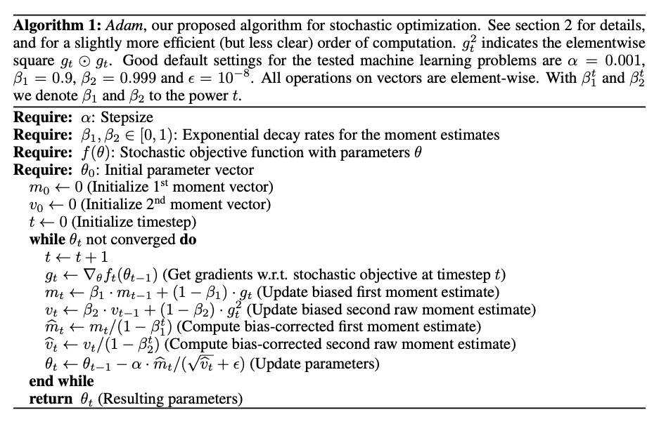

# Notes from Aman Arora's blog titled 'Understanding Optimizers: Adam, SGD, Momentum & RMSprop from Scratch'

<https://amaarora.github.io/posts/2021-03-13-optimizers.html>

> [WATCH](https://youtu.be/CJKnDu2dxOE?t=6208) Jeremy Howard implemented Adam on Excel. What a freak!

Repeatedly evaluate graident and perform parameter update *pseudocode*

## Stochastic Gradient Descent (SGD) vs Gradient Descent (GD)

```py
# Vanilla GD - over all data at once
for epoch in range(epochs):
    preds = model(train_data)
    loss = loss_fn(preds, labels)
    weights_grad = eval_gradient(loss) # same as loss.backward()
    weights = weights - lr * weights_grad
```

```py
# Vanilla Stochastic GD - over batches of data (using Pythorch.DataLoaders)
for epoch in range(epochs):
    for train_data, labels in train_loader:
        preds = model(train_data)
        loss = loss_fn(preds, labels)
        weights_grad = eval_gradient(loss) # same as loss.backward()
        weights = weights - lr * weights_grad
```

| Method | data | step |
| --- | --- | --- |
| **Vanilla GD** | preds and hence loss on **whole data** | parameter update step |
| **Stochastic GD** | **on batches** | parameter update step |

## Basic Optimizer class

```py
class Optimizer(object):
    def __init__(self, params, **defaults):
        self.params = list(params)
        self.defaults = defaults
    
    def grad_params(self):
        """
        grabs all those parameters as a list whose gradients are not None
        """
        return [p for p in self.params if p.grad is not None]
    
    def step(self):
        raise NotImplementedError
    
    def zero_grad(self):
        """zero out the gradients"""
        for p in self.params:
            if p.grad is not None:
                p.grad.zero_()

```

> In PyTorch, calling `loss.backward()` appends an attribute `.grad` to each of the parameters in `model.parameters()`

### SGD Optimizer class

```py
class SGD(Optimizer):
    def __init__(self, params, **defaults):
        super().__init__(params, **defaults)
    
    def step(self):
        lr: float = self.defaults['lr']
        for p in self.grad_params():
            p.data = p.data - lr * p.grad.data
```

## SGD with Momentum

From the paper,

```math

\begin{align*}
    v_{t+1} &= \mu v_t - \text{lr} \cdot \nabla f(\theta_t) \\
    \theta_{t+1} &= \theta_t + v_{t+1} \\ 
    &= \theta_t - \text{lr} \cdot \nabla f(\theta_t) + \mu v_t \\
    &= \text{usual update} + \mu v_t
\end{align*} 

```

where, <br>

- $v_t$ is the velocity at time step $t$
- $\mu$ is the momentum factor
- $\nabla f(\theta_t)$ is the gradient at time step $t$
- $\theta_t$ are the parameters at time step $t$

> **Momentum** pushes the step *toward past directions*. **Gradient** pushes the step *toward descent*.

Also notice how if we set $\mu = 0$, we get the same result as SGD

Here's a popular story about momentum - gradient descent is a man walking down a hill. He follows the steepest path downwards; his progress is slow, but steady. *Momentum is a heavy ball* rolling down the same hill. The added *inertia* acts both as a *smoother and an accelerator, dampening oscillations and causing us to barrel through narrow valleys, small humps and local minima.*

Similarly Sebastian Ruder writes - At the core of Momentum is this idea - why don’t we keep going in the same direction as last time? *When using momentum, we push a ball down a hill. The ball accumulates momentum as it rolls downhill, becoming faster and faster on the way.* The same thing happens to our parameter updates: The momentum term increases for dimensions whose gradients point in the same directions and reduces updates for dimensions whose gradients change directions. As a result, we gain faster convergence.

Another mathematical notation for the same (just signs vary). We give gradient descent a short-term memory -

```math
\begin{align*}
    w^{k+1} &= w^k - \text{lr} \cdot \nabla f(w^k) ~ (\dots  \text{earlier}) \\
    &= w^k - \text{lr} \cdot \nabla f(w^k) + \mu v^k ~ (\dots \text{now}) \\
\end{align*}
```

> **compared to SGD, instead of the NEW STEP just being guided by the gradients, is also guided by $\mu$ times the old STEP SIZE**

```py
class SGD(Optimizer):
    def __init__(self, params, **defaults):
        super().__init__(params, **defaults)
        self.lr = defaults.get('lr', 0.01)
        self.mu = defaults.get('mu', 0.9)
        self.state = defaultdict(dict)
    
    def step(self):
        for p in self.grad_params():
            param_state = self.state[p]
            d_p = p.grad.data

            if 'velocity' not in param_state:
                v = param_state['velocity'] = torch.clone(d_p).detach()
            else:
                v = param_state['velocity']
            
            v = self.mu * v + d_p  # velocity update # TODO: does this also update the param_state['velocity']?
            p.data = p.data - self.lr * v # param update
```

## RMSprop

Why should all parameters have the **step-size** when clearly some parameters should move faster?

> Actually introduced as part of a MOOC by Geoffrey Hinton. What a FREAK!

```math

\begin{align*}
    MS(w,t) &= 0.99 \cdot MS(w,t-1) + 0.01 \cdot (\nabla f(w,t))^2 \\
    \theta_{t+1} &= \theta_t - \text{lr} \cdot \nabla f(\theta_t)  \cdot \frac{1}{\sqrt{MS(w,t)} + \epsilon} 
\end{align*} 
```

where, <br>

- $MS(w,t)$ is the moving average of squared gradients $(Mean Square)$ at time step $t$
- $\epsilon$ is a small number to avoid division by zero

> Key takeaway to be able to implement RMSprop - we need to able to **store the exponentially weighted moving average of the mean square weights of the gradients**

Exponential weighted average because

```math
\begin{align*}
    MS(w,t) &= 0.99 \cdot MS(w, t-1) + \dots  \\ 
    &= 0.99 \cdot (0.99 MS(w, t-2) + \dots)
\end{align*}
```

```py
class RMSprop(Optimizer):
    def __init__(self, params, **defaults):
        super().__init__(params, **defaults)
        self.lr = defaults.get('lr', 0.01)
        self.mu = defaults.get('mu', 0.9)
        self.eps = defaults.get('eps', 1e-8)
        self.state = defaultdict(dict)
    
    def step(self):
        for p in self.grad_params():
            param_state = self.state[p]
            d_p = p.grad.data

            if 'mean_square' not in param_state:
                ms = param_state['mean_square'] = torch.zeros_like(p, memory_format=torch.preserve_format)
            else:
                ms = param_state['mean_square']
            
            ms = self.mu * ms + (1 - self.mu) * (d_p ** 2)  # mean square update

            # save updated ms back to state
            param_state['mean_square'].copy_(ms)

            p.data = p.data - self.lr * d_p / (torch.sqrt(ms) + self.eps ) # param update

```

> Not sure about the `torch.clone` part. There is something like `torch.zeros_like` too

## ADAM (ADAptive Moment estimation)

The method computes *adaptive learning rates for different parameters from estimates of first and second moments of the gradients*



> From author: it is mentioned that *dividing by the sqrt of second moments of the gradients* (like in RMSprop), we can achieve better stability. As to why? I am not sure.

> To be able to implement Adam - we need to able to **store the moving average of the first and second moments of the gradients**

Based on the bias correction term $1 - \beta_1 t$ (for first moment estimate) and $1 - \beta_2 t$ (for second moment estimate), we compute the

- biased corrected version
- first and second raw moment estimates

Update step becomes

```math
\begin{align*}
    \theta_{t+1} &= \theta_t - \text{lr} \cdot \hat{m}_t  \cdot \frac{1}{\sqrt{\hat{v}_t} + \epsilon} 
\end{align*} 

```

where, <br>

- $\theta_{t}$ is the parameter vector at time $t$
- $\hat{m}_t$ is the bias corrected first moment estimate
- $\hat{v}_t$ is the bias corrected second moment estimate

```py

class Adam(Optimizer):
    def __init__(self, params, **defaults):
        super().__init__(params, **defaults)
        self.lr = defaults.get('lr', 0.001)
        self.beta1 = defaults.get('beta1', 0.9)
        self.beta2 = defaults.get('beta2', 0.999)
        self.eps = defaults.get('eps', 1e-8)
        self.state = defaultdict(dict)
        self.t = 0  # time step
    
    def step(self):
        self.t += 1

        for p in self.grad_params():
            param_state = self.state[p]
            d_p = p.grad.data

            if 'm' not in param_state:
                m = param_state['m'] = torch.zeros_like(p, memory_format=torch.preserve_format)

            else:
                m = param_state['m']
            
            if 'v' not in param_state:
                v = param_state['v'] = torch.zeros_like(p, memory_format=torch.preserve_format)

            else:
                v = param_state['v']
            
            # update biased first moment estimate
            m = self.beta1 * m + (1 - self.beta1) * d_p
            # update biased second moment estimate
            v = self.beta2 * v + (1 - self.beta2) * (d_p ** 2)

            # save updated m and v back to state
            param_state['m'].copy_(m)
            param_state['v'].copy_(v)

            # compute bias-corrected first moment estimate
            m_hat = m / (1 - self.beta1 ** self.t)
            # compute bias-corrected second moment estimate
            v_hat = v / (1 - self.beta2 ** self.t)

            # parameter update
            p.data = p.data - self.lr * m_hat / (torch.sqrt(v_hat) + self.eps)
```

**NOTE**

`p.data = p.data + ...`, breaks optimizer buffers and can break autograd if not careful.

Recommended: use operators like `addcdiv_` in-place

The article uses the second (correct) way like:

```py
# Vanilla SGD
p.data.add_(p.grad.data, alpha=-self.lr)

# SGD with momentum
buf.mul_(self.µ).add_(d_p)            
p.data.add_(buf, alpha=-self.lr)

# RMSprop
exp_avg_sq.mul_(self.α).addcmul_(d_p, d_p, value=1-self.α)
denom = exp_avg_sq.sqrt().add_(self.eps)
p.data.addcdiv_(d_p, denom, value=-self.lr)

# Adam
exp_avg.mul_(self.ß1).add_(d_p, alpha=1-self.ß1)
exp_avg_sq.mul_(self.ß2).addcmul_(d_p, d_p, value=1-self.ß2)

bias_correction_1 = 1 - self.ß1**self.state_step
bias_correction_2 = 1 - self.ß2**self.state_step

unbiased_exp_avg = exp_avg/bias_correction_1
unbiased_exp_avg_sq = exp_avg_sq/bias_correction_2

denom = unbiased_exp_avg_sq.sqrt().add_(self.eps)

step_size = self.lr / bias_correction_1

p.data.addcdiv_(unbiased_exp_avg, denom, value=-step_size)
```
