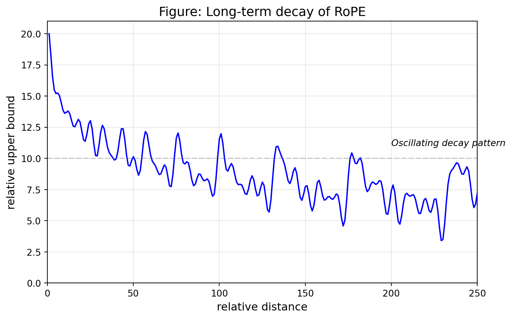
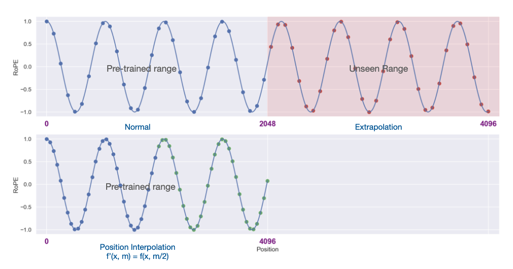
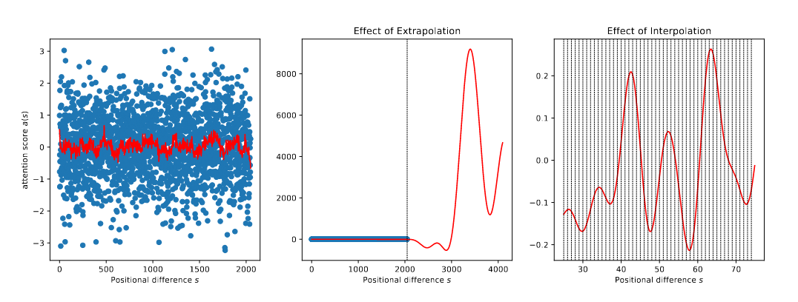
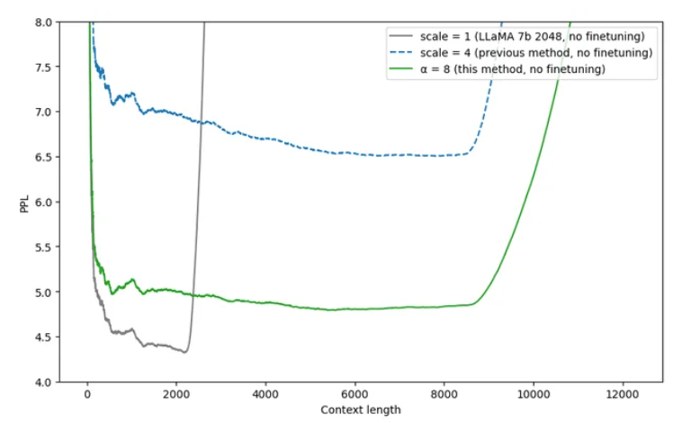

# Notes from Aman Arora's blog titled 'How LLMs Scaled from 512 to 2M Context: A Technical Deep Dive'

<https://amaarora.github.io/posts/2025-09-21-rope-context-extension.html>

- Grok-4-fast 2M context length!
- Gemini series was the first to allow accepting 1 million tokens
- Tongyi Labs termed the 128K context length as insufficient
- Qwen, DeepSeek, LLaMA, gpt-oss are finetuned using YaRN to enable context length expansion only utilising a small percentage of the pre-trained dataset

## APE (Absolute positional embeddings)

```math
\begin{align*}
PE_{(pos,2i)} &= \sin(pos/10000^{2i/d_{model}})  &= \sin(ω
_i  * pos) \\ 
PE_{(pos,2i+1)} &= \cos(pos/10000^{2i/d_{model}}) &= \cos(ω
_i  * pos) \\
ω_i &= 10000^{2i/d_{model}} ~ \dots ~  \text{frequency}
\end{align*}
```

> The authors chose this function because they hypothesized it would allow the model to easily learn to attend by relative positions, since for any fixed offset $k$ ($PE_{pos+k}$), can be represented as a linear function of $PE_{pos+k}$ ***CHECK PROOF1.md***

**Dropout is applied** to the sums of the embeddings and the positional encodings in both the encoder and decoder stacks

```python
class PositionalEncoding(nn.Module):
    """Implement the PE function."""

    def __init__(self, d_model: int = 512, dropout: float = 0.1, max_len=5000):
        super().__init__()
        self.dropout = nn.Dropout(p=dropout)

        pe = torch.zeros(max_len, d_model) # pe = (5000, 512)
        position = torch.arange(0, max_len).unsqueeze(1) # position = (5000,) --unsqueeze--> (5000,1)
        div_term = torch.exp(
            torch.arange(0, d_model, 2) * -(math.log(10000.0) / d_model)
        ) # div_term = (256, )
        pe[:, 0::2] = torch.sin(position * div_term) # (5000, 1) * (256,) = (5000, 256)
        pe[:, 1::2] = torch.cos(position * div_term)
        pe = pe.unsqueeze(0) # (5000, 512) --unsqueeze--> (1, 5000, 512)
        self.register_buffer("pe", pe) # non-trainable tensor

    def forward(self, x: torch.Tensor) -> torch.Tensor:
        # x: (batch, seq_len, d_model) = (32, 120, 512)
        seq_len = x.size(1)

        # Add positional encoding
        x = x + self.pe[:, : x.size(1)] # (32, 120, 512) + (1, 120, 512) = (32, 120, 512)
        
        x = x.requires_grad_(False)
        return self.dropout(x)
```

### Visualizing Positional Encoding Frequencies

Each dimension oscillates at a different frequency. Each position gets a unique encoding (like a fingerprint!). **Lower dimensions oscillate rapidly while higher dimensions change slowly**


### Understanding Position Fingerprints


```text
🔍 Position Fingerprints (showing dims 4-7 only):

Position 4:  [0.59, 0.81, 0.25, 0.97]
Position 8:  [0.95, 0.30, 0.48, 0.88]
Position 50: [1.00, -0.07, -0.01, -1.00]
```

> **For positions close to each other, the slower dimensions have not changed much.** The model learns these positions are *neighbours*. Whereas for positions further away from each other, for example position 2 and position 50, even the slower dimensions have had time to change. This way the model learns these positions are distant from each other.

### Why APE cannot be extended

- **The Training-Inference Mismatch**: Position 1024+ creates encoding patterns the model has never seen during training
- **Performance Cliff**: Chen et al. measure effective context window size using a passkey retrieval task (needle in a haystack)

| Model Size | Context Window | Method | 200  | 600  | 1000 | 10000 |
|------------|----------------|--------|----- |----  |------|-------|
| 7B         | 8192           | FT     | 1792  | 2048  | 2304 | 2560 |
| 33B        | 8192           | FT     | 1792  | 1792 | 2304 | -    |

> **Key observation**: Even with 10,000 fine-tuning steps, models can only achieve ~2560 effective context length when targeting 8192 tokens!

## RoFormer: Enhanced Transformer with Rotary Position Embedding (RoPE)

Between two token embeddings $x_m$ & $x_n$ at different positions $m$ & $n$, we want the **self attention inner product** to be based on

1. The embedding vectors
1. A function of the relative distance $m-n$ (to have positional information)

Valuable properties of RoPE

- Sequence length flexibility
- Decaying inter-token dependency with increasing relative distances
- Capability of equipping the linear self-attention with relative position encoding

So the vector representation at position 1 gets rotated by, vector representation at position 2 gets rotated by $2 \theta$, and position
 gets rotated by

| Position | Vector representation <br>  rotated by |
|----------|----------------|
| 1        | $\theta$       |
| 2        | $2 \theta$     |
| m        | $m \theta$     |

Rotation is applied to pairs of dimensions (2,3), (4,5), (6,7), and (8,9). This is because RoPE applies 2D rotations to consecutive dimension pairs. **Each dimension pair gets rotated by a different frequency, where:**

```math
\theta_{i} = 10000^{2i/d_{model}}
```

> **This creates a spectrum of rotation frequencies - lower dimensions rotate faster while higher dimensions rotate slower**

For example, with $d=128$ dimensions, we have 64 dimension pairs. Each pair gets rotated by $m \theta_{i}$

```math
\begin{align*}
\theta_1 &= 10000^{-0/128} = 1 ~  \text{(for dims 0,1)}\\ 
\theta_2 &= 10000^{-2/128} \approx 0.8660 ~ \text{(for dims 2,3)}\\
\theta_3 &= 10000^{-4/128} \approx 0.7499 ~ \text{(for dims 4,5)}\\
\theta_{64} &= 10000^{-126/128} \approx 0.0100 ~ \text{(for dims 126,127)} \\

\end{align*}
```

At position $m=5$ in the sequence:

The actual rotation angles are $m \theta_1$, $m \theta_2$, $m \theta_3$ etc.For example, at position $m=5$:

- Dims 0,1 rotate by:  $m \theta_1 = 5 \dot 1 = 5$ radians
- Dims 2,3 rotate by:  $m \theta_2 =  0.8660 \dot 1 = 4.33$ radians
- Dims 4,5 rotate by:  $m \theta_3 = 5 \dot 0.7499 = 3.75$ radians
- Dims 127,128 rotate by:  $m \theta_64 = 5 \dot 0.0100 = 0.05$ radians

> Both APE and RoPE use a spectrum of frequencies across dimensions (both where lower dimensions have higher frequency and higher dimensions have lower frequency), with the **key difference being that APE uses additive sinusoidal functions while RoPE uses rotational matrices!**

Further, the rotation matrix in mathematical terms can be represented as:

```math
R(m\theta) = 
\begin{pmatrix} 
    \cos m\theta & -\sin m\theta \\ 
    \sin m\theta & \cos m\theta 
\end{pmatrix}
```

> Check Proof2.md

For the full d-dimensional embedding, RoPE applies this 2D rotation to each consecutive pair of dimensions, resulting in a block-diagonal matrix:

```math
R_{\Theta,m}^d = 
\begin{pmatrix}
    \cos m\theta_1 & -\sin m\theta_1 & 0 & 0 & \cdots & 0 & 0 \\
    \sin m\theta_1 & \cos m\theta_1 & 0 & 0 & \cdots & 0 & 0 \\
    0 & 0 & \cos m\theta_2 & -\sin m\theta_2 & \cdots & 0 & 0 \\
    0 & 0 & \sin m\theta_2 & \cos m\theta_2 & \cdots & 0 & 0 \\
    \vdots & \vdots & \vdots & \vdots & \ddots & \vdots & \vdots \\
    0 & 0 & 0 & 0 & \cdots & \cos m\theta_{d/2} & -\sin m\theta_{d/2} \\
    0 & 0 & 0 & 0 & \cdots & \sin m\theta_{d/2} & \cos m\theta_{d/2}
\end{pmatrix}
```

### Relative distance using RoPE

| Condition | Lower dimensions <br> (high frequency) | Higher dimension<br>  (low frequency) |
| --- | --- | --- |
| Neaby tokens <br>  (e.g., positions 2 and 3) |  Small rotation difference, preserving alignment |  Minimal rotation, nearly identical |
| Distant tokens <br>  (e.g., positions 2 and 50) | Many full rotations, becoming orthogonal | Moderate rotation, maintaining some correlation |

```python
import torch
import torch.nn as nn


# d_model = hidden_size = 512
# num_heads = 8
# head_dim = 64
# batch_size = 32 (original x)
# seq_len = 120

def rotate_half(x):
    """
    Rotates half the hidden dims of the input
    The function swaps and negates to get [-x_2, x_1] , which when combined with cos/sin gives us the rotation
    """
    # x: (..., head_dim) = (..., 64)
    x1 = x[..., : x.shape[-1] // 2]  # (..., 32)
    x2 = x[..., x.shape[-1] // 2 :]  # (..., 32)
    return torch.cat((-x2, x1), dim=-1)  # (..., 64)


def apply_rotary_pos_emb(q, k, cos, sin, unsqueeze_dim=1):
    """Applies Rotary Position Embedding to query and key tensors."""
    # q: (batch, heads, seq_len, head_dim) = (32, 8, 120, 64)
    # k: (batch, heads, seq_len, head_dim) = (32, 8, 120, 64)
    # cos: (batch, seq_len, head_dim) = (32, 120, 64)
    # sin: (batch, seq_len, head_dim) = (32, 120, 64)

    cos = cos.unsqueeze(unsqueeze_dim) # (32, 1, 120, 64)
    sin = sin.unsqueeze(unsqueeze_dim) # (32, 1, 120, 64)
    q_embed = (q * cos) + (rotate_half(q) * sin) # (32, 8, 120, 64)
    k_embed = (k * cos) + (rotate_half(k) * sin)
    return q_embed, k_embed


def compute_rope_parameters(hidden_size:int = 512, num_heads: int = 8, max_position=2048, base=10000):
    """Compute the inverse frequencies for RoPE."""
    head_dim = hidden_size // num_heads # 512 // 8 = 64
    inv_freq = 1.0 / (base ** (torch.arange(0, head_dim, 2).float() / head_dim)) # (32, )
    return inv_freq


class RotaryEmbedding(nn.Module):
    def __init__(self, hidden_size, num_heads, max_position=2048, base=10000):
        super().__init__()
        inv_freq = compute_rope_parameters(hidden_size, num_heads, max_position, base) # (32, )
        self.register_buffer("inv_freq", inv_freq, persistent=False)

    def forward(self, x, position_ids):
        """Generate cos and sin for rotary embeddings."""
        # x: (batch, heads, seq_len, head_dim)
        # position_ids: (batch, seq_len)
        # inv_freq: (32,)

        inv_freq_expanded = self.inv_freq[None, :, None].float().expand(
            position_ids.shape[0], -1, 1
        ) # (1, 32, 1).expand(batch, -1, 1) = (batch, 32, 1)
        position_ids_expanded = position_ids[:, None, :].float() # (batch, 1, seq_len) # WTF!
        freqs = (inv_freq_expanded @ position_ids_expanded).transpose(1, 2) # (batch, 32, 1) @ (batch, 1, seq_len) --> (batch, 32, seq_len) --transpose--> (batch, seq_len, 32) 
        emb = torch.cat((freqs, freqs), dim=-1) # (batch, seq_len, 64) = (32, 120, 64)
        cos = emb.cos() # (32, 120, 64)
        sin = emb.sin() # (32, 120, 64)
        return cos, sin


# Example usage
batch_size = 2
seq_len = 10
hidden_size = 512
num_heads = 8
head_dim = hidden_size // num_heads

rope = RotaryEmbedding(hidden_size, num_heads)
q = torch.randn(batch_size, num_heads, seq_len, head_dim)
k = torch.randn(batch_size, num_heads, seq_len, head_dim)
position_ids = torch.arange(seq_len).unsqueeze(0).expand(batch_size, -1)

cos, sin = rope(q, position_ids)
q_rotated, k_rotated = apply_rotary_pos_emb(q, k, cos, sin)

print("=== RoPE in Action ===")
print(f"Embedding dimension: {head_dim}, Number of frequency pairs: {head_dim//2}")
print(f"\n--- Base Frequencies (θ_i) for each dimension pair ---")
for i in range(3):
    theta = rope.inv_freq[i].item()
    print(f"Dimension pair {i} (dims {2*i},{2*i+1}): θ_{i+1} = {theta:.4f}")
print("...")
print(f"Dimension pair {head_dim//2-1} (dims {head_dim-2},{head_dim-1}): θ_{head_dim//2} = {rope.inv_freq[-1].item():.4f}")

print(f"\n--- Rotation Angles at Different Positions ---")
print("(Showing how fast vs slow frequencies behave)")
positions = [1, 10, 100]
for pos in positions:
    angle_first = pos * rope.inv_freq[0].item()
    angle_last = pos * rope.inv_freq[-1].item()
    print(f"Position {pos:3d}: First pair rotates {angle_first:6.2f} rad, Last pair rotates {angle_last:6.4f} rad")

print(f"\n--- How Rotation Affects Dot Product ---")
import math
test_q = torch.zeros(1, 1, 1, head_dim)
test_k = torch.zeros(1, 1, 1, head_dim)
test_q[0, 0, 0, 0] = 1.0
test_k[0, 0, 0, 0] = 1.0

distances = [(2, 3), (2, 10), (2, 100)]
for pos_m, pos_n in distances:
    cos_m, sin_m = rope(test_q, torch.tensor([[pos_m]]))
    cos_n, sin_n = rope(test_k, torch.tensor([[pos_n]]))

    q_rot = test_q * cos_m.unsqueeze(1) + rotate_half(test_q) * sin_m.unsqueeze(1)
    k_rot = test_k * cos_n.unsqueeze(1) + rotate_half(test_k) * sin_n.unsqueeze(1)

    dot_product = (q_rot[0, 0, 0] @ k_rot[0, 0, 0].T).item()
    print(f"Dot product for positions ({pos_m},{pos_n}) with distance={pos_n-pos_m}: {dot_product:.4f}")

```

```text
=== RoPE in Action ===
Embedding dimension: 64, Number of frequency pairs: 32

--- Base Frequencies (θ_i) for each dimension pair ---
Dimension pair 0 (dims 0,1): θ_1 = 1.0000
Dimension pair 1 (dims 2,3): θ_2 = 0.7499
Dimension pair 2 (dims 4,5): θ_3 = 0.5623
...
Dimension pair 31 (dims 62,63): θ_32 = 0.0001

--- Rotation Angles at Different Positions ---
(Showing how fast vs slow frequencies behave)
Position   1: First pair rotates   1.00 rad, Last pair rotates 0.0001 rad
Position  10: First pair rotates  10.00 rad, Last pair rotates 0.0013 rad
Position 100: First pair rotates 100.00 rad, Last pair rotates 0.0133 rad

--- How Rotation Affects Dot Product ---
Dot product for positions (2,3) with distance=1: 0.5403
Dot product for positions (2,10) with distance=8: -0.1455
Dot product for positions (2,100) with distance=98: -0.8193

```

> In PyTorch, `self.register_buffer` is used to attach a tensor to an `nn.Module` so that: (i) It becomes part of the module’s state (shows up in `state_dict`, so it is saved/loaded with the model).​ (ii) It is automatically moved to the right device and dtype when you call `.to(device)`, `.cuda()`, `.cpu()`, or `.half()`/ `.float()` on the module.​ (iii) It is explicitly marked as "not a parameter", so it never gets gradients, never appears in `model.parameters()`, and won’t be updated by optimizers.​ A plain attribute like `self.variable = value` does not give you any of that "framework integration" for free

### Long-term Decay of RoPE



## The Extrapolation Problem

### Evidence of Extrapolation Failure

- Anil et al. (2022) demonstrated that several fine-tuning approaches fail to resolve length generalization pathologies
- ***IMP!!*** Press, Smith, and Lewis (2022) found that **Transformer models overfit to specific position embeddings seen during training, even with RoPE. They proposed ALiBi (Attention with Linear Biases) as a solution**, observing that models essentially memorize position-token pairs rather than learning generalizable positional patterns.
- Liu et al. (2023) observed **catastrophic glitches** in long-range language modeling, with minor fluctuations in attention head logits causing complete failure beyond training lengths.
- Chi et al. (2022) find that **constraining the receptive field can actually improve extrapolation.**
- Tao, Feng, and Zhao (2023) discovered that **rear position embeddings are updated less frequently than front positions during training**, leading to poor generalization at longer contexts.

> The evidence for this memorization is striking: - A 250M parameter model can extrapolate ~50 tokens beyond training - A 1.3B parameter model fails immediately at position 1025 - Larger models have more capacity to memorize, so they overfit more
> This suggests models aren't learning "how positions work" but rather memorizing a lookup table of "position X means Y"

## Early Interpolation Discovery: The kaiokendev Breakthrough

*"Eventually, I stopped fighting the model's learned behavior; if it doesn’t want to go past 2048, then fine: let's instead interpolate instead of extrapolate"*

```py
class ScaledRotaryEmbedding(torch.nn.Module):
    def __init__(self, dim, max_position_embeddings=2048, base=10000, device=None):
        super().__init__()
        inv_freq = 1.0 / (base ** (torch.arange(0, dim, 2).float().to(device) / dim))
        self.register_buffer("inv_freq", inv_freq)

        # Build for longer sequences
        max_position_embeddings = 8192
        self.max_seq_len_cached = max_position_embeddings
        t = torch.arange(self.max_seq_len_cached, device=self.inv_freq.device)

        # The magic two lines that took a month to discover:
        self.scale = 1/4  # Scale factor
        t *= self.scale   # Apply interpolation

        # Now position 2048 → 512, position 8192 → 2048
```

The results were remarkable: - Without any finetuning: Model remained coherent up to 7000 tokens

> The intuition: By scaling positions down by 4x, position 8192 looks like position 2048 to the model - keeping everything within the range it memorized during training.



We reduce position indices from $[0, L')$ to $[0, L)$ to match the original range of indices before computing RoPE.

In simpler terms, during inference with context length $L_{context} > L_{train}$, we scale position indices:

$$\text{position}_{interpolated} = \frac{\text{position} \cdot L_{train}}{L_{context}}$$

This ensures all positions map to the range $[0, L_{train}]$ that the model saw during training.

 <br>

*Extrapolation versus interpolation. Left: A fitted attention score function (red curve) trained on positions [0, 2048]. Middle: Extrapolation beyond training range causes values to explode beyond 8000, breaking attention computation. Right: Interpolation between integer positions remains smooth and well-behaved*

```py
def apply_positional_interpolation(position_ids, original_max_length, target_max_length):
    """
    Scale position IDs to fit within the original training range.

    Args:
        position_ids: Current position indices
        original_max_length: Maximum position seen during training (e.g., 2048)
        target_max_length: Desired context length (e.g., 8192)

    Returns:
        Interpolated position IDs
    """
    if target_max_length <= original_max_length:
        return position_ids

    scaling_factor = original_max_length / target_max_length
    interpolated_positions = position_ids.float() * scaling_factor

    return interpolated_positions

# Example
import torch
original_context = 2048
target_context = 8192

positions = torch.arange(target_context)
interpolated = apply_positional_interpolation(positions, original_context, target_context)

print(f"Original positions (first 5): {positions[:5].tolist()}")
print(f"Interpolated positions (first 5): {[f'{x:.2f}' for x in interpolated[:5].tolist()]}")
print(f"\nKey insight: Position {target_context-1} maps to {interpolated[-1]:.2f} (within training range!)")

```

```text
Original positions (first 5): [0, 1, 2, 3, 4]
Interpolated positions (first 5): ['0.00', '0.25', '0.50', '0.75', '1.00']

Key insight: Position 8191 maps to 2047.75 (within training range!)
```

## NTK-Aware Scaling: A Frequency-Based Approach (Neural Tangent Kernel)

> Just like kaikondev, the following solution was proposed by another reddit user bloc97. [reddit thread here](https://www.reddit.com/r/LocalLLaMA/comments/14lz7j5/ntkaware_scaled_rope_allows_llama_models_to_have/)

### Problem with Linear Interpolation

For example, with a 4x compression: - Original positions: 100, 101, 102, 103 - After interpolation: 25.0, 25.25, 25.5, 25.75

The compressed positions are so close that the model struggles to maintain the fine-grained distinctions it learned during training. **This becomes catastrophic at higher compression ratios.**

### NTK Insight

Instead of scaling positions, NTK-aware scaling modifies the RoPE base frequency:

$$ \text{base}_{\text{new}} = \text{base} \times \alpha^{d/(d-2)} $$

where: $\alpha$ is the context extension factor (e.g., 8 for 2K→16K extension), $d$ is the hidden dimension, $\text{base}$ is the original base (typically 10000)

> why change the base!

Recall that RoPE frequencies are computed as:

$$ \theta_i = \text{base}^{-2i/d} $$

**By increasing the base, we slow down all rotation frequencies proportionally**. This is fundamentally different from position interpolation:

| Technique | Position indices | Frequencies |
| ---       |   ---            |    ---      |
| Position Interpolation | compressed | fixed |
| NTK Scaling | same | adjusted |

 <br>

*Perplexity comparison of different context extension methods on LLaMA 7B. Gray line: baseline (scale=1), Blue dashed: linear interpolation (scale=4), Green solid: NTK-aware scaling (α=8). **NTK-aware scaling maintains much lower perplexity across extended context lengths** without any fine-tuning*

## Dynamic scaling

> Just like kaikondev and bloc97, we now have emozilla [reddit thread here](https://www.reddit.com/r/LocalLLaMA/comments/14mrgpr/dynamically_scaled_rope_further_increases//). Crazy.

Adjust the scaling factor dynamically based on the actual sequence length

### The Fixed Scaling Dilemma

- Choose a large factor: Good for long sequences, but degrades short sequence performance
- Choose a small factor: Preserves short sequence quality, but limits extension capability

This forces an unnecessary compromise before you even know what sequence lengths you'll process.

### Dynamic Linear Scaling

**Use exact positions for the first 2K tokens, then scale only as needed**

- Positions 0-2048: Use exact trained positions (scale=1.0)
- Position 4096: scale=2.0
- Position 8192: scale=4.0

### Dynamic NTK Scaling

```math
\begin{align*}
    \text{dynamic factor} &= \dfrac{\text{factor} * \text{seq len}}{\text{original context}} - (\text{factor} - 1) \\
    \text{base new} &= \text{base} * \text{dynamic factor}^{d/(d-2)}
\end{align*}
```

 <br>

```py

class DynamicNTKScaledRoPE(nn.Module):
    def __init__(self, dim, original_max_position=2048, factor=8, base=10000):
        super().__init__()
        self.dim = dim
        self.original_max_position = original_max_position
        self.factor = factor
        self.base = base

    def forward(self, seq_len):
        seq_len = max(seq_len, self.original_max_position)

        # Dynamic NTK formula
        scaled_base = self.base * (
            (self.factor * seq_len / self.original_max_position) - (self.factor - 1)
        ) ** (self.dim / (self.dim - 2))

        inv_freq = 1.0 / (scaled_base ** (torch.arange(0, self.dim, 2).float() / self.dim))
        return inv_freq

```

> Qwen models use Dynamic NTK-aware scaling to achieve strong performance across context lengths

## NTK By Parts - Frequency-Aware Interpolation

bloc97 discovered that different frequency components benefit from different scaling strategies. So we can apply different interpolation methods to different parts of the frequency spectrum.

### The Multi-Scale Problem

**The key insight:** RoPE's frequency components encode information at different scales:

- High frequencies (low dimensions): Encode local, fine-grained relationships
- Low frequencies (high dimensions): Encode global, long-range dependencies

> Applying the same scaling strategy to all frequencies is suboptimal. *High frequencies should use linear interpolation to preserve local patterns, while low frequencies benefit from NTK scaling for long-range coherence.*

Check implementation at ***ntk_by_parts.md***

### How It Works

The method uses two transition zones to intelligently blend different scaling strategies

1. **The beta zone (β₀ to β₁)** transitions from *linear interpolation* to *NTK scaling* - *high frequencies use linear interpolation* while *low frequencies use NTK scaling*, with a smooth transition in between
1. **The gamma zone (γ₀ to γ₁)** transitions to pure extrapolation for *very low frequencies*, where ultra-low frequencies that barely rotate use *original base frequencies* to help maintain very long-range patterns

This frequency-aware approach preserves both local and global patterns by treating frequencies appropriately.

> It unifies all methods - setting factors to 0 recovers linear interpolation - and improves perplexity across all context lengths without spikes. The "by parts" correction represents the culmination of community experimentation - *a sophisticated solution that recognizes positional encoding isn't one-size-fits-all*, but requires frequency-specific strategies. This insight would later influence YaRN and other advanced methods.

## YaRN: Yet Another RoPE Extension

Adds **attention temperature scaling** to the previous methods

### The Problem with Pure Interpolation

Limitation of position interpolation and NTK scaling (even though they successfully extend context) - they compress positional information, potentially degrading the model's ability to distinguish between nearby tokens

> YaRN addresses this by modifying not just the positional encodings, but also the attention computation itself.

### Attention Temperature Scaling

Instead of the standard attention computation:
$$\text{softmax}\left(\frac{\mathbf{q}_m^T \mathbf{k}_n}{\sqrt{D}}\right)$$

YaRN modifies it to:

$$\text{softmax}\left(\frac{\mathbf{q}_m^T \mathbf{k}_n}{t\sqrt{D}}\right)$$

where $t = \sqrt{1/s} = 0.1\ln(s) + 1$ for scale factor $s$

By scaling the complex RoPE embeddings by $\sqrt{1/t}$, YaRN effectively alters the attention mechanism without modifying its code. This **length scaling** trick scales both $\mathbf{q}_m$ and $\mathbf{k}_n$ by a constant factor, achieving the temperature effect with zero overhead during inference


### Intuition (counter intuitive!)

- A higher temperature actually softens the attention distribution, making the model pay attention to more tokens rather than focusing sharply

> However, this is precisely why it works!

1. Position interpolation compresses positional information
1. It can create artifacts where certain keys get artificially inflated scores. 1. By softening the softmax, YaRN prevents the model from over-relying on a single, potentially incorrect high-scoring key
1. Instead, it forces the model to consider a broader range of keys, *making its decisions more robust to the slight loss of precision from position interpolation*
1. It is a counter-intuitive but powerful idea - **deliberately making attention *fuzzier* to handle compressed positions better**.

YaRN combines: 1. **NTK-by-parts interpolation**: Frequency-aware scaling from the previous section 2. **Attention temperature scaling**: Preserves local token distinctions

From the paper, this dual approach allows YaRN to:

- Extend context to 128K+ tokens with minimal perplexity degradation
- Maintain fine-grained positional discrimination
- Require only lightweight fine-tuning (often <1% of pretraining compute)

***See yarn.md***


