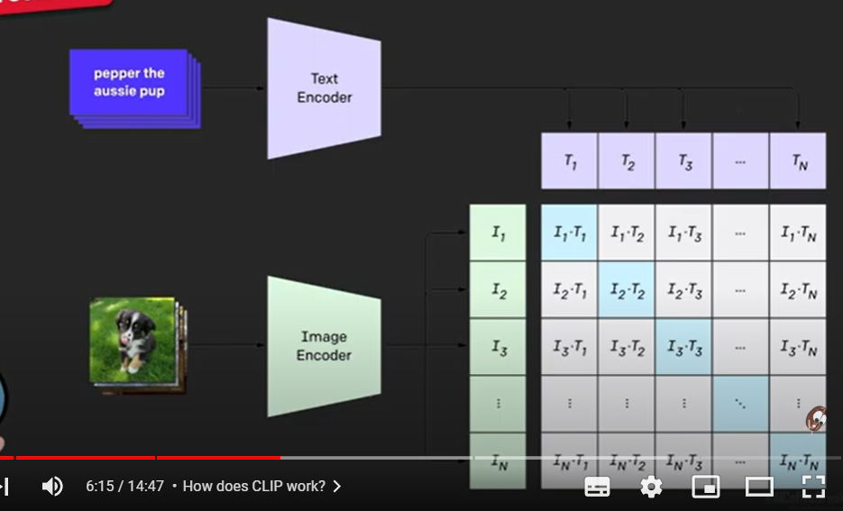

## CLIP
- trained on 400 mn image-text pairs
- compare to 1.4 mn pairs used for resnet

encode images and texts using transformers - get embdd vectors for each - train in CONTRASTIVE fashion such that similarity in diagonal is high and off-diagonal is low

