# Notes from Cameron Wolfe's substack titled 'GPT-oss from the Ground Up'

<[https://cameronrwolfe.substack.com/p/gpt-oss](https://cameronrwolfe.substack.com/p/gpt-oss)>

## At a Glance

| Model | Layers | Total Params | Active Params per token | Total Experts | Active Experts per Token | Context Size | Size if MXFP4 (~4-bit) |
|-------|--------|--------------|-------------------------|---------------|--------------------------|--------------| -----------------------|
| gpt-oss-120b | 36 | 117B | **5.1B** | 128 | 4 | 128k | **80 GB** |
| gpt-oss-20b  | 24 | 21B | **3.6B** | 32| 4 | 128k | **16 GB** |

OpenAI released the Harmony prompt format (chat template) for handling function calling, tool use, reasoning etc. Apparently it is found to be overly complex!

> OpenAI also released HealthBench, for health-related tasks.

GPT-oss models obey inference-time scaling laws (wrt reasoning) - as longer reasoning traces generated, performance improves, *and therefore consume more compute* (during inference).

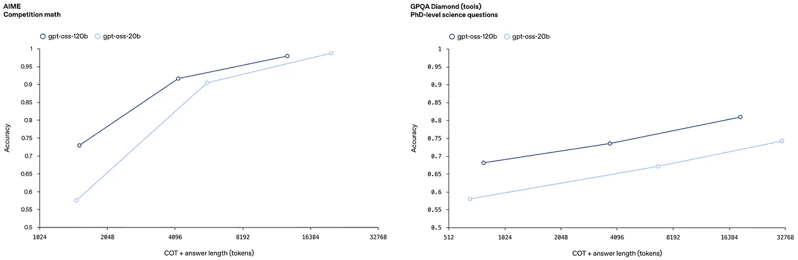

## Model Architecture

### Transformer Structure

Embeddings layer gives 2880-dim vectors.

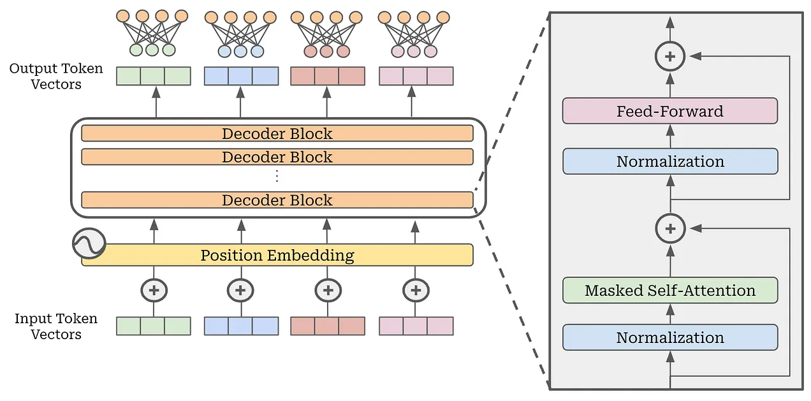

*pretty standard*

Even if pre-norm structures are common, there is no clear answer if pre-norm or post-norm is superior. Some work shows post-norm benefits training stability

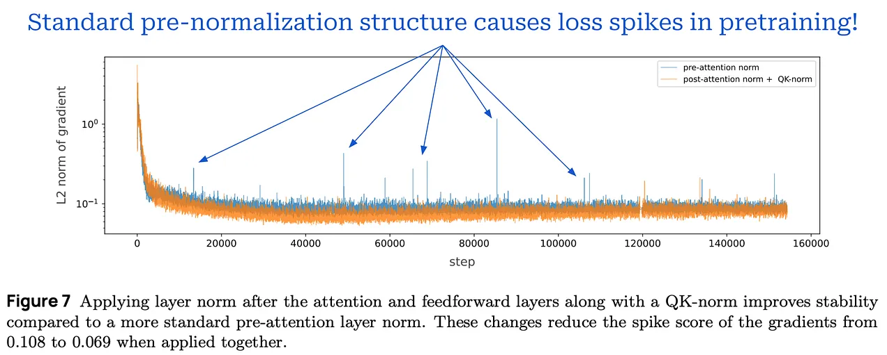

Although a pre-normalization structure is most common, there is no clear answer in terms of whether pre or post-normalization is superior. In fact, recent work has even shown that post-normalization benefits training stability

### Attention Mechanism

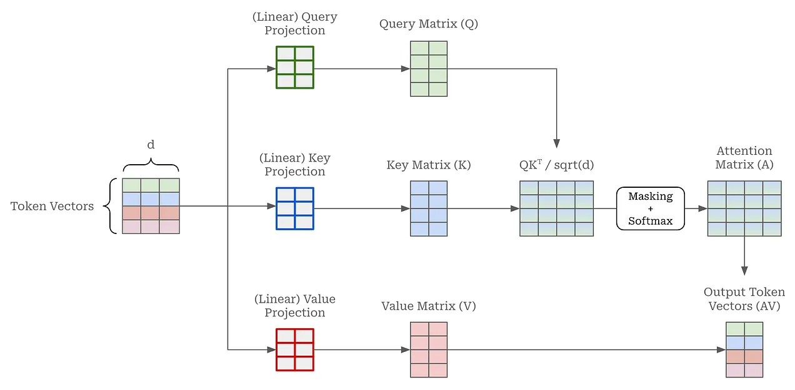

**Masked self-attention:**  Each self-attention layer has 64 parallel attention heads, each with dimension 64. So the key, query, value projections transform embedding vectors from 2880-dim to 64-dims

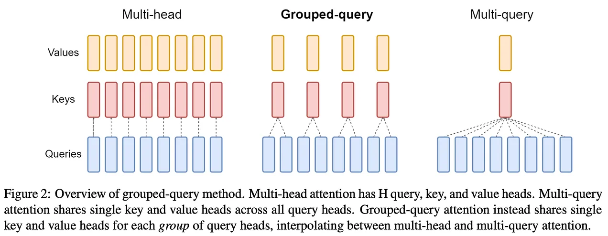

**Grouped Query Attention (GQA):** Best tradeoff because at inference time, because fewer keys/values to be retrieved from KV cache. MQA has been shown to quality degradation and training instability

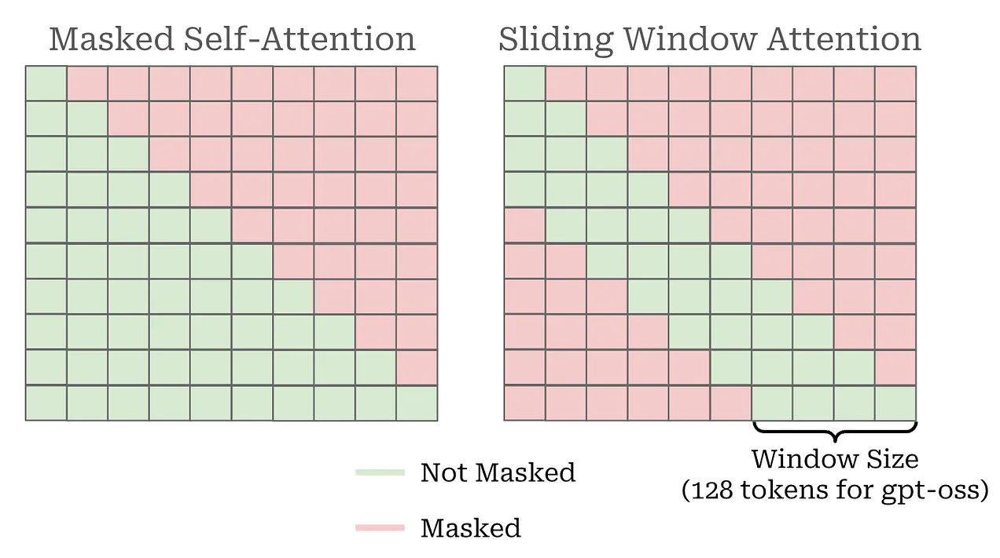

**Sparse Attention (aka Locally Bandeded Sparse Attention):** One diagonal is masked as usual causal attention. Also masking tokens that are *sufficiently far in the past*. Sparse because **every other masked self-attention module is replaced with sliding window attention**. All to avoid $O(n^2)$ complexity.

> 1:1 ratio of dense and sparse attention layers is still conservative. E.g. Gemma-3 uses 5:1 ratio

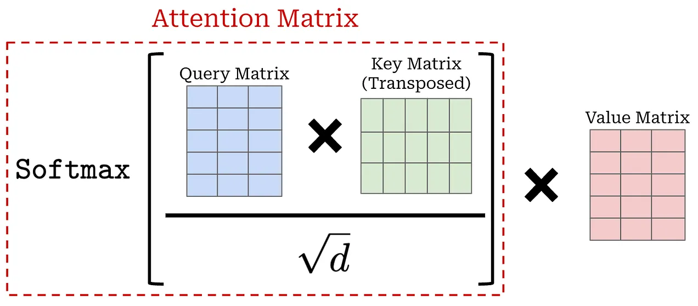

> Self attention is essentially a weighted sum of the value vectors. Where weights are given by the attention scores

**Attention Sinks:** Since softmax forces a probability distribution - *it is IMPOSSIBLE for the model to NOT pay attention to any tokens.* It has been found that LLMs assign spuriously high attention scores to (usually) the first token in a sequence - commonly referred to as **"attention sinks"**. Super high scores assigned by LLMs to attention sinks can lead to practical issues, e.g., outlier attention values make quantization more difficult.

> Qualcomm AI researchers found that 97%+ of outlier activations in LLMs occur in whitespace and punctuation positions

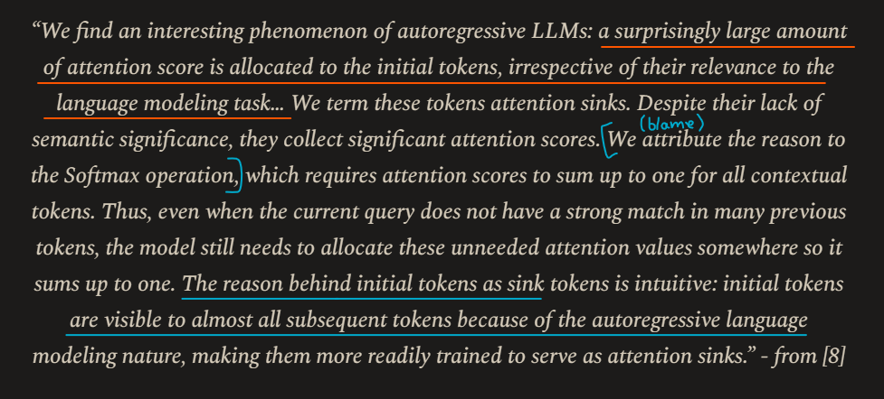

***NOTE:*** Expand this image from Evan Miller's blog and read the highlights. It is lovely!

To solve this issue, authors use an approach simlar to (not exactly same though) the one proposed by Evan Miller. *"Each attention head has a learned bias in the denominator of the softmax, similar to off-by-one attenion and attention sinks, which enables the attention mechanism to pay no attention to any tokens"*

### Mixture of Experts (MoE)

Instead of dense feedforward layers, every P-th layer is replaced with a MoE layer **(stride P)**. Each MoE layer has several expertsi.e. feedforward networks with their own independent weights. *Each MoE block consists of a **standard linear router** projection that maps residual activations to scores for each expert*

> For a token (d-dim vector), we want to select a subset of experts(of size k) that will perform a forward pass on this token.

To aggregate the outputs of each expert, we simply take a weighted average across all experts, where weights are the softmax scores from the router. *"We select the **top-4 experts** for each token given by the router, and weiht the output of each expert by the softmax of the router projection over only the selected experts"*

**Load balancing:** (i) model learns to route all tokens to single expert (*routing collapse*), (ii) numerical unstabilities while training. MoEs use a **load balancing loss** that is minimised when

- MoE assigns equal probability to all experts
- MoE dispatches an equal number of tokens tokens to each expert

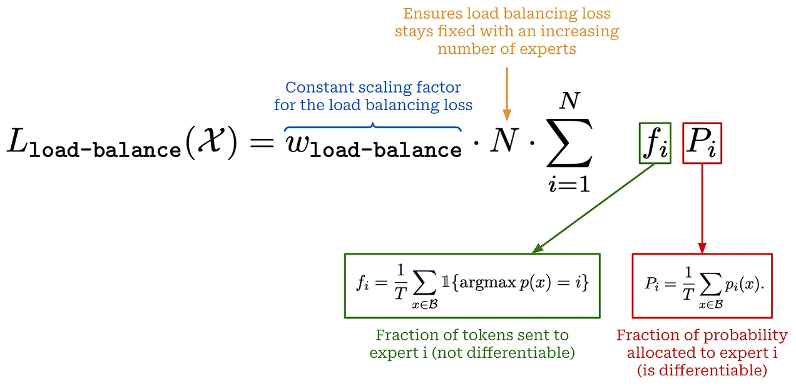

To reduce numerical instability, another auxiliary loss term - **router-z loss** is used. It constrains logits outputted by the router. These logits are prone to instability because they are passed into *the exponential* softmax for deriving expert weights.

> Large router logits are key source of numerical instability of MoE training

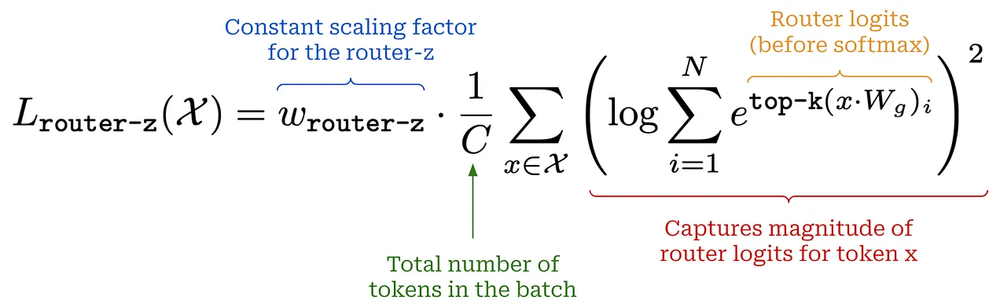

**Capacity factor:** To limit the maximum number of tokens assigned to each expert. Any tokens beyond capacity are dropped for that expert. Also allows us to *fix the batch size per expert*!

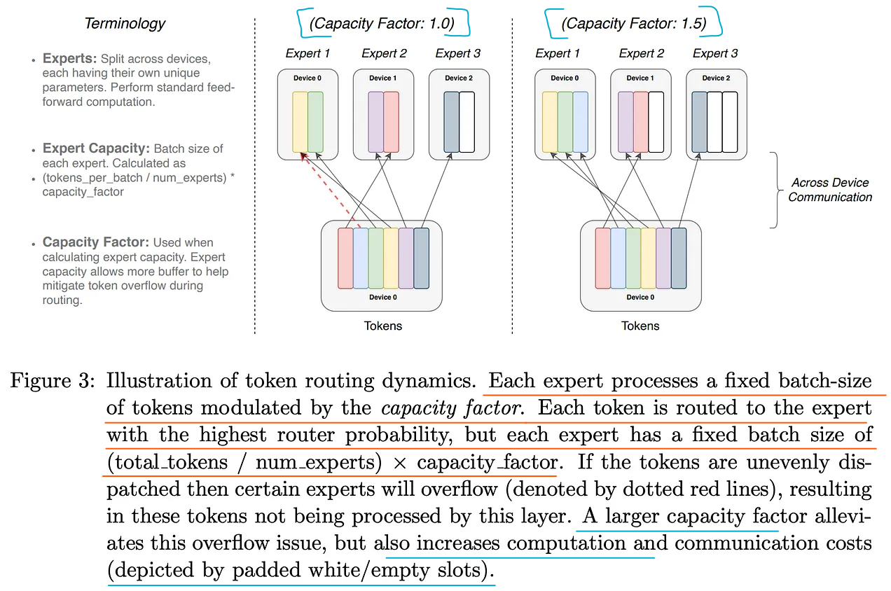

> Auxiliary losses, like regularisation, negatively impacts performance. DeepSeek-V3 uses an auxiliary-loss-free approach that adds a bias term to the router logits by each expert. But authors still use auxiliary losses - just with much lower weight.

**Other factors:** Uses **FlashAttention** and *expert optimised* **triton kernels**

## Content Management for the Agentic Era

*Agents and reasoning are the most heavily emphasised aspects of GPT-oss*

### Tokeniser

**Byte Pair Encoding**

**Chat templates:** Need special tokens like `<eos>`, `<|end_of_text|>`. Need chat templates to encode complex conversations into a flat prompt. Example from Qwen-3 with special tokens highlighted

**Tool usage:** Tool calls are generated inline with an LLM's standard output

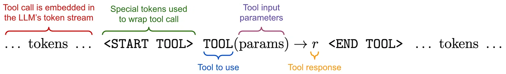

When the special `START TOOL>` token is generated, we

1. Stop generating text with the LLM
1. Parse arguments for the tool call from model's output
1. Make tool call
1. Add output from tool into LLM's text sequence
1. Continue generating the rest of the sequence

**Reasoning models:** Begin their output with the special `<think>` token. Once reasoning concludes, the model generates `</think>` token. Final generation ends with a standard `|im_end|` token.

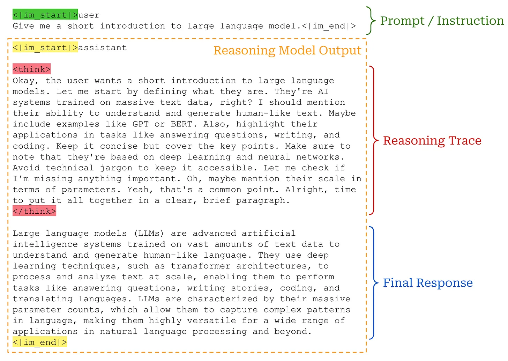

### Harmony format for Agents, Reasoning, Tool Calling

| Models              | Tokenizer       | Vocab Size |
|---------------------|-----------------|------------|
| GPT-4o, GPT-4o-mini | o200k           | 200K       |
| GPT-oss             | o200k_harmony   | 201,088    |

*roles in the Harmony prompt format below*

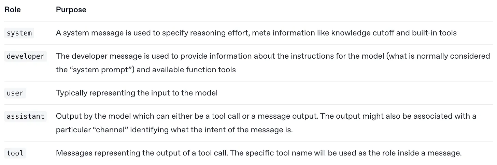

Instruction heirarchy: Which part to obey if multiple instructions conflict?

`System > Developer > User > Assistant > Tool`

The `Assistant` role has three channels within it -- `final` (shown in UI), `analysis`, and `commentary`

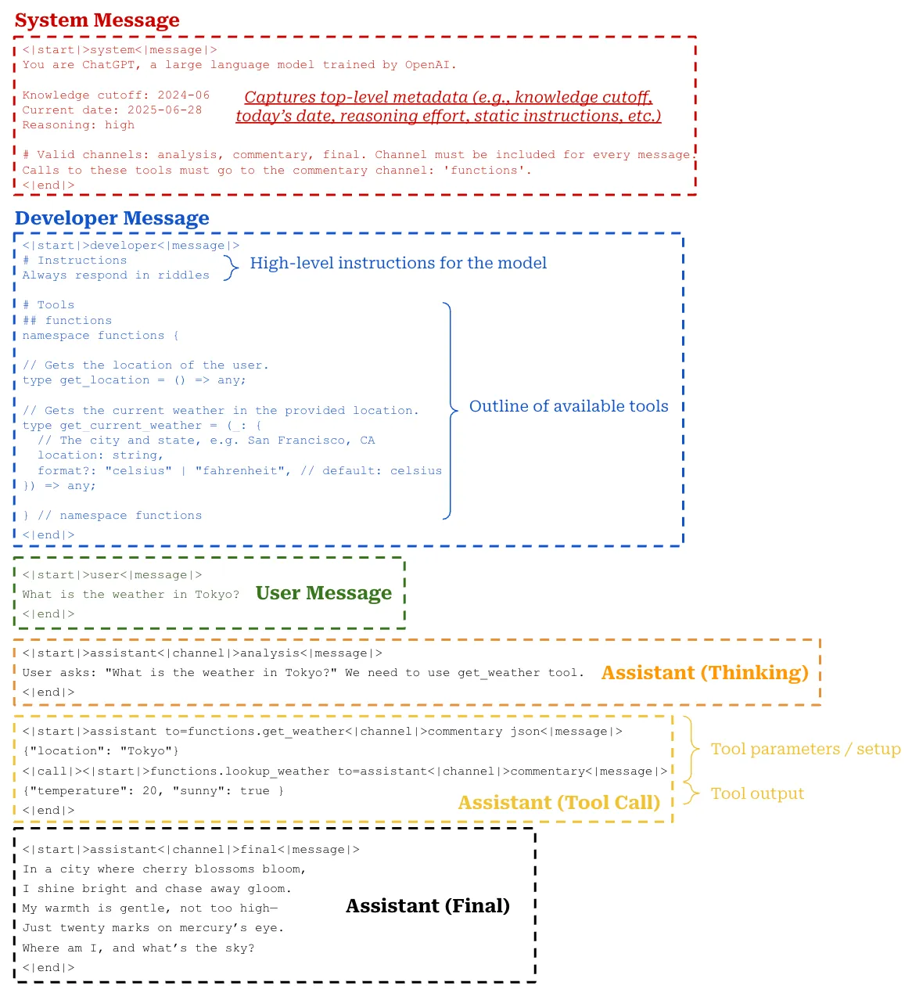

### Long Context

> ***READ: AMAN ARORA'S YARN BLOG (1_Resources_NLP/AmanArora/YaRN/readme.md)***

#### **Absolute Postition Embeddings (APE)**

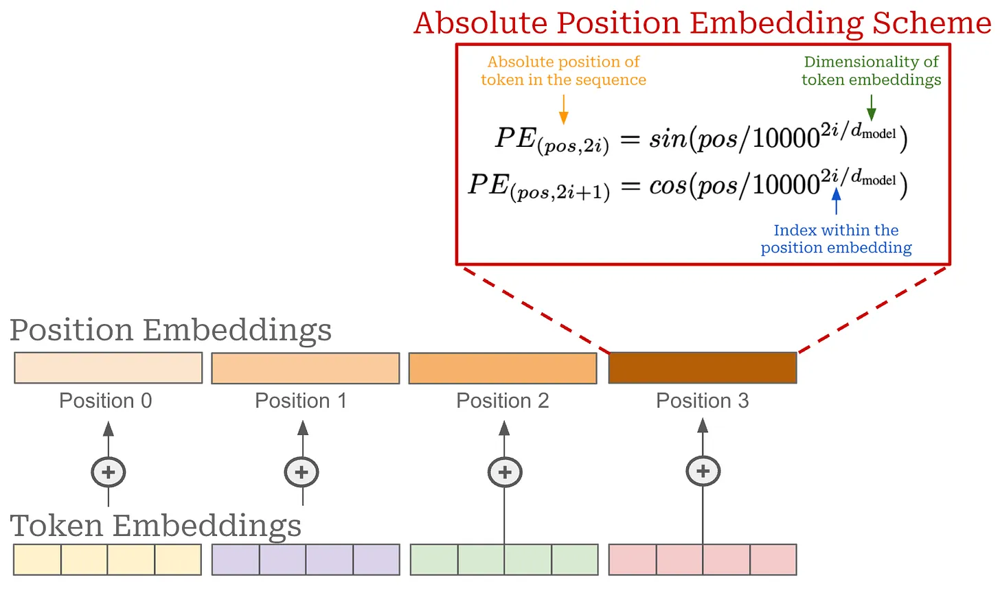

#### **RoPE** 

Unlike APE, RoPE acts upon every transformer layer - *not just the input layer*

Usual way to get Key vector ($k_i$): $$ W_{k}^{\top} x_i \rightarrow k_i $$  
With RoPE we multiply by a **rotation matrix**  $$ R(\theta, i) \cdot W_{k}^{\top} x_i \rightarrow f_k(x_i, \theta)$$

Remember how $\theta$ is a vector of size $d/2$

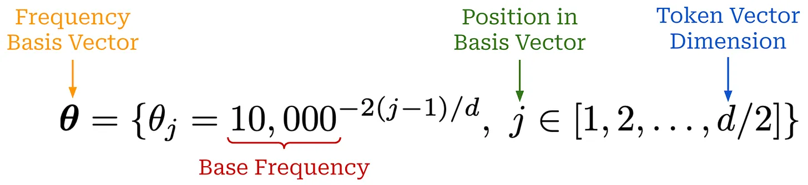

Then get the expression for the Rotation matrix $  R(\theta, i) $  
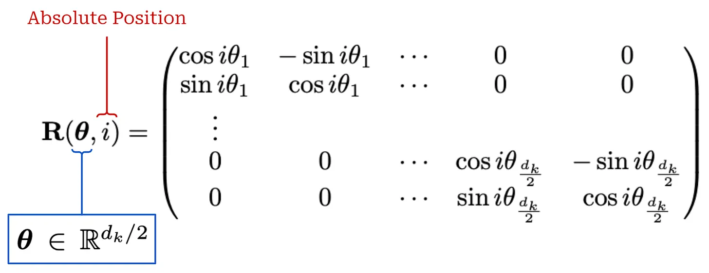

After being multiplied by this matrix, EACH PAIR of dimensions in output embedding is rotated based upon

1. Absolute position of token in sequence $i$
1. The entry of $\theta$ corresponding to that dimension pair

Again, rotation matrix is applied IN EVERY TRANSFORMER LAYER to both Key and Query projections

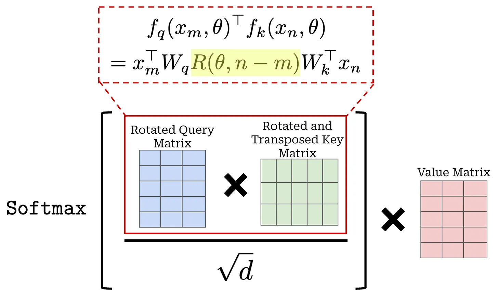

**Most important:** When we multiply rotated keys and queries, the rotation matrix combines to form a single rotation matrix $R(\theta, n - m)$ So the combination of rotating the key and query vectors in self-attention captures the relative distance between tokens. ***Rotation matrices inject the relative position of each token pair directly into the self-attention scores.***

To extend context further, YaRN is used!

> RoPE is still scaling of position indices. Base frequency remains same

#### **Position interpolation**

Assuming $L$ is original context window, $L'$ is desired context window after extension, define $s = L / L'$. Assuming $L' > L$, get position matrix

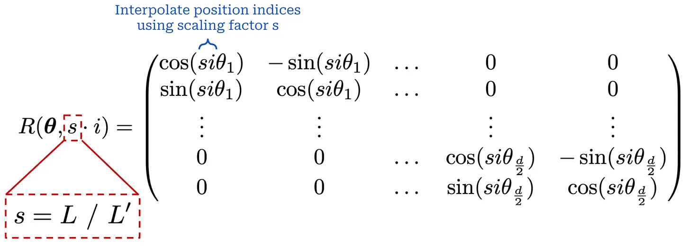

Ensures larger positions - upto length of $l'$ are fall within original context window. *Since only position indices are changed and NOT the values of the rotation basis vector $\theta$, this is called **blind interpolation***

#### **NTK-aware interpolation**

| Model   | Original frequency basis |
|---------|--------------------------|
| RoPE    | 10 k                     |
| Gemma-3 | 1 M                      |
| Llama 3 | 500k                     |

**Since every dimension of RoPE is scaled equally,** performance on short context drops at the cost of teaching the LLM to handle longer contexts. Need a NON-UNIFORM approach for interpolation. Done by **scaling frequency-basis** intead of scaling position indices. This is NTK-aware interpolation

> NTK-aware interpolation still performs uniform scaling of the base frequency - *wavelength is not considered*

#### **NTK-by-parts**

Define a wavelength $\lambda$ for each dimension of the frequency basis vector in RoPE. For dimension $j$ of frequency basis vector $\theta$, $$ \lambda_j = \frac{2\pi}{\theta_j} $$

**Perform interpolation based on the wavelength of a given dimension**. Define ratio $$r(j) = \frac{L}{\lambda_j} = \frac{L \theta_j}{2\pi}$$ and *use this to determine base frequency used by a given RoPE dimension*

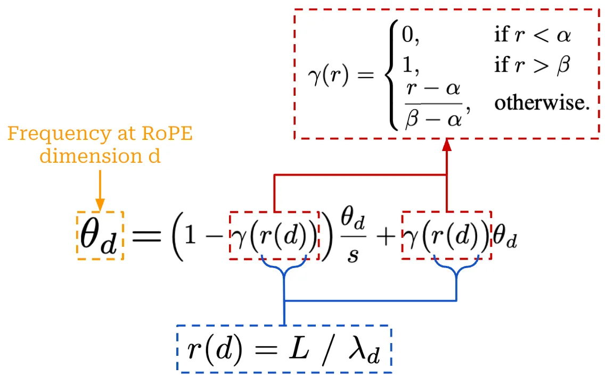

***CRUX***

1. If $\lambda_j << L$  then perform no interpolation
1. If $\lambda_j > L$ then interpolate the base RoPE frequency
1. Else perform a bit of both

> MAIN IDEA: Control how much interpolation is performed dynamically based on the frequency of each RoPE dimension.

#### **YaRN**

Very similar to NTK-by-parts interpolation. Uses same interpolation technique as above, with a temperature scaling parameter $t$ to the softmax in self-attention.

$$ \text{softmax}\left(\frac{\mathbf{q}_m^T \mathbf{k}_n}{t\sqrt{D}}\right) $$

where $\sqrt{\frac{1}{t}} = 0.1\ln(s) + 1$

## What I didn't cover

- Training
- Post training
- Alignment
- Safety
- Evaluation in biology and cybersecurity

## What the technical report does not cover

- Data! Data is OpenAI's key differentiator. Model architectures and training algorithms are essential to understand, but collecting and optimising data *tends to have the highest impact*
