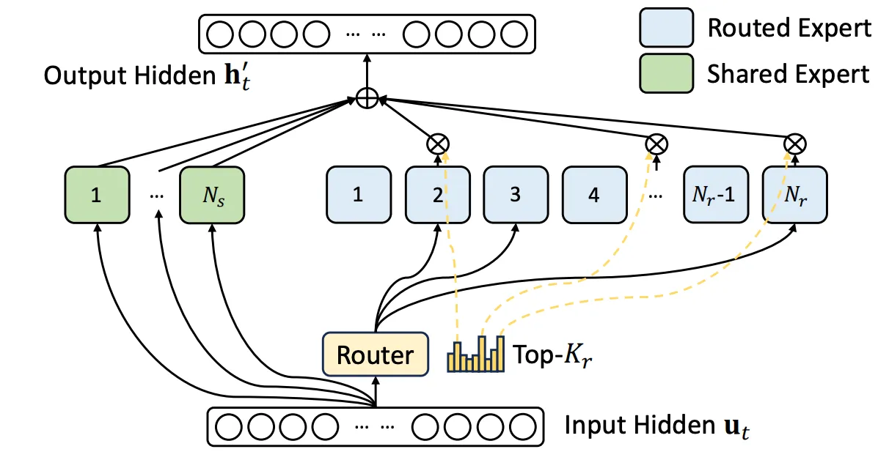

# Notes from Cameron Wolfe's substack titled 'Llama-4: The Challenges of Creating a Frontier-Level LLM'

<https://cameronrwolfe.substack.com/p/llama-4>

>> The recent release of Llama 4 was far from perfect, but there is a lot that can be learned from this new generation of models. Put simply, Llama 4 is a massive pivot in Meta's research direction. Such significant changes incur a lot of risk-there is a huge chance that these models will perform poorly at first. The most beautiful-or frightening for model developers-aspect of open LLM research is the fact that these learnings are happening in public. In this overview, we will gain a better understanding of how modern, frontier-level LLMs are developed do exactly this by gaining a deep understanding of LLama 4 and related models.

## Llama 4 Model Architecture

### Mixture-of-Experts (MoE)

> Llama 3 paper said that they opt for a standard dense Transformer model architecture with minor adaptations, rather than for a mixture-of-experts model *to maximize training stability*.

Note that larger MoE models introduce extra complexity to training and inference. However, **dense models - though simple and effective - are difficult to scale. By using an MoE architecture, we can drastically improve the training (and inference) efficiency of very large models, thus enabling greater scale.**

Decoder only transformer:  

#### RECAP OF MOE

MoEs modify the feed-forward component of the transformer block. *Instead of having a single feed-forward network in each block, we have several feed-forward networks, each with their own independent weights*. We refer to each of these networks as an **expert**

**Each expert in the MoE is identical in structure to the original, feed-forward network from that layer**, and we usually convert only a subset of transformer layers into MoE layers; e.g., Llama 4 uses interleaved MoE layers where every other layer of the transformer becomes an expert layer.

#### ROUTING MECHANISM

We select a **subset of experts (e.g., one or two experts)** - referred to as the "active" experts or parameters-to use for each token. This selection is done by passing each token vector through a linear layer that outputs a probability distribution over the set of experts.

> The gating network tends to converge to a state where it always produces large weights for the same few experts. This **imbalance is self-reinforcing**, as the favored experts are trained more rapidly and thus are selected even more by the gating network

#### LOAD BALANCING AND TRAINING STABILITY

If we *train an MoE similarly to a standard dense model*, several issues are likely to occur.

1. The model will quickly learn to route all tokens to a single expert - a phenomenon known as **routing collapse**.
1. MoEs are more likely to experience **numerical instabilities during training**, potentially leading to a divergence in the training loss.

To avoid these issues, most MoEs employ a **load-balancing loss** during training, which *rewards the MoE for assigning equal probability to experts and routing tokens uniformly*. It is like adding an extra loss term to the standard, next-token prediction loss.

> These auxiliary losses can impact the performance of the model, which has led some popular MoE-based LLMs (e.g., DeepSeek-v3) to avoid them altogether.

No statement is made about auxiliary losses in Llama 4's paper. However, DeepSeek-v3 uses an auxiliary-loss-free load-balancing strategy. Other tricks include *better weight initialization* or *selective precision*.

> The primary takeaway we should glean from this information is the simple fact that MoEs-despite their many benefits-are much harder to train compared to standard dense models.

#### LLAMA 4 MOE ARCHITECTURE

| Model | Total Parameters | Active Parameters | Experts per Layer | Release | Notes | GPU |
| --- | --- | --- | --- | --- | --- | --- |
| Scout | 109B | 17B | 16 | open | inference efficiency like Gemini Flash or GPT-4o-mini | fits on a H100 GPU (with Int4 quantization) |
| Maverick | 400B | 17B | 128 | open | like DeepSeek-v3 | needs a single H100 *host* i.e. distributed inference |
| Behemoth | 2T *(whaaaaaat)* | 288B | 128 | preview | like GPT-4-esque | |

#### SHARED VS ROUTED EXPERTS

Similarly to DeepSeek-v3, Llama 4 models use both shared and routed experts. **Shared expert means that all tokens are passed to this expert with 100% probability**-and selects one active routed expert per token using a routing mechanism

> Only a **single routed expert (in blue above) is selected per layer in Llama 4,** whereas **DeepSeek** has multiple shared experts and **eight active routed experts per layer** (i.e., 37B active parameters and 671B total parameters). This smaller number of active parameters improves both the training and inference efficiency of Llama 4. *In fact, Llama 4 models were reported to have used less compute during training relative to Llama 3 despite a drastic increase in data and model scale.* ***AMAZEEEEEE***

#### FINE-GRAINED EXPERTS

To use fine-grained experts, we just:

1. Increase the number of experts in each MoE layer
1. Decrease the size (number of parameters) for each individual expert

|  | Advantages | Disadvantages |
| --- | --- | --- |
| Fine-grained experts | Specialised experts; more performance and efficiency | Increased complexity into the distributed training process |

> The Scout model has 16 total experts, while Maverick has 128 total experts. Given that Maverick has 16× the number of experts but only 4× the number of total parameters compared to the smaller Scout model, it must be using fine-grained experts.

#### EXPERT PARALLELISM

1. Experts are typically *distributed across multiple GPUs* during training (i.e., expert parallelism)
1. We can usually fit multiple fine-grained experts into the memory of a single GPU
1. However, because we usually select a larger number of experts when using fine-grained experts, we could run into an issue where *each token* has to be routed to *multiple different GPUs* in the cluster (to go throgh the larger number of experts), thus creating a drastic increase in communication costs between GPUs.

> crazy crazy - *We ensure that each token will be sent to at most M nodes, which are selected according to the sum of the highest K / M affinity scores of the experts distributed on each node. Under this constraint, our MoE training framework can nearly achieve full computation-communication overlap.* - from DeepSeek-v3 paper

As a result, we must adopt some strategy to limit communication costs and improve training efficiency. For example, **DeepSeek-v3 uses the node-limited routing scheme described above, which restricts the number of devices to which a single token can be routed.** We can avoid this extra complexity by not using fine-grained experts.

#### IMPACT TO OPEN LLMs

Even if MoEs don't use all parameters during inference, but we still have to fit the model’s parameters into GPU memory $\implies$ **MoEs have a much higer memory footprint.** Need distributed inference on a multi-GPU host.

> The barrier to entry for using Llama models is increased. Hence, we need more distilled versions like DeepSeek-R1 (671B, MoE) that was distilled into several dense LLMs from 1.5B to 70B parameters.

### Native Multi-modality and Early Fusion

Llama 4 models support visual inputs-both images and videos. However, it takes a drastically different approach to multi-modality!

#### MULTI-MODAL ARCHITECTURES

Usually consists of *(i.)* an LLM backbone (decoder-only transformer) and *(ii.)* a vision encoder (CLIP or ViT)

There are two primary model architectures that can be used for fusing text and visual information together:

- **Unified embedding:** Concatenates both image and text tokens at the input layer to form a single input sequence
- **Cross-modality attention:** Passes text tokens as input to the LLM and fuses visual information into the model via additional cross-attention layers

#### MULTI-MODAL TRAINING

> This is important! These are proper terms.

- **Native multi-modality $ \approx $ early fusion:** Train the vLLM from scratch using multi-modal data from the beginning.
- **Compositional multi-modality $ \approx $ late fusion:** Begin by training a separate LLM backbone and vision encoder, then perform extra training to fuse them together.

Native multi-modality introduces extra complexity into the training process (e.g., imbalances between modalities). However, it expands the scope and volume of data to which the model can be exposed. Early fusion can be more efficient and performant in some cases too.

> Llama 4 models are designed with native multimodality, incorporating early fusion. Early fusion enables us to jointly pre-train the model with large amounts of unlabeled text, image, and video data. - from Llama 4 blog. Google and OpenAI have also adopted this approach.

Prior Llama variants (e.g., Llama 3.2 Vision) use a cross-modality attention architecture and are trained with a compositional approach. Migrating to native multi-modality allows Llama 4 models to draw upon multiple modalities of data when constructing their massive 30T token pretraining dataset-more than 2× larger than that of Llama 3.

#### EARLY FUSION

Means that images and text are combined at the input-level of the LLM, is used to describe the architecture of Llama 4 models. Alternatively, *late fusion* architectures (e.g., cross-modality attention) combine image and text data in a later layer of the LLM.

> Although Llama authors do not provide many details on the architecture of Llama 4, we can look at Chameleon - a recent publication from Meta on the topic of native multi-modality and early fusion - for hints on what might be happening in Llama 4.

  
*The Chameleon architecture - it is trained using a natively multi-modal approach and is capable of generating images as output*

> ***Didn't understand the right-side part.***

Due to Chameleon's native multi-modality, authors experienced many unique difficulties like *(i.)* more frequent training instabilities and *(ii.)* being harder to scale compared to a standard text-based LLM. **Few notable changes made to the transformer architecture** to get around these challenges:

- **Layer norm** is applied to the query and key vectors during attention.
- **An additional dropout module** is added after each attention and feed-forward layer in the transformer.
- The position of layer norm in the transformer block is modified (i.e., a **post-norm structure** is adopted instead of the more standard pre-norm).

> Although Llama 4 is not confirmed to use any of the architectural tricks from Chameleon, these lessons are universally useful for any model trained using a natively multi-modal approach.

#### THE VISION ENCODER

Although the Chameleon architecture largely matches the structure of the unified embedding model described above, **notice that Chameleon has no image encoder!** Instead, we **directly quantize images into discrete token embeddings**, as described in [this paper](https://arxiv.org/abs/2203.13131).

> Note: Fuyu (a model!) breaks images into patches—and linearly projects these patches to make them the same size as a text token vector. Then, the LLM can directly ingest these image patch embeddings as input. *The main motivation for this approach is the fact that relevant information from the image may be lost when we pass that image through a vision encoder - CRAZY TO ASSUME THIS?!*

Unlike Chameleon, **Llama 4 uses a vision encoder that is based upon MetaCLIP** — an open replication of CLIP that is trained in conjunction with an LLM to

- improve the quality of its embeddings
- better align the visual embeddings with textual embeddings from the LLM

> *We also improved the vision encoder in Llama 4. This is based on MetaCLIP but trained separately in conjunction with a frozen Llama model to better adapt the encoder to the LLM* - from Llama 4 blog

### 10M Token Context Window

A variety of tricks involving modified position embeddings, scaled softmax, and long-context focused training procedures help in extending Llama 3’s context length of 128K tokens to 10M tokens in Llama 4 Scout.

> Quick recap: Self-attention does not consider positions i.e. it is position agnostic. Therefore we add positional information explicitly. Many position encoding schemes exist, such as standard Absolute Position Embeddings **(APE)**, Rotary Position Embeddings **(RoPE)**, Attention with Linear Biases **(ALiBi)**, and more.

  
*Absolute Position embeddings*

  
*Rotary Position embeddings*

>> ***Check the Rotary-embds for more info about RoPE. Content taken from this blog is also kept there. It is crazyy***

In a nutshell -

- The rotation matrix in RoPE is a block-diagonal matrix. It is computed based on absolute position of a token in the sequence.
- Each of those blocks rotates a pair of two dimensions of the (d-dimensional) vectors.
- It is applied to the query and key vectors. In every transformer layer.
- To calculate attention, i.e. $softmax [ \dfrac {Q * K^T}{\sqrt d} ] * V$, the two rotated matrices used to rotate the keys and queries respectively, combine to form a single rotation matrix $R(θ, n - m)$
- In other words, the combination of rotating both the key and query vectors in self-attention captures the relative distance between tokens in the sequence.

  

> **This is the crux of RoPE! It injects the relative position of each token pair directly into the self-attention mechanism!**

  
***what is happening here!***

#### LENGTH GENERALISATION

If a sequence much longer than the sequences upon which the LLM was trained is passed, the performance of the model will drastically deteriorate. Position embeddings play a key role in an LLM’s ability to generalize to longer context lengths

Position encoding schemes—including RoPE—fail to generalize well to long context lengths. RoPE performs similarly to absolute position encodings when generalizing to long context lengths. However, the **No Positional Embedding (NoPE) scheme, which simply removes position embeddings from the model, is surprisingly capable of generalizing to longer contexts.**

  

*The fact that NoPE works well is surprising, but empirical (and theoretical) analysis reveals that transformers can represent both relative and absolute position encodings without using explicit position embeddings.*

Practically, the attention patterns learned by NoPE are shown to resemble relative position encodings; see above. Drawing upon these results, Llama 4 models **interleave standard transformer layers that use RoPE with layers using NoPE.** This approach, called **interleaved RoPE (iRoPE)**, improves long context abilities.

> A key innovation in the Llama 4 architecture is the use of interleaved *attention layers without positional embeddings*. Additionally, we employ inference time temperature scaling of attention to enhance length generalization. - from Llama 4 blog

#### TEMPERATURE SCALING

Every transformer layer has a softmax operation in attention mechanism. For element $i$ of an $N$-dimensional vector is

$$
Softmax(x_i) = \dfrac{\exp(x_i)} {\sum_{j=1}^{N} \exp(x_j)}
$$

**The denominator of this expression—the sum of raw attention scores for all pairs of tokens in the sequence** — will become larger with increasing context length, but the numerator is decoupled from the context length and fixed in magnitude. These two facts create an interesting phenomenon in attention scores for long contexts: *attention scores get smaller as the context length grows larger*. To mitigate this issue, Scalable-Softmax is used -
$$
Scalable-Softmax(x_i) = \dfrac{N^{s \cdot x_i}} {\sum_{j=1}^{N} N^{s \cdot x_j}}
$$

- **s**: a scaling parameter that can be tuned to change the function’s shape
- **N**: the length of the input vector

> Scalable-Softmax is just a function that converts a vector of values into a valid probability distribution.

By including the length of the input vector in Scalable-Softmax, we can balance the scale of the numerator and denominator, prevent long context attention scores from decaying and improve long context capabilities.

  
*Ooo niceee*

#### CONTEXT EXTENSION

Training directy on long context is memory intensive. Instead we can train the model in two stages-

- Standard pretraining with lower context length
- Finetuning on a long context dataset, also known as **context extension**.

> We continued training the model in mid-training to improve core capabilities with **new training recipes including long context extension using specialized datasets.** This enabled us to enhance model quality while also *unlocking best-in-class 10M input context length* for Llama 4 Scout - from Llama 4 blog

> In most cases, the training data used for context extension is synthetic—either created with heuristics or an LLM—due to the difficulty of collecting real long-context data. *The quality of the synthetic data used for context extension can drastically impact the model's capabilities*. This data must accurately resemble and capture the types of tasks that the model will solve in practice. **The long context abilities of Llama 4 models break down in practice, possibly due to this issue.**

There are two main categories of approaches used for extending the context of an LLM:

- **Position Interpolation**: these techniques *adjust the frequency basis of RoPE* such that larger positions still fit within the model’s known context length; e.g., Position Interpolation, NTK-RoPE, YaRN, and CLEX.
- **Approximate Attention**: these techniques modify the structure of attention to only consider *certain groups of tokens (e.g., based on a blocks, landmarks or a sliding window)* when computing attention scores.

We see that position interpolation-style methods tend to perform the best. In particular, **NTK-RoPE achieves very impressive performance due to its ability to dynamically adjust frequencies in RoPE so that the frequency of nearby tokens is not changed too much.** These techniques are very commonly used for training LLMs.

> As a concrete example, see page four of the Qwen-2.5 report where **authors describe increasing the base frequency of RoPE before performing long context training.**
