# Notes from Cameron Wolfe's substack titled 'Basics of Reinforcement Learning for LLMs'

<https://cameronrwolfe.substack.com/p/basics-of-reinforcement-learning>

**When is RL useful?** We **cannot apply a loss function** that trains the language model to maximize human preferences with supervised learning. Why? Well, the **score that we get from the human is a bit of a black box.** There's no easy way for us to explain this score or connect it mathematically to the output of the neural network.

> In other words, we cannot backpropagate a loss applied to this score through the rest of the neural network. This would require that we are able to differentiate (i.e., compute the gradient of) the system that generates the score, which is a human that subjectively evaluates the generated text.

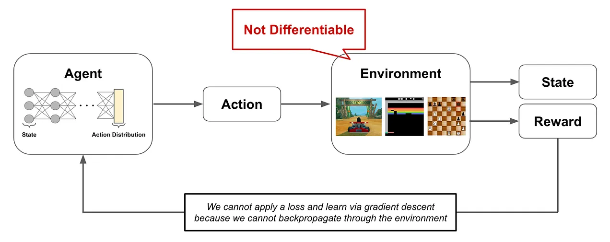

**Big picture.** RL allows us to learn from signals that are non-differentiable and, therefore, not compatible with supervised learning. **Put simply, this means that we can learn from arbitrary feedback on a neural network's output!** In the case of RLHF, we can score the outputs generated by a language model according to any principle that we have in mind. Then, we can use **RL to learn from these scores,** no matter how we choose to define them! **In this way, we can teach a language model to be helpful, harmless, honest, more capable (e.g., by using tools), and much more.**

## Formal Framwork

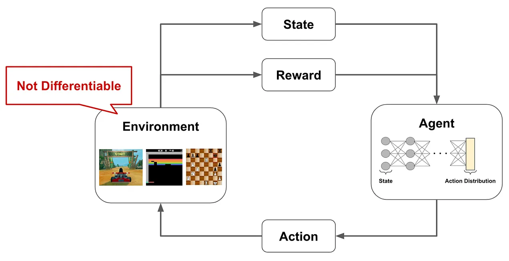

- An **agent** that is interacting with an **environment**. The agent has a **state** in the environment and produces **actions**, which can modify the current state, as output. As the agent interacts with the environment, it can receive both positive and negative **rewards** for its actions. The agent's goal is to maximize the rewards that it receives, but there is **not a reward associated with every action taken by the agent!** Rather, rewards may *have a long horizon*, meaning that it takes several correct, consecutive actions to generate any positive reward.

## Markov Decision Process (MDP)

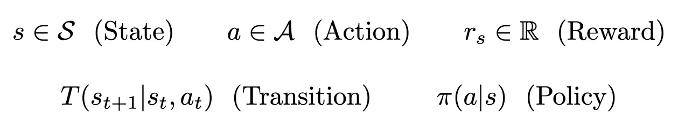

- States and actions have discrete values *since finite set?*
- Rewards are real numbers

In an MDP, we define two types of functions: (i) **transition** and (ii) **policy** functions.

- The **policy** takes a state as input, then outputs a *probability distribution over possible actions.*
- Given this output, we can *make a decision for the action* to be taken from a current state
- The **transition** is then a function that *outputs the next state based upon the prior state and chosen action.*

Using these components, the agent can interact with the environment in an iterative fashion

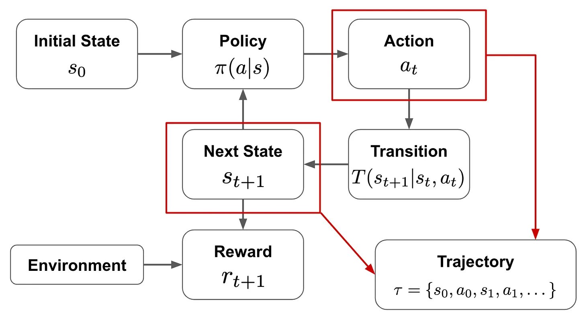

> Think of the agent as implementing the policy within its environment. The policy describes how the agent chooses its next action given the current state. The agent follows this strategy as it interacts with the environment, and our goal is to learn a policy that maximizes the reward that the agent receives from the environment.

As the agent interacts with the environment, we form a **trajectory** of states and actions that are chosen throughout this process. Then, given the reward associated with each of these states, we get a total return given by the equation below, where **$γ$** is the **discount factor**. This return is the summed reward across the agent's full trajectory, but **rewards achieved at later time steps are exponentially discounted by the factor $γ$**

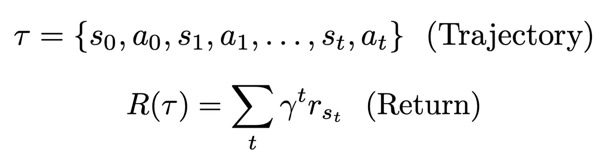

The goal of RL is to **train an agent** that **maximizes this return**. Equated as **finding a policy that maximizes the return** over trajectories that are sampled from the final policy

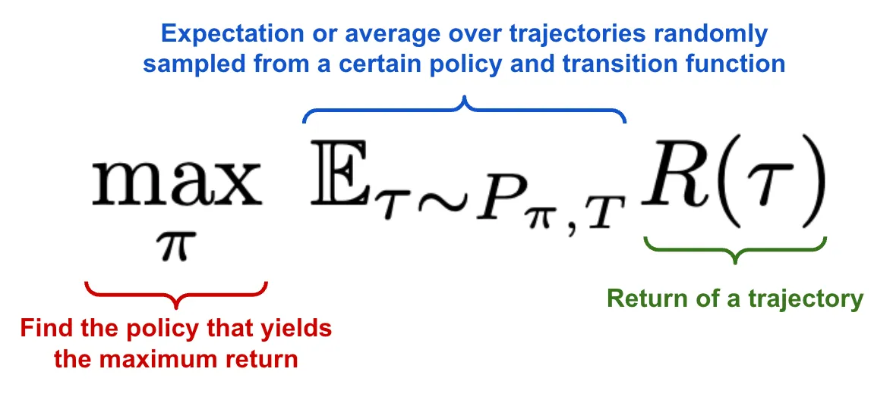

## RL for LLMs

At inference, the LM

1. Predicts the next token.
1. Adds the next token to the current input sequence.
1. Repeats.

To view this setup from the lens of RL

- Consider our **language model to be the policy.**
- **State is the current textual sequence.**
- Given this state as input, the language model (policy) can **produce an action-the next token** - that modifies the current state to produce the **next state-the textual sequence with an added token**.
- Once a full textual sequence has been produced, we can obtain a **reward by rating the quality of the language model's output**, either with a *human or a reward model* that has been trained over human preferences.

> OOOOOOFFFFFFF!!

We begin to see that the problem formulation used for RL is quite generic. There are many different problems that we can solve using this approach!

## Terms and Definitions

**Trajectory**: Sequence of states and actions that describe the path taken by an agent through an environment. <br>
**Episode**: Sometimes the environment has a well-defined end state. When this happens, we refer to the trajectory so far as an episode.<br>

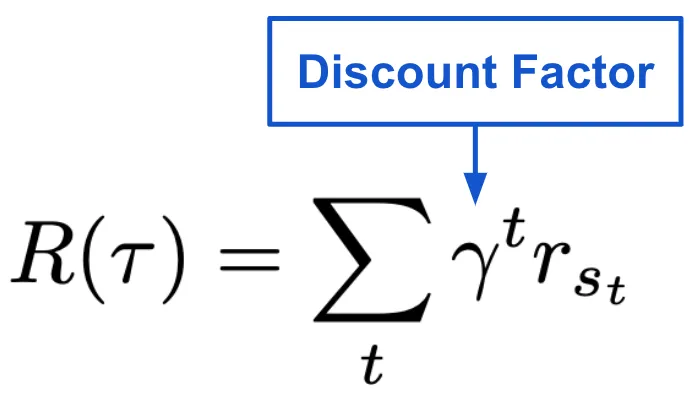

**Return**: Summed reward received along a trajectory. Includes a **Discount Factor** to account for the fact that rewards further into the future are less important than those closer to the present.

> Although the intuitive explanation of the discount factor is easy to understand, the exact formulation we see above is rooted in mathematics and is actually a complex topic of discussion [link](https://stats.stackexchange.com/questions/221402/understanding-the-role-of-the-discount-factor-in-reinforcement-learning)

**Policy**

- *Target policy*: the policy our agent is aiming to learn.
- *Behavior Policy*: the policy being used by the agent to select actions as it interacts with the environment.

**On vs. Off-Policy**: whether the behavior policy is the same as the target policy (on-policy) or not (off-policy).

> *RL trains a neural network* via interaction with an environment. The policy that this neural network implements takes a current state as input and produces a probability distribution over potential actions as output.

**$ε$-Greedy Policy**: How do we choose which action to actually execute? One of the most common approaches is an $ε$-greedy policy, which **selects the action with the highest expected return most of the time** (i.e., with probability $1 - ε$) and a random action otherwise. Such an approach balances [exploration and exploitation](https://www.geeksforgeeks.org/epsilon-greedy-algorithm-in-reinforcement-learning/) by allowing the agent to explore new actions in addition to those that it knows to work well.

## Q-Learning

> Q-Learning is a model-free RL algorithm, meaning that we don't have to learn a model for the environment with which the agent interacts.

We *don't have to train a model to estimate the transition or reward functions* -these are just given to us as the agent interacts with the environment. <br>

The goal of Q-Learning is to **learn the value of any action at a particular state.** We do this through learning a **Q function**, which defines the value of a state-action pair (input) as the *expected return* of taking that action at the current state under a certain policy and continuing afterwards according to the same policy.

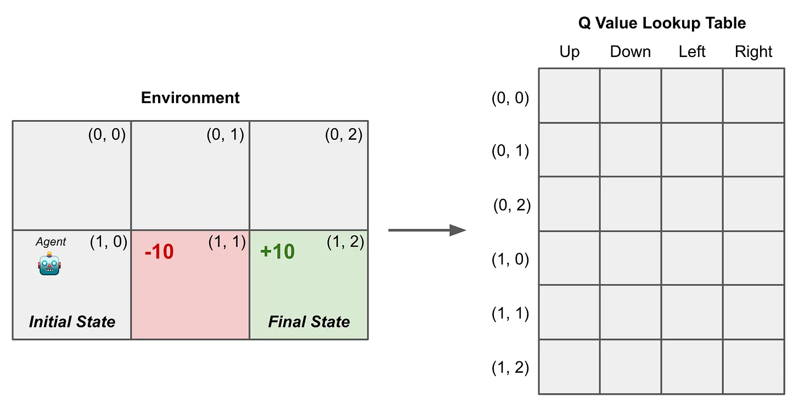

To learn this Q function, we create a lookup table for state-action pairs. Each entry of the lookup table represents the Q value (i.e., the output of the Q function) for a particular state-action pair. These Q values are initialized as zero and updated-using the *[Bellman equation](https://towardsdatascience.com/the-bellman-equation-59258a0d3fa7)*-as the agent interacts with the environment until they become optimal.

**The Algorithm** <br>


Iterate over:

1. Pick an action to execute from the current state (using an ε-Greedy Policy).
1. Get a reward and next state from the **(model-free) environment.**
1. Update the Q value based on the Bellman equation.

As highlighted in the figure, update to the Q value considers

- Reward of the *current action*
- Q value of the *current state*
- Q value of the ***next state***

However, given that our agent might execute several actions within the next state, it is unclear which Q value we should use for the next state when performing our update. **In Q-learning, we choose to use the maximum Q value**, as shown below.

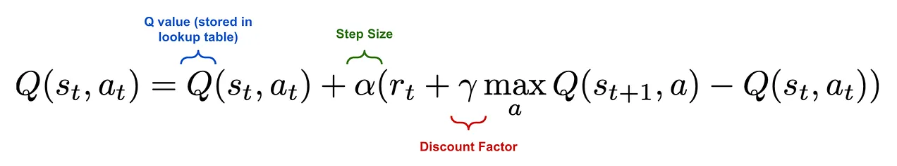

Interestingly, Q-learning utilizes an ε-greedy policy when selecting actions, allowing new states and actions to be explored with a certain probability.

> When computing Q value updates i.e., estimating the return of a state-action pair, however, we always consider the next action with the maximum Q value, which may or may not be executed from the next state. **So this framework leverages two Q values in its update rule: a (predicted) Q value for the current state-action pair and the (target) Q value of the best state-action pair for the next state.**

*this para is confusing slightly*

In other words, Q-learning estimates the return for state-action pairs by assuming a greedy policy that just selects the highest-return action at the next state, even though we don't follow such an approach when actually selecting an action. **For this reason, Q-learning is an off-policy learning algorithm**; see here for more details.

```text
**Explanation from Perpexity**

Q-learning has two different modes:

1. Action Selection Mode (During Exploration)
    Uses an ε-greedy policy: Mostly chooses the best-known action (like taking a familiar shortcut). Occasionally takes random actions (like exploring a new route). This helps discover better strategies while still using current knowledge

2. Learning/Update Mode: When updating its knowledge (Q-values), it pretends it will always take the absolute best action next time. This is like planning your study schedule assuming you'll always choose the most effective study method, even if you sometimes get distracted in reality

Why this matters:
This separation allows Q-learning to learn the optimal strategy ("what if I always made perfect choices?") while still exploring imperfect actions in practice. This makes it an "off-policy" algorithm - it learns about one strategy (perfect choices) while actually following another (ε-greedy choices).

Analogy: Imagine learning to navigate a maze:
You sometimes take wrong turns to explore (ε-greedy)
But when updating your mental map, you assume "next time I'll take the quickest path from here" (max Q-value)
```

Brief mathematical note. The update rule used for Q-learning is mathematically guaranteed to find an optimal policy for any (finite) MDP-meaning that we will get a policy that maximizes our objective given sufficient iterations of the above process.

## Deep Q-Learning

> Use a more powerful model rather than a lookup table

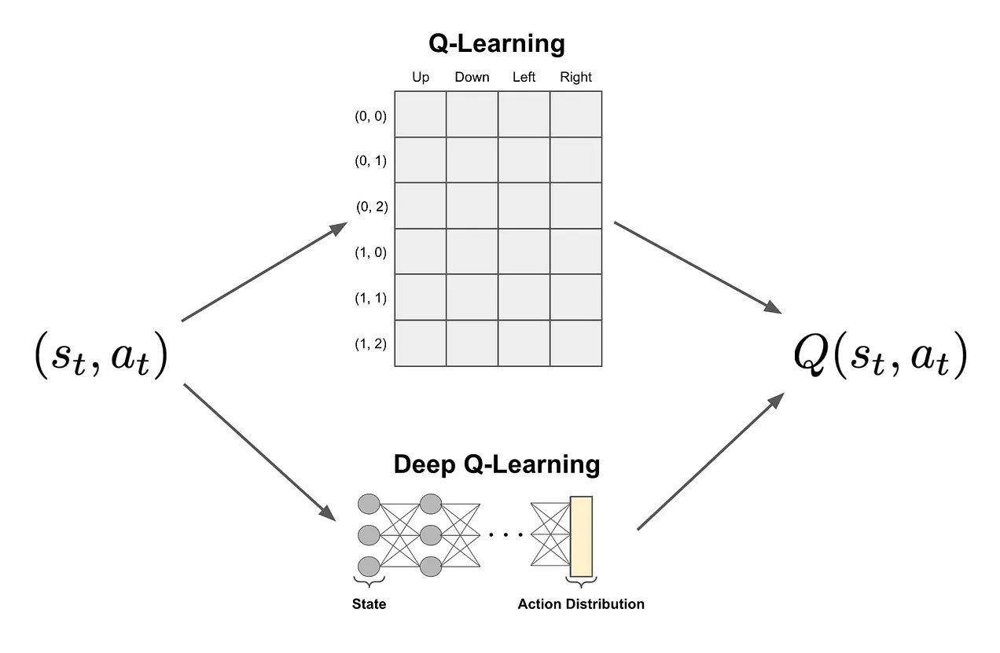

**The problem with Q-Learning.** The size of the lookup table is dependent upon the total number of states and actions that exist within an environment. It is intractable in complex environments (e.g., high-resolution video games or real life).

We need a more scalable approach. DQL solves this problem by **modeling the Q function with a neural network instead of a lookup table**. This neural network *takes the current state as input and predicts the Q values of all possible actions from that state as output*.

> DQL eliminates the need to store a massive lookup table! We just store the parameters of our neural network and use it to predict Q values.

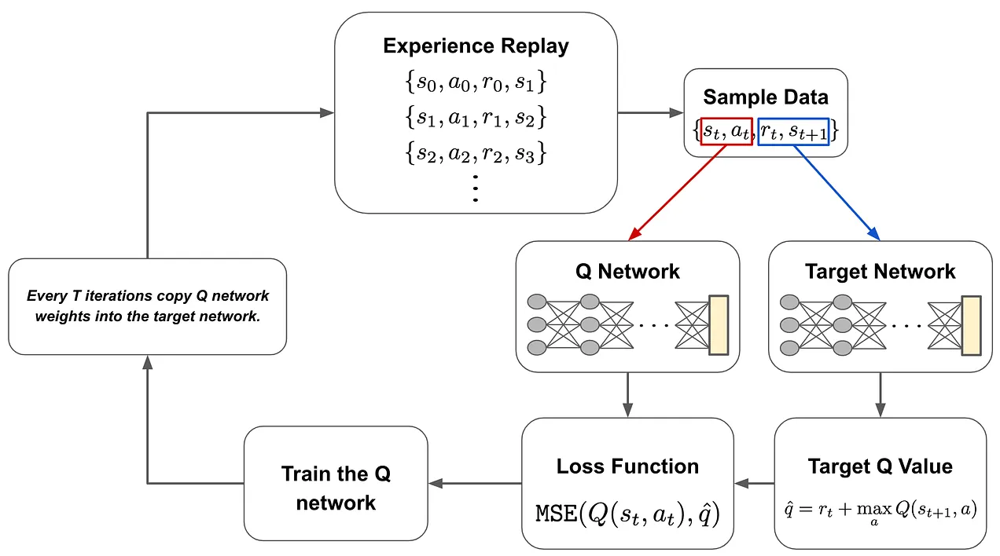

**The algorithm**  <br>
We have two neural (identical) networks:

1. Q network
1. Target network

To train these networks, we first gather data by interacting with the environment. This data is gathered using the current Q network with an ε-greedy policy. This process of **gathering interaction data for training the Q network is referred to as experience replay**.

During each training iteration, we sample a batch of data and pass it through both the Q network and the target network.

| Network | Input | Output |
| --- | --- | --- |
| Q Network | Current state | Predicted Q value of the *action taken* |
| Target Network | **Next state** | Target Q value of the *best action* that can be taken |

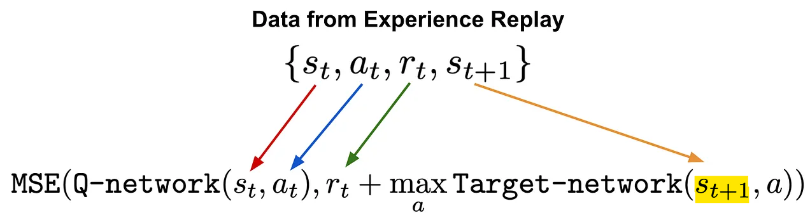

We use the predicted Q value, the target Q value, and the observed reward to train the Q network with an MSE loss. The target network is held fixed. *Every several iterations, the weights of the Q network are copied to the target network, allowing this model to be updated as well*. Then, we just repeat this process until the Q network converges.

> Notably, the dataset we obtain from experience replay is cumulative, meaning that we maintain all of the data we have observed from the environment throughout all iterations.

**Why do we need the target network?** <br>
Similarly as vanilla Q leaning, in DQL, we have to generate both of these Q values i.e. predicted and target Q values. Since the Q network's weights are being updated at every training iteration, it would cause the target Q value to constantly fluctuate as the model is updated. To **avoid creating a "moving target"**, we keep the target network separate and fixed, only **updating its weights every several iterations.**

> This is exactly knowledge distillation - using a separate network to produce a training target for another network.

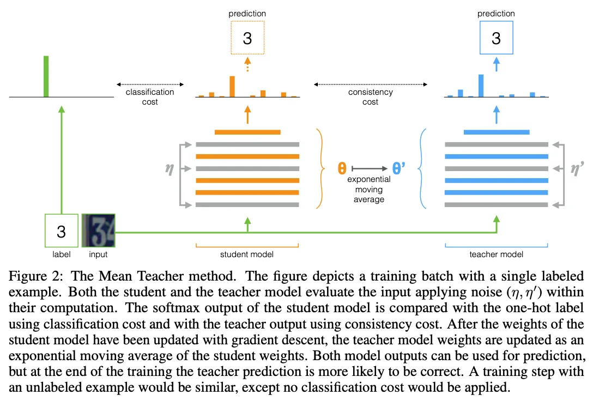

The **Mean Teacher approach** updates the weights of the teacher model as *an exponential moving average of the student network's weights*. In this way, we can ensure a stable target is provided by the teacher during training.

### Practical applications

Authors from Google DeepMind, in 2013, [showed](https://arxiv.org/abs/1312.5602) that Deep Q-Learning is a useful approach for training agents that can successfully beat simple video games like Atari breakout. For a more hands on tutorial, check out [this article](https://huggingface.co/blog/deep-rl-dqn) that explores a similar approach for Space Invaders.
