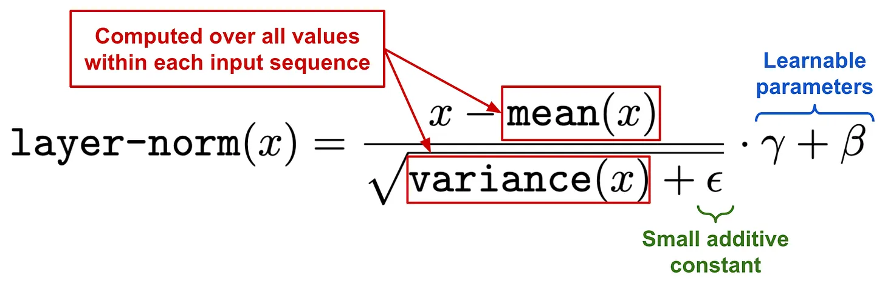
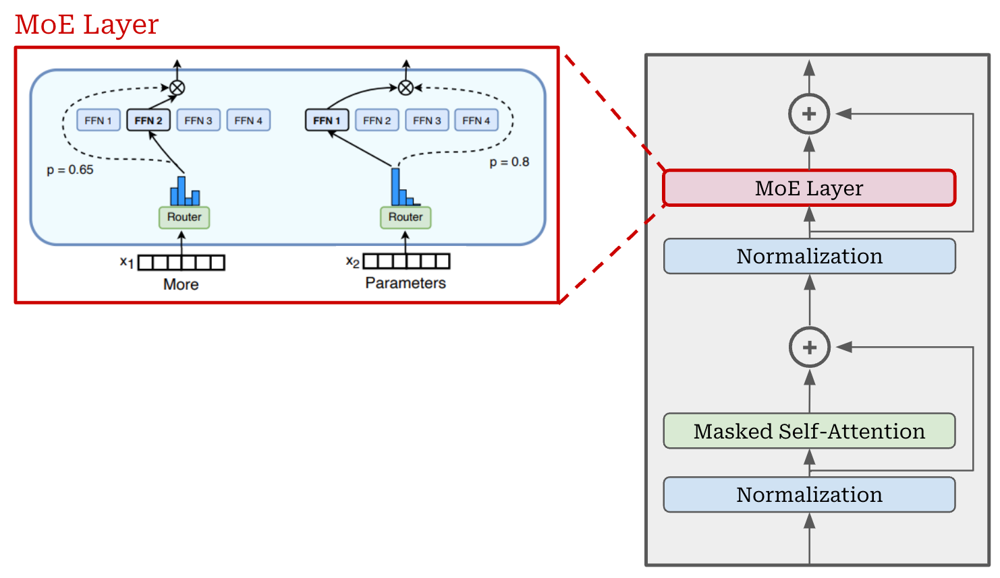
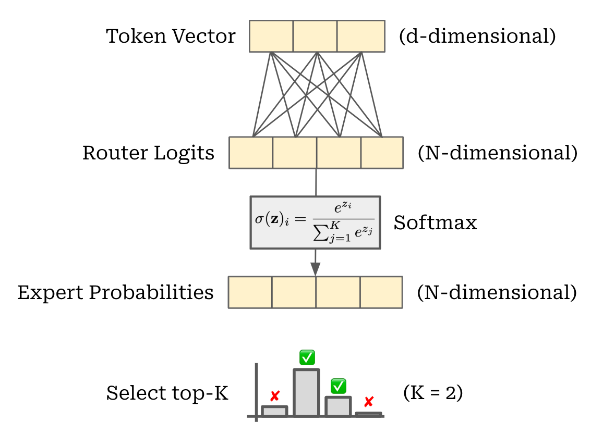

# Notes from Cameron Wolfe's substack titled 'nanoMoE: Mixture-of-Experts (MoE) LLMs from Scratch in PyTorch'

<https://cameronrwolfe.substack.com/p/nano-moe>

## Snippets
**What is self-attention?** Put simply, self-attention **transforms the representation of each token in a sequence based upon its relationship to other tokens in the sequence.** Intuitively, self-attention bases the representation of each token on the other tokens in the sequence (including itself) that are most relevant to that token. In other words, we learn **which tokens to “pay attention” to when trying to understand the meaning of a token in our sequence.** 

> An attention function [maps] a query and a set of key-value pairs to an output, where the query, keys, values, and output are all vectors. The output is computed as a weighted sum of the values, where the weight assigned to each value is computed by a compatibility function of the query with the corresponding key.


**Computing output.** Once we have the attention scores, deriving the output of self-attention is easy. **The output for each token is simply a weighted combination of value vectors**, where the **weights are given by the attention scores**. To compute this output, we simply multiply the attention matrix by the value matrix as shown above. Notably, **self-attention preserves the size** of its input—a transformed, d-dimensional output vector is produced for each token vector within the input.




**LayerNorm**
The normalization operation has two components:
- Performing normalization.
- Applying a (learnable) affine transformation.

In other words, we multiply the normalized values by **weight and add a bias instead of directly using the normalized output.** Both the weight and bias are learnable parameters that can be trained along with other network parameters. Layer normalization is implemented in PyTorch and easy to use; see [here](https://pytorch.org/docs/stable/generated/torch.nn.LayerNorm.html)


**Why the decoder?** Why do LLMs only use the decoder component of the transformer? **The key distinction between the encoder and decoder for a transformer is the type of attention that is used.** The **encoder uses bidirectional self-attention**, meaning all tokens in the sequence—including those before and after a given token—are considered by the self-attention mechanism. In contrast, the **decoder uses masked self-attention**, which prevents tokens from attending to those that follow them in the sequence.


## Expert Layers
The main modification made by an MoE model is within the feed-forward component of the transformer block. Usually, this block has one feed-forward network that is applied in a pointwise fashion across all token vectors. Instead of having a single feed-forward network, an MoE creates several feed-forward networks, each with their own independent weights. **We refer to each of these networks as an “expert”, and a feed-forward layer with several experts is called an “expert layer”.** If we have $N$ experts in a layer, we can refer to the $i$-th expert using the notation $E_i$; 
$$\textrm{Experts} : \{ E_i (\cdot) \}_{i=1}^{N}$$


PyTorch Implementation. **Create several feed-forward networks instead of one**. The main complexity to this implementation is that **we do not use standard Linear layers** in PyTorch. Instead, **we wrap the weights of all experts into several Parameter** objects so that we can **compute the output of all experts in batch by using the batch matrix multiplication** operator. 
> This implementation avoids having to loop over each expert to compute its output, which drastically improves efficiency.


Creating an MoE. To create an MoE-based decoder-only transformer, we simply **convert the transformer’s feed-forward layers to MoE—or expert—layers.** Each expert within the MoE layer has an architecture that is identical to the original, feed-forward network from that layer. We just have several independent copies of the original feed-forward network within an expert layer; see below.



However, we need not use experts for every feed-forward layer in the transformer. **Most MoE-based LLMs use a stride of $P$, meaning that every $P$-th layer is converted into an expert layer** and other layer are left untouched.

> The ST-MoE models have 32 experts with an expert layer frequency of 1/4 (every fourth FFN layer is replaced by an MoE layer).

**Psuedocode**
```python
transformer_blocks = []
for i in range(num_blocks):
    use_moe = (i % P) == 0

    # when use_moe = False, this is regular transformer block
    # when use_moe = True, this is an expert layer
    transformer_blocks.append(Block(use_moe=use_moe))
```

## Selecting experts
Consider a single token—represented by a $d$-dimensional token vector. Our goal is to select a subset of experts (of size $k$) to process this token. In the MoE literature, we usually say that the token will be "routed" to these experts. 



The simplest possible routing algorithm would 
1. Apply a linear transformation to the token vector, forming a vector of size $N$ (i.e., the number of experts).
2. Apply a softmax function to form a probability distribution over the set of experts for our token; see above. We can use this distribution to choose experts to which our token should be routed by selecting top-$K$ experts in the distribution. The top-$K$ values—the "expert probabilities"—are also important.

Simple router implementation. As described above, this routing mechanism is actually quite simple—it’s **just a linear layer!** The output of our softmax router is:
* A set of top-K expert indices for each token in the input.
* The top-K expert probabilities (i.e., the probability values for each of the top-K indices) associated with selected experts.

> Despite its simplicity, this routing mechanism is effective and serves its purpose well. **Most modern MoEs adopt a similar linear routing scheme with softmax.**


---
---


[link](./src/expert_layer.py)

<details>
  <summary>## Click me</summary>
  
  ### Heading
  1. Foo
  2. Bar
     * Baz
     * Qux

  ### Some Javascript
  ```js
  function logSomething(something) {
    console.log('Something', something);
  }
  ```
</details>
