# Notes from Cameron Wolfe's substack titled 'nanoMoE: Mixture-of-Experts (MoE) LLMs from Scratch in PyTorch'

<https://cameronrwolfe.substack.com/p/nano-moe>

## Snippets

**What is self-attention?** Put simply, self-attention **transforms the representation of each token in a sequence based upon its relationship to other tokens in the sequence.** Intuitively, self-attention bases the representation of each token on the other tokens in the sequence (including itself) that are most relevant to that token. In other words, we learn **which tokens to “pay attention” to when trying to understand the meaning of a token in our sequence.**

> An attention function [maps] a query and a set of key-value pairs to an output, where the query, keys, values, and output are all vectors. The output is computed as a weighted sum of the values, where the weight assigned to each value is computed by a compatibility function of the query with the corresponding key.

**Computing output.** Once we have the attention scores, deriving the output of self-attention is easy. **The output for each token is simply a weighted combination of value vectors**, where the **weights are given by the attention scores**. To compute this output, we simply multiply the attention matrix by the value matrix as shown above. Notably, **self-attention preserves the size** of its input-a transformed, d-dimensional output vector is produced for each token vector within the input.


**LayerNorm**
The normalization operation has two components:

- Performing normalization.
- Applying a (learnable) affine transformation.

In other words, we multiply the normalized values by **weight and add a bias instead of directly using the normalized output.** Both the weight and bias are learnable parameters that can be trained along with other network parameters. Layer normalization is implemented in PyTorch and easy to use; see [here](https://pytorch.org/docs/stable/generated/torch.nn.LayerNorm.html)

**Why the decoder?** Why do LLMs only use the decoder component of the transformer? **The key distinction between the encoder and decoder for a transformer is the type of attention that is used.** The **encoder uses bidirectional self-attention**, meaning all tokens in the sequence-including those before and after a given token-are considered by the self-attention mechanism. In contrast, the **decoder uses masked self-attention**, which prevents tokens from attending to those that follow them in the sequence.

## Basics revision

*Decoder-only Transformer Block*  <br>
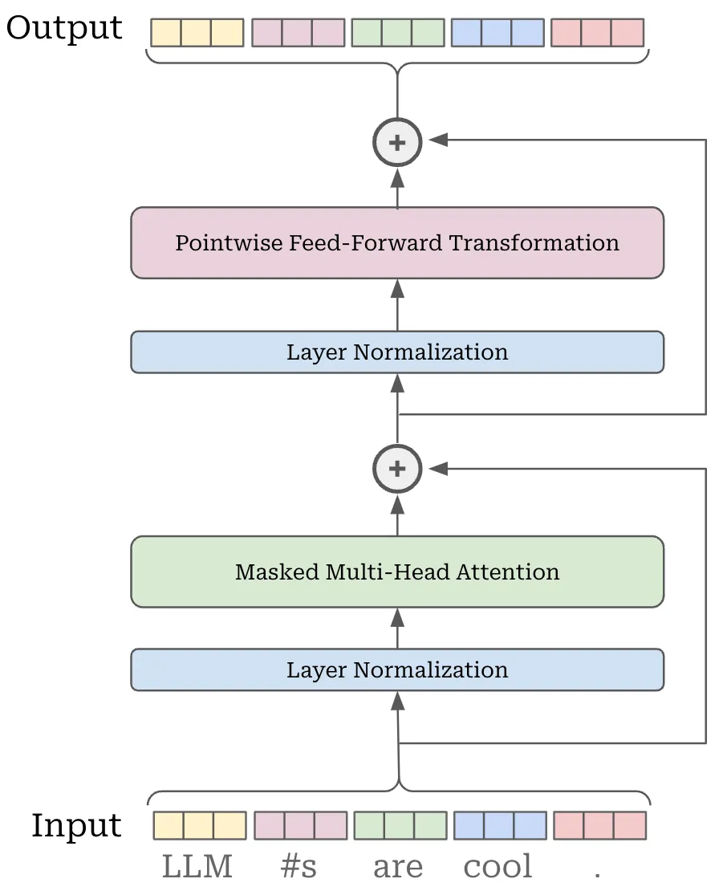

<br>
*Predicting next tokens with an LLM* <br>
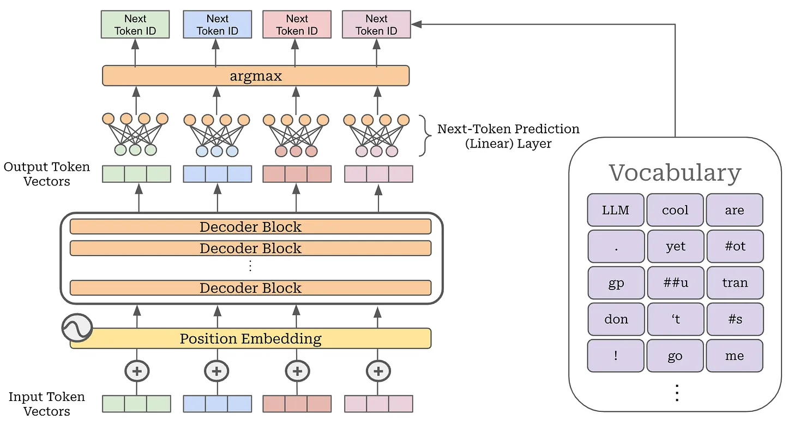

## Expert Layers

The main modification made by an MoE model is within the feed-forward component of the transformer block. Usually, this block has one feed-forward network that is applied in a pointwise fashion across all token vectors. Instead of having a single feed-forward network, an MoE creates several feed-forward networks, each with their own independent weights. **We refer to each of these networks as an “expert”, and a feed-forward layer with several experts is called an “expert layer”.** If we have $N$ experts in a layer, we can refer to the $i$-th expert using the notation $E_i$;
$$\textrm{Experts} : \{ E_i (\cdot) \}_{i=1}^{N}$$

PyTorch Implementation. **Create several feed-forward networks instead of one**. The main complexity to this implementation is that **we do not use standard Linear layers** in PyTorch. Instead, **we wrap the weights of all experts into several Parameter** objects so that we can **compute the output of all experts in batch by using the batch matrix multiplication** operator.
> This implementation avoids having to loop over each expert to compute its output, which drastically improves efficiency.

Creating an MoE. To create an MoE-based decoder-only transformer, we simply **convert the transformer’s feed-forward layers to MoE-or expert-layers.** Each expert within the MoE layer has an architecture that is identical to the original, feed-forward network from that layer. We just have several independent copies of the original feed-forward network within an expert layer; see below.


However, we need not use experts for every feed-forward layer in the transformer. **Most MoE-based LLMs use a stride of $P$, meaning that every $P$-th layer is converted into an expert layer** and other layer are left untouched.

> The ST-MoE models have 32 experts with an expert layer frequency of 1/4 (every fourth FFN layer is replaced by an MoE layer).

**Psuedocode**

```python
transformer_blocks = []
for i in range(num_blocks):
    use_moe = (i % P) == 0

    # when use_moe = False, this is regular transformer block
    # when use_moe = True, this is an expert layer
    transformer_blocks.append(Block(use_moe=use_moe))
```

## Selecting experts

Consider a single token-represented by a $d$-dimensional token vector. Our goal is to select a subset of experts (of size $k$) to process this token. In the MoE literature, we usually say that the token will be "routed" to these experts.


The simplest possible routing algorithm would

1. Apply a linear transformation to the token vector, forming a vector of size $N$ (i.e., the number of experts).
2. Apply a softmax function to form a probability distribution over the set of experts for our token; see above. We can use this distribution to choose experts to which our token should be routed by selecting top-$K$ experts in the distribution. The top-$K$ values-the "expert probabilities"-are also important.

Simple router implementation. As described above, this routing mechanism is actually quite simple-it’s **just a linear layer!** The output of our softmax router is:

- A set of top-K expert indices for each token in the input.
- The top-K expert probabilities (i.e., the probability values for each of the top-K indices) associated with selected experts.

> Despite its simplicity, this routing mechanism is effective and serves its purpose well. **Most modern MoEs adopt a similar linear routing scheme with softmax.**

## Noise in Experts

Optionally, we can **add (learnable) noise into the routing mechanism to regularize** the MoE’s training process.

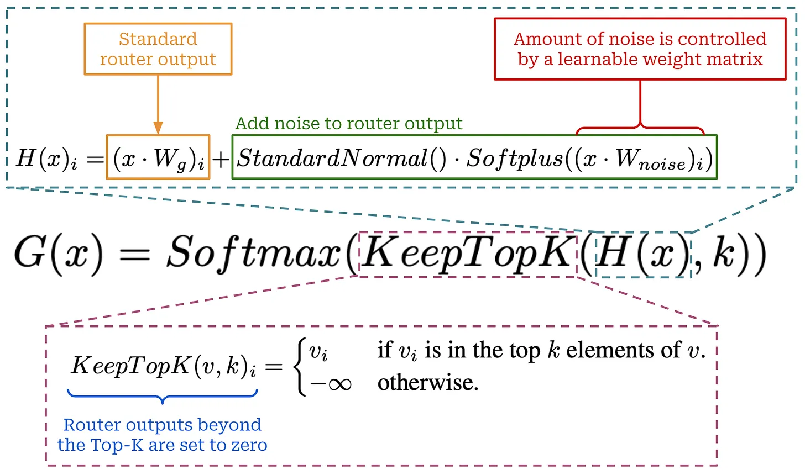

> Because we only select a subset of experts to process each token within an MoE layer, there is a concept of **active parameters** in the MoE literature

## Expert Capacity

> "To improve hardware utilization, most implementations of sparse models have static batch sizes for each expert. The **expert capacity refers to the number of tokens that can be routed to each expert.** *If this capacity is exceeded then the overflowed tokens are passed to the next layer through a residual connection.*"

We choose the **tokens to be computed by each expert based on the output of the router, which changes depending upon the sequences of tokens provided as input to the MoE.** The dynamic nature of the input for each expert can make the implementation of an expert layer somewhat complicated: *How can we deal with the fact that each expert’s input will have a different and unpredictable size?*

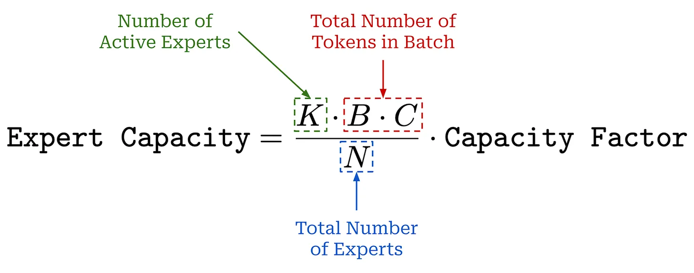

Most implementations of MoEs avoid this problem by **using fixed batch sizes ($=expert~capacity$) for each expert**-this is a useful trick for improving hardware utilization.

> The **expert capacity dictates the maximum number of tokens in each batch that can be sent to any single expert.**

A capacity factor of one means that tokens are routed uniformly, while setting the capacity factor greater than one provides extra buffer to handle imbalanced token routing between experts-this comes at the cost of higher memory usage and lower efficiency.

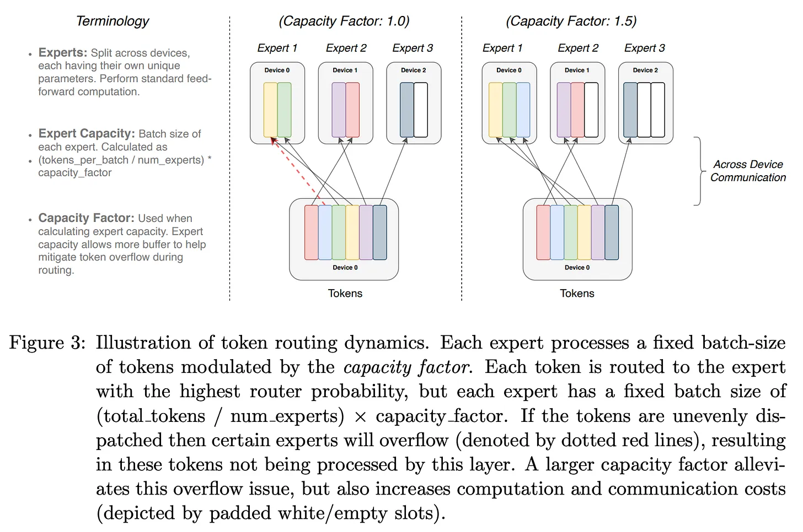

If the number of tokens routed to an expert exceeds the expert capacity, then we *drop* these extra tokens by performing no computation and letting their representation flow directly to the next layer via the transformer’s residual connection; see above.

The capacity factor can also be different during training and evaluation; e.g., ST-MoE uses a capacity factor of 1.25 and 2.0 during training and evaluation, respectively.

[PyTorch Implementation.](./src/full_softmax_router.py) Go beyond this implementation by creating the fixed-size input tensors for each of the expert. High-level steps -

1. Compute the output of the (noisy) linear router.
1. Compute the top-K experts and their associated probabilities.
1. Compute the expert capacity.
1. Use fancy PyTorch indexing and tensor manipulation to handle constructing the batch of expert inputs9.
1. Construct the final batch of expert inputs.

### Load Balancing and Auxiliary Losses

> The gating network **tends to converge to a state where it always produces large weights for the same few experts.** This imbalance ($=model~collapse$) is self-reinforcing, as the favored experts are trained more rapidly and thus are selected even more by the gating network.

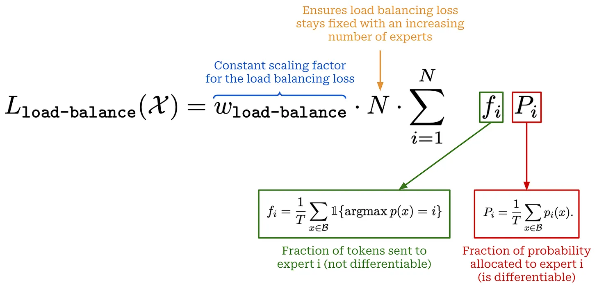

To encourage a balanced selection of experts during training, we can **simply add an additional component to the training loss that rewards the model for uniformly leveraging its experts.**.

We create the auxiliary loss term shown above, which measures expert importance (i.e., the probability assigned to each expert) and load balancing (i.e., the number of tokens sent to each expert). Two quantities:

1. The fraction of router probability allocated to each expert.
1. The fraction of tokens dispatched to each expert.

If we store both of these quantities in their own N-dimensional vectors, we can create a single loss term by taking the dot product of these two vectors. *This loss is minimized when experts receive uniform probability and load balancing.*

[PyTorch Implementation.](./src/load_balancing_loss.py)

### Router z-loss

**To complement the load balancing loss**, we have an extra auxiliary loss term, called the router z-loss. It constrains the size of the *logits-not probabilities*, this is before softmax is applied-predicted by the routing mechanism. The main logic is like a `torch.logsumexp(logits)`

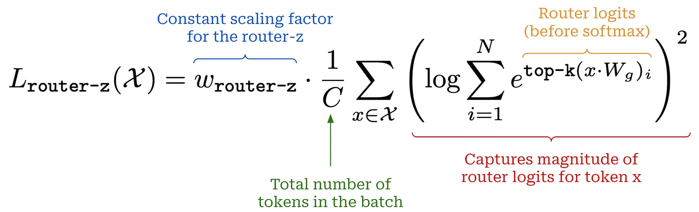

The router z-loss encourages the MoE to keep these logits small and, in turn, avoid  round-off errors.

> The router computes the probability distribution over the experts in float32 precision. However, at the largest scales, we find this is insufficient to yield reliable training.

[PyTorch Implementation.](./src/load_balancing_loss.py)

### Combining auxiliary losses

We can just add each of these losses to our standard language modeling loss during training. Default scaling factors for load balancing and router z-losses are 0.001 and 0.01, respectively.

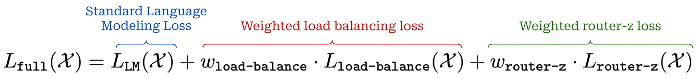

> Recent research has shown that-depending upon how the scaling factors are set-such auxiliary losses might sacrifice model performance for training stability in some cases.

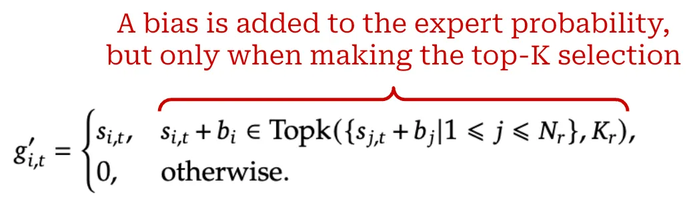

DeepSeek-v3 model (the base model used to create the DeepSeek-R1 reasoning model)- uses an *auxiliary-loss-free load balancing strategy*, which **simply adds a dynamic bias** to the router output when selecting top-K experts. This bias is increased for experts that are not selected enough and decreased for experts that are selected too much, thus increasing the chance that under-utilized experts will be selected. This dynamic bias is found to **improve load balancing without sacrificing model performance**.

> (From Deepseek paper) We keep monitoring the expert load on the whole batch of each training step. At the end of each step, we will decrease the bias term by 𝛾 if its corresponding expert is overloaded, and increase it by 𝛾 if its corresponding expert is underloaded, where 𝛾 is a hyper-parameter called bias update speed.”

## Decoder-Only MoE Implementation

*Note that it is not MoE + Decoder Blocks. <br> Red colour text says Every P-th layer becomes an MoE block (P=2)*
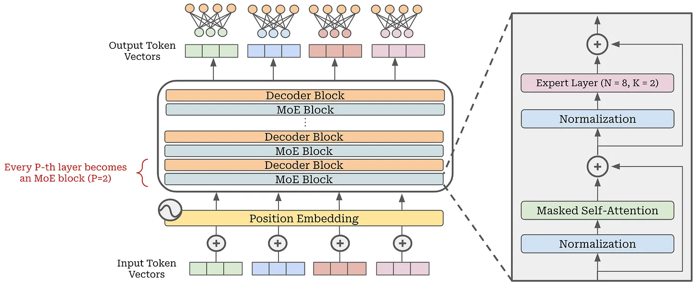

**Computing expert layer output.** Once we have used the routing mechanism to determine the set of active experts for a given token, we can compute the final output for this expert layer as follows:

1. Send the tokens to their active experts.
1. Compute the output of the active experts for these tokens.
1. Take a weighted average of expert outputs for each token, where the weights are simply the probabilities assigned to each active expert by the router.

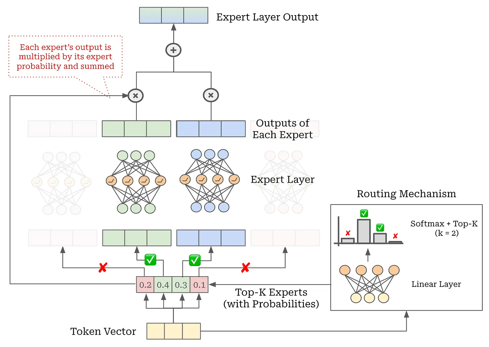

An implementation of a full expert layer is provided in
[PyTorch Implementation.](./src/expert_layer.py)

**MoE in PyTorch**. Now, we can modify the decoder-only transformer block to optionally use an expert layer in place of the usual feed-forward layer. This is a drop-in replacement of our MLP module with the new MoELayer, forming an MoEBlock.
[PyTorch Implementation.](./src/moe_block.py)

---
---

<details>
  <summary>## Click me</summary>
  
### Heading

  1. Foo
  2. Bar
     - Baz
     - Qux

### Some Javascript

  ```js
  function logSomething(something) {
    console.log('Something', something);
  }
  ```

</details>
