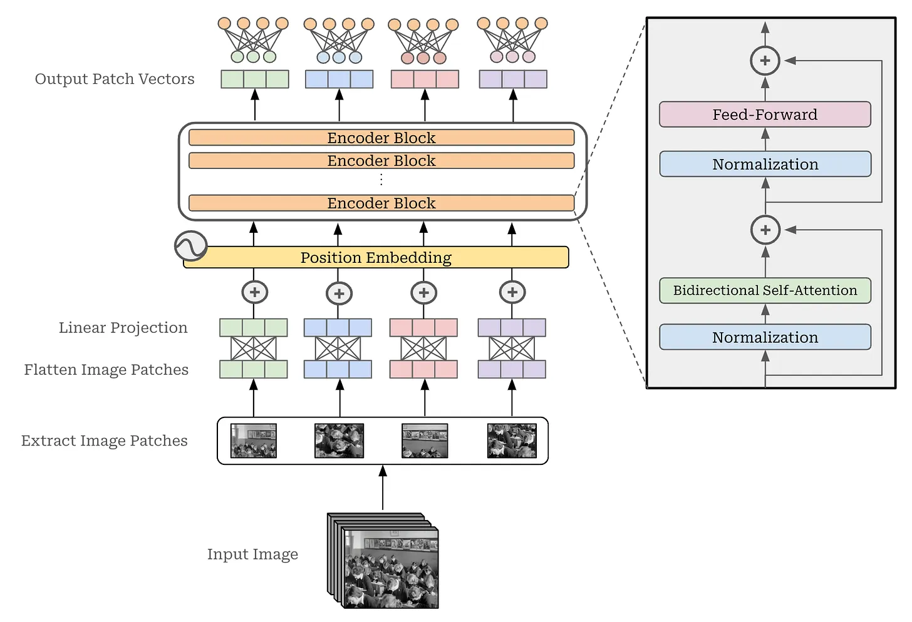

# Vision Large Language Models (vLLMs)

<https://cameronrwolfe.substack.com/p/vision-llms>

## Basics

`bidir_self_attn.py` contains self attention score

As outlined in `cross_attention.py`, we are no longer computing attention scores between tokens within a single sequence. Rather, we are computing inter-sequence attention scores, thus forming a fused representation of the two input sequences.

## Handling images

The input for a vision transformer is an image. In order to pass this image as input to our transformer, however, we need to convert the image into a list of vectors-resembling a sequence of textual token vectors. For ViTs, we do this by segmenting an image into a set of patches and flattening each patch into a vector. From here, these vectors may not be of the same size expected by the transformer, so we just linearly project them into the correct dimension.

> The original ViT model shares the same architecture as BERT. All ViT models are trained using supervised image classification on datasets of varying sizes

### CLIP

Although the CLIP model is trained with both an image and text encoder, **most of the work we will see in this overview only uses the image encoder from CLIP**. The key contribution of CLIP is not the model architecture, but rather the training objective. Using both an image and text encoder allows us to train the image encoder using the contrastive objective described above, which is very efficient (see above) and **does not rely on large amounts of supervised data (unlike ViT)**.

> The CLIP model architecture can be useful as a whole; e.g., we can use it to perform zero-shot image classification as shown above. **However, we can also train a CLIP model solely for the purpose of obtaining a high-quality image encoder!**

## Handling Videos

*A video is just a collection of ordered frames.* Similar to images, each of these frames are usually represented in RGB-format, and all frames in a video have the same spatial resolution. For example, the video in the figure above has three frames, each with three color channels and a height and width of five, forming a tensor of size `3 (frames) × 3 (color channels) × 5 (height) × 5 (width)`.

> We can also create a **mini-batch of videos**, but we must make sure that **each video has the same number of frames-this is usually done by extracting fixed-length "clips" from the video** (e.g., with 64 frames).

**Frame Rate**
Neural networks do not need to process videos at this level of granularity (i.e. full 24fps, 60 fps etc.). We can save computational costs by **sub-sampling the frames within a video**; e.g., sampling every eighth frame of a 24 FPS video to simulate 3 FPS.

**Encoding Videos**
Video --> sub-sampled video frames --> treat video as a set of images(frames) --> each frame through CLIP --> LLM takes in embeddings **as additional input**

> But, there is still a problem here: the number of vectors produced for the video is large and sometimes unpredictable because the video can be of any length. **We need an additional module to aggregate the frame representations for a video into a single, fixed-sized set of vectors!**

This is where the Perceiver and Perceiver Resampler come in handy. The perceiver (shown above) is an attention-based neural network architecture that can ingest high-dimensional input-such as large set of vectors of variable size produced from the frames of a video-and output a fixed-size representation based upon this input. Put simply, this means that **we can pass all of our video vectors to the Perceiver and it will give us a fixed-size set of vectors in return**. Then, we can easily integrate this additional input into an LLM, just like an image!

The Perceiver was originally applied to multi-modal LLMs by **Flamingo, which proposed the Perceiver Resampler**. Flamingo samples video at *one FPS* (i.e., a single frame from every second of video). *Each sub-sampled frame of a video is passed independently through an image encoder*, producing a corresponding image embedding. Before passing these image embeddings to the text-based LLM, however, we pass them through a **Perceiver architecture that produces a fixed (64) number of visual token vectors for the video**.

> Then, we integrate these vectors into the LLM using cross-attention as described before.

## vLLM Architecture Variants

There are two common vLLM architecture variants that fuse these components (CLIP/ViT with decoder-only transformer) together: the unified embedding and cross-modality attention architecture
