# Notes from Maarten Grootendorst's blog titled 'A Visual Guide to Quantization'

<https://newsletter.maartengrootendorst.com/p/a-visual-guide-to-quantization>

> Since this blog has so many INCREDIBLE annotations, I think it will be nice to take screenshots and annotate them. Full credits to the author!

Quantization: Reduce the precision of a model's parameter from **higher bit-widths** (e.g. 32-bit floating point) **to lower bit-widths** (e.g. 8-bit integers)

# INTRO

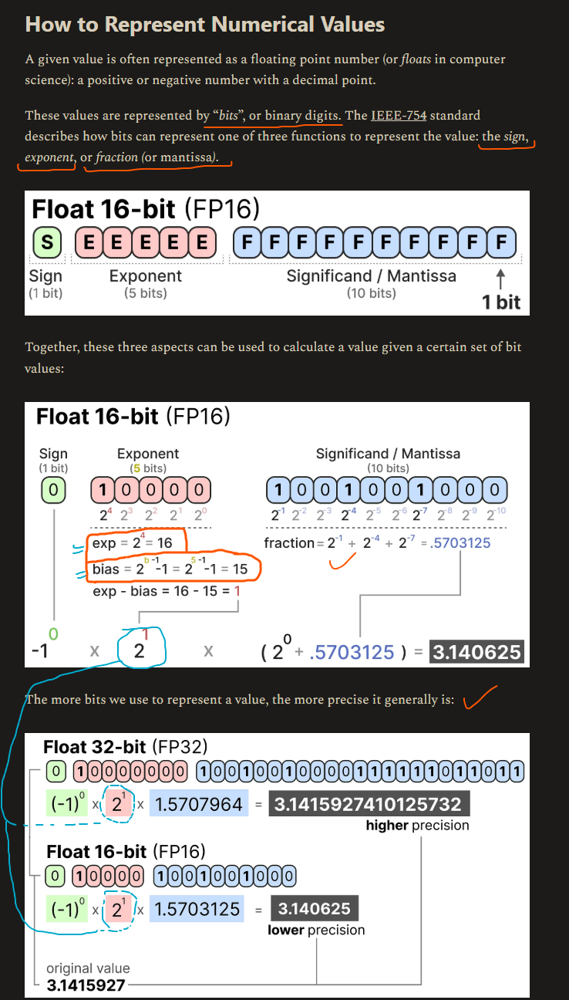

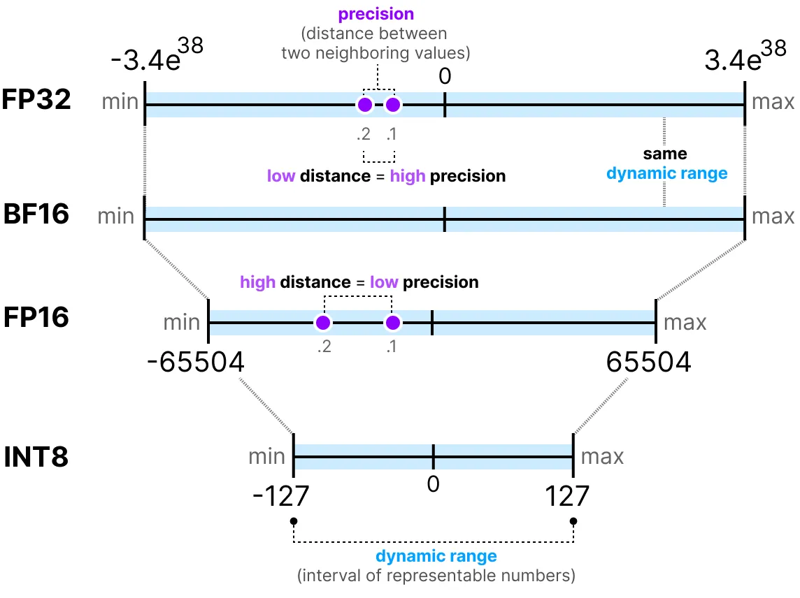

Since there are 8 bits in a byte of memory, we can create a basic formula for most forms of floating point representation.

$$ \text{memory} = \dfrac{\text{nbr bits}}{8} \cdot \text{nbr params} $$

| bit-widths | Size needed |
| --- | --- |
| 64-bits | $\dfrac{64}{8} \cdot 70 \text{B} \approx 560 \text{GB}$ |
| 32-bits | $\dfrac{32}{8} \cdot 70 \text{B} \approx 280 \text{GB}$ |
| 16-bits | $\dfrac{16}{8} \cdot 70 \text{B} \approx 140 \text{GB}$ |

# Common DataTypes

| bit-widths | min | max | bits-sign | bits-exponent | bits-mantissa | bits-total | notes |
| ---        | --- | --- | ---       | ---           | ---           | ---        | ---   |
| FP32      | $-3.4e^{34}$ | $3.4e^{34}$ | 1 | 8 | 23 | 32 | our reference |
| FP16      | $-65504$ | $65504$ | 1 | 5 | 10 | 16 | range is quite smaller than FP32 |
| BP16    *(brain-float 16)*     | $-3.4e^{34}$ | $3.4e^{34}$ | 1 | 8 | 7 | 16 | *aka truncated FP32*. Uses the same amount of bits as FP16 but can take a wider range of values. Often used in deep learning applications |
| INT8 | $-127$ | $127$ | 1 | 0 | 7 | 8 | |

> In practice, we do not need to map the entire FP32 range  $[-3.4e^{34}, 3.4e^{34}]$ into INT8. We merely need to find a way to map the range of our data (the model's parameters) into INT8.

# Symmetric Quantization

Quantized value for zero in the floating-point space is exactly zero in the quantized space

**absmax quantization**

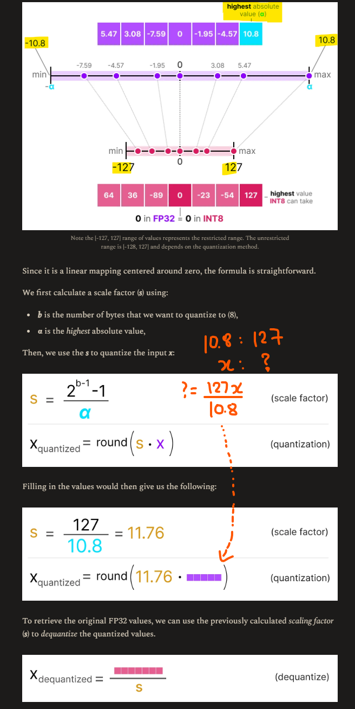

# Asymmetric Quantization

Is not symmetric around zero. Instead, it maps the minimum (β) and maximum (α) values from the float range to the minimum and maximum values of the quantized range

**zero-point quantization**

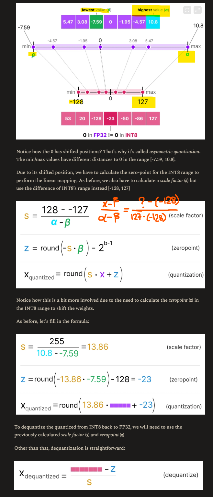

# Range Mapping and Clipping

**Major downside of mapping to lower-bit representation : OUTLIERS**

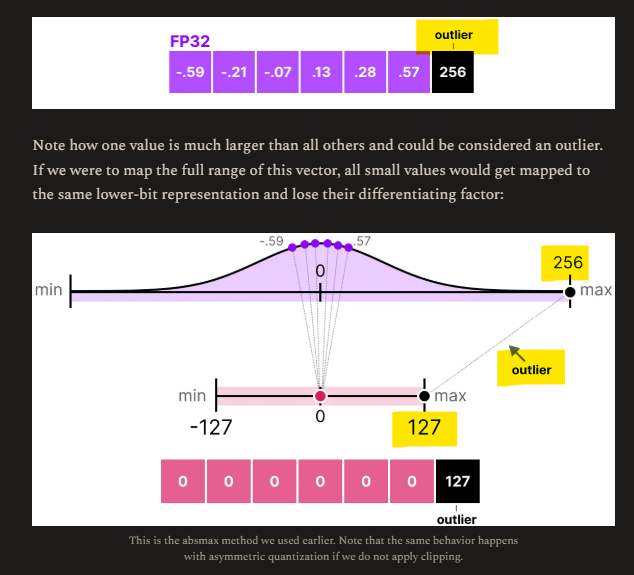

Instead, *clip* certain values - we set different dynamic range - *all outliers get the same value*

e.g. **MANUALLY set dynamic range to [-5, 5]** all values outside that will either be mapped to -127 or to 127 regardless of their value:

- GOOD: quantization error of the non-outliers $\downarrow$
- BAD: quantization error of outliers $\uparrow$

# Calibration

Instead of manually selecting an arbitrary range like [-5, 5], selecting it such that

1. no. of values included $\uparrow$
1. quantization error $\downarrow$

> Since $ \text{no. of weights (billions)}  >> \text{no. of biases (millions)}$, main quantization effort is for weights, biases often kept at higher like INT16

## Activations

Unlike weights and biases, activations vary with each input during inference. Two broad methods

1. Post-Training Quantization (PTQ): Quantization **after** training
1. Quantization Aware Training (QAT): Quantization **during** training/fine-tuning

# Post Training Quantization

- *Weights*: symm or asymm quantization
- *Activations*: *Dynamic* or *Static*

## Dynamic Quantization (during inference)

Data passes through model - collect *for each layer*, distributions of activations - collect zeropoint and scale factor - repeated each time data passes through a new layer

> Each layer has its own separate z and s values and therefore different quantization schemes!

## Static Quantization (beforehand)

**Calibration dataset** through model - collect distributions for all activations - calculate zeropoint and scale factor globally

> Dynamic is slower (because during inference) but accurate. Static is faster but less accurate

## **4-bit Quantization**

### GPTQ (full model on GPU)

- asymmetric quantization
- layer by layer (each layer independent)
  - converts the layer's weights into the **inverse-Hessian**

> Weights associated with smaller values in the Hessian matrix are more crucial because small changes in these weights can lead to significant changes in the model's performance

- Now quantize and dequantize -- first element of the first row of weight matrix
- Get quantization error -- weighted by inverse hessian
- Redistribute this weighted quantization error over the other weights in the row
  - i.e. use the same error value to update weights

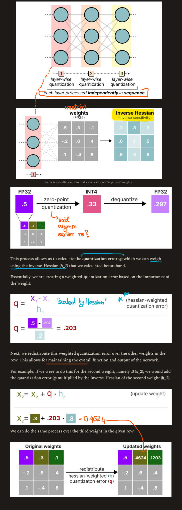

### GGUF (potentially offload layers on the CPU)

- weights of a given layer are split into "super" blocks each containing a set of "sub" blocks
- each "sub" block quantized usign *absmax*
- scale factor for each "sub" block is quantized using the "super" block

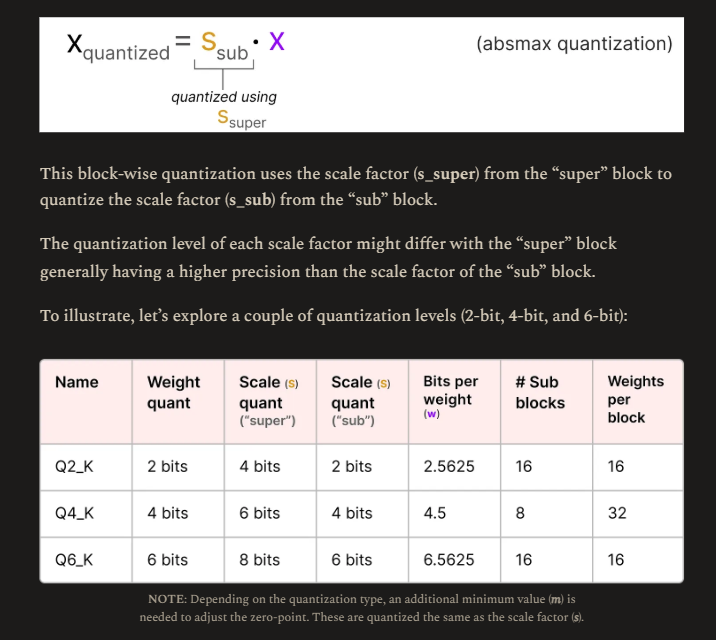

> Downside of Post Training Quantization: does not consider the actual training process

# Quantization Aware Training

**Learn quantization parameters $(s, \alpha, \beta, z)$ during backward pass**

> QAT usually more accurate than PTQ since quantization already considered during training

During training, so-called *fake quants* are introduced

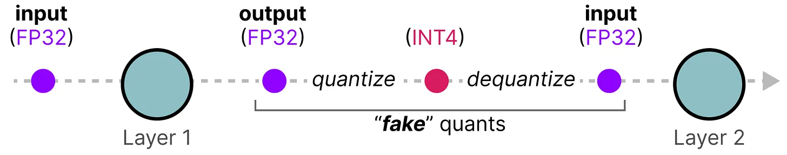

QAT attempts to explore the loss landscape for “wide” minima to minimize the quantization errors as “narrow” minima tend to result in larger quantization errors.

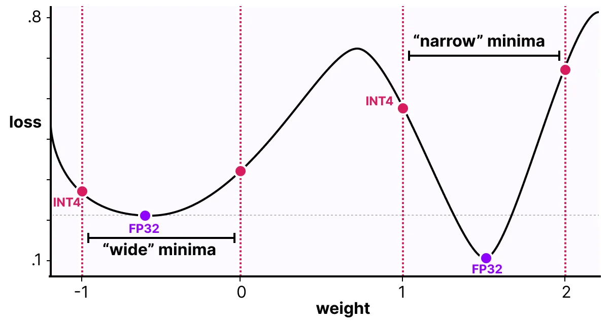

Consider if quantization is *not* considered during backward pass

- We choose the weight with the smallest loss according to gradient descent
- **However, that would introduce a larger quantization error if it’s in a “narrow” minima**

If we consider quantization

- A different updated weight will be selected **in a "wide" minima with a much lower quantization error**

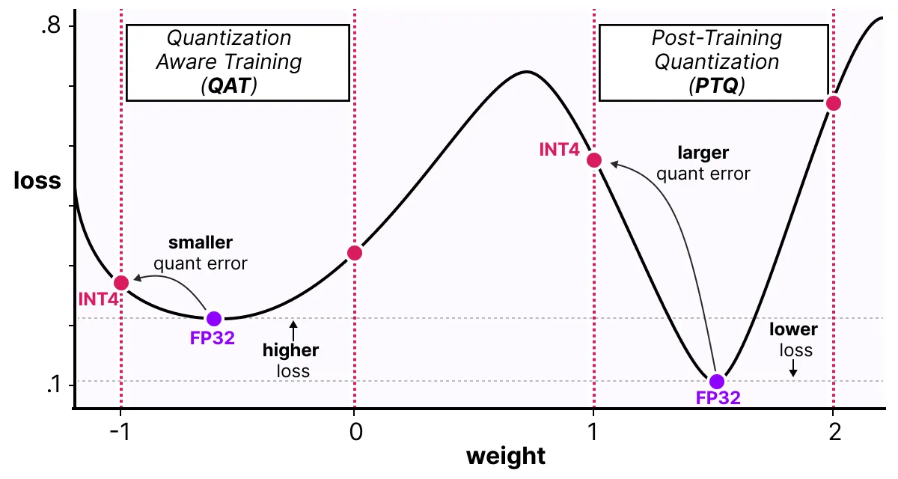

> *slightly unclear tbh*

## 1-bit LLMs: BitNet

Instead of Linear layers (FP16), use BitLinear layers (1-bit). Throughout the architecture

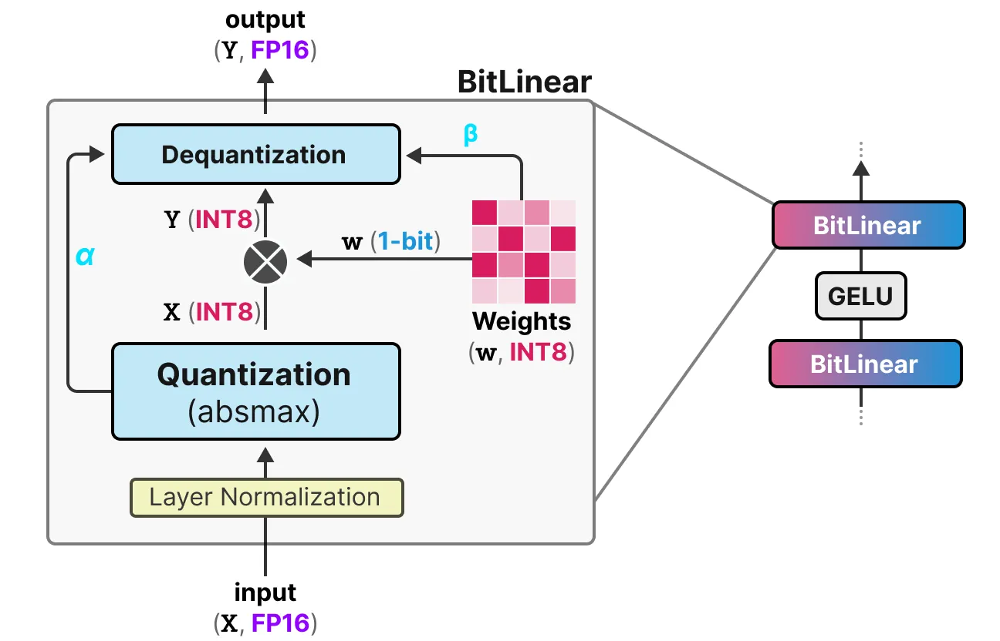

For BitLinear layer

|  params       | bit-width  |
| ---           | ---        |
| weights       | 1-bit      |
| activations   | INT8       |

### Weight quantization

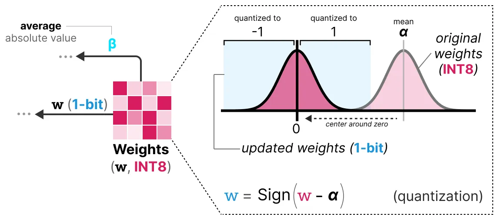

While training, the weights are stored in INT8 and then quantized to 1-bit using the signum function $(sign())$

### Activation quantization (need to read properly)

### Dequantization

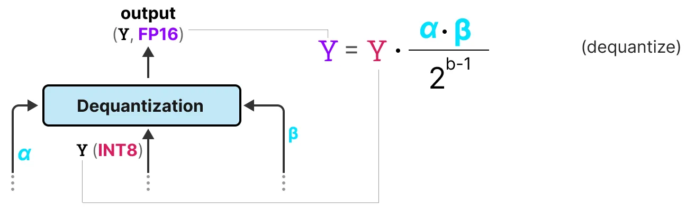

## 1.58 Bits

- **Every single weight of the model is not just -1 or 1, but can now also take 0 as a value (ternary)**.

- Interestingly, adding just the 0 greatly improves upon BitNet and allows for much faster computation.

> During matrix multiplication, +1 indicates to add, -1 indicates to subtract. Having 0 tells we can skip this value

General matmul  
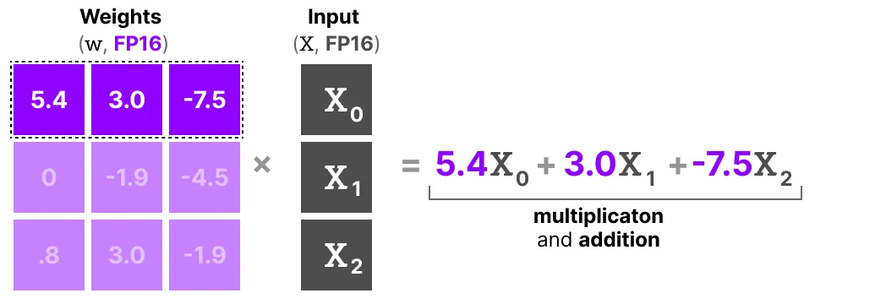

BitNet 1.58b, with its ternary weights  

**Instead of multiplying and adding, we are now only adding!**

### Quantization

Uses *absmean*   Compresses weights distribution and uses absmean $\alpha$ to quantize. Then round off to either -1, 0, 1

Compared to BitNet the activation quantization is the same except for - Instead of scaling the activations to range [0, 2ᵇ⁻¹], they are now scaled to
[-2ᵇ⁻¹, 2ᵇ⁻¹] instead using absmax quantization.

**1.58-bit quantization required (mostly) two tricks:**

- Adding 0 to create ternary representations [-1, 0, 1]
- absmean quantization for weights

> **13B BitNet b1.58** is more efficient, in terms of latency, memory usage, and energy consumption than a **3B FP16 LLM**
