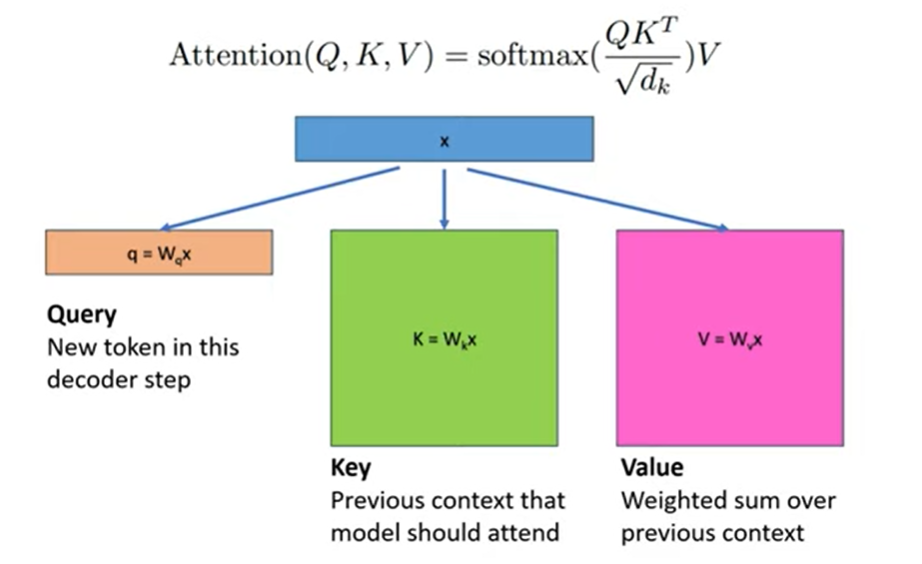
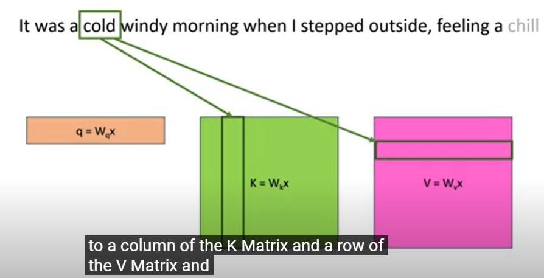
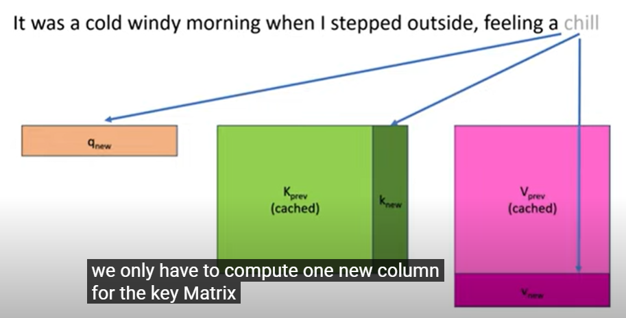
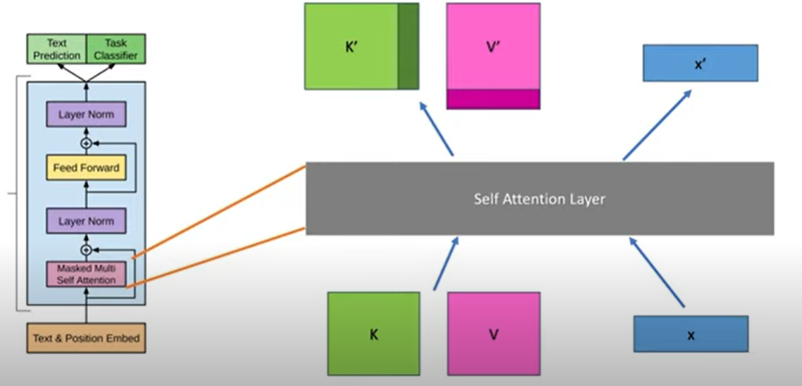

**SOURCE https://www.youtube.com/watch?v=80bIUggRJf4**

## Notes
- During decoding, the query is the new token's embedding (i.e. one-size matrix) = vector
- The key and value are matrices with information about the previous tokens

- doing dot product is like attention between current and previous tokens

- this token about cold is present as a col and row of key and value matrices resp
- while generating new tokens, K and V do dont change much, but K = W_k * x and V = W_v * x has to be calculated for every new x --> x^2 time complexity
- - for each new token, all prev tokens have to be used for generating K and V
- only one extra col and row are added once one generation is done

**kv caching**

- Self attention block takes in prev k,v cache and makes new k,v
- Other parts like layernorm, linear layer etc -- no need of k,v cache

