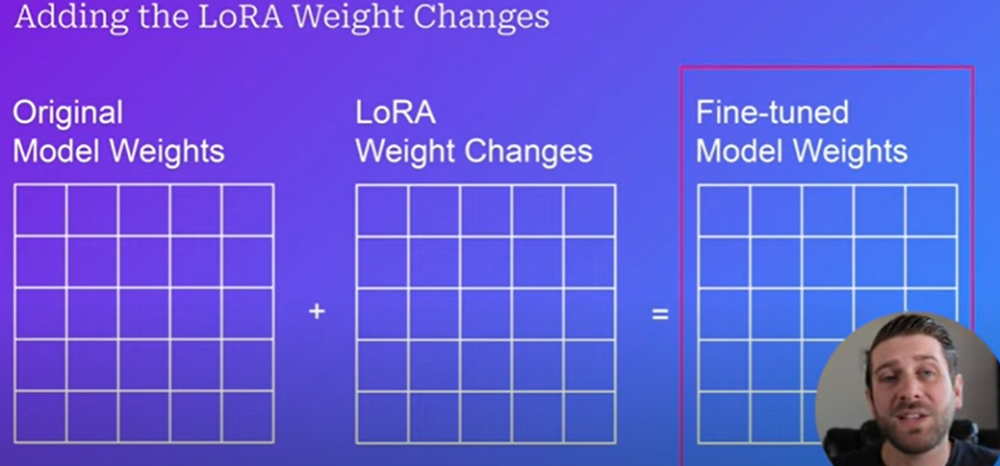
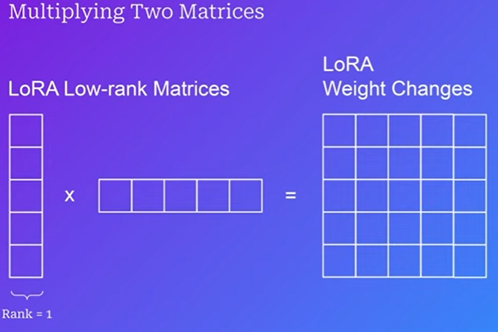
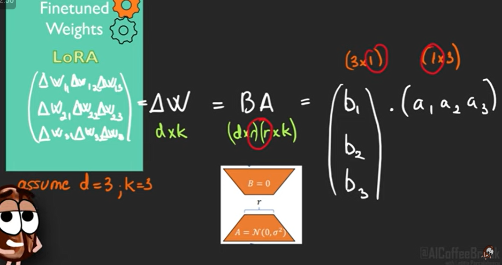
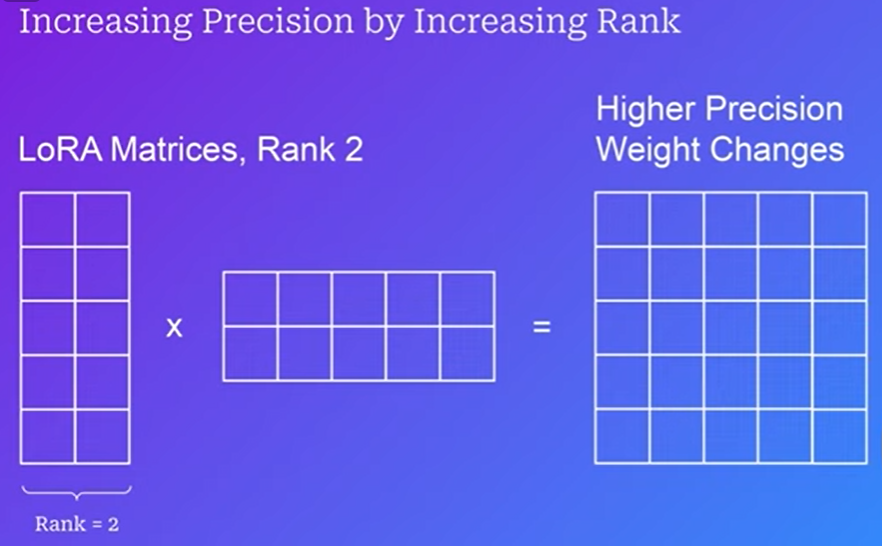

## How is LORA different?
1. Instead of updating weights directly, we track changes.
2. These weight changes are tracked in two separate, smaller matrices that get multiplied together to form a matrix the same size as the model's weight matrix.

- rank 1 matrices are not full precision ofc \

idea is that hopefully we chose an'r' such that we reduce the W matrix to its low rank form --> no info loss and lesser params \\
- If r low --> we have lost info (less params yes)
- If r high --> we have kept a lot info but params also high

- here rank2 matrices will give more precision yessss

**IMP TO NOTE**: downstream tasks are intrinsically low rank

**WHY DOES IT WORK** \

