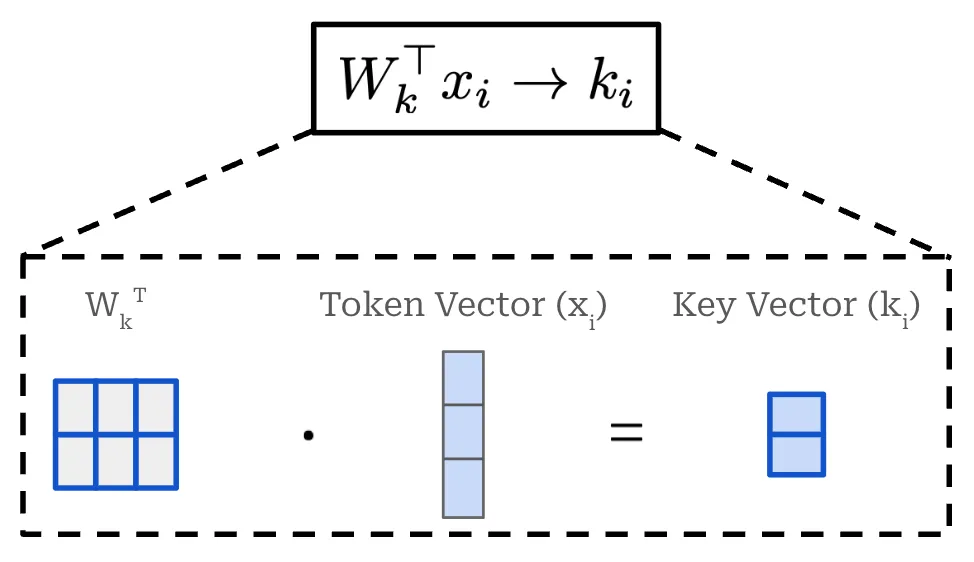

# RoPE notes from <https://cameronrwolfe.substack.com/i/161016210/m-token-context-window>

## Producing Key and Value vectors

RoPE is a hybrid of absolute and relative position embeddings that operates by **modifying the query and key vectors in self-attention. Unlike absolute position embeddings, RoPE acts upon every transformer layer—not just the input layer**. In the standard transformer architecture, we produce key and query vectors by linearly projecting the sequence of token vectors for a given layer. For a single token in the input sequence, we can formulate this operation as shown below, where we linearly project a single token embedding. The figure below displays the creation of a key vector, but we follow the same exact approach—with a different weight matrix—to produce query and value vectors too.

*Projecting a token vector to form a key in self-attention*

RoPE incorporates position information into the creation of key and query vectors by **multiplying the weight matrix used in the above operation by a unique rotation matrix.** Here, this rotation matrix is computed based upon the absolute position of a token in the sequence—the amount that a given vector is rotated depends upon its position in the sequence. This modified operation is shown below, where we again depict the creation of key vectors. The same strategy is applied to the creation of query vectors, but **we do not modify the creation of value vectors.**

*Incorporating position information via a rotation matrix*

Here, $θ$ is a vector called the rotational (or frequency) basis. We have a function $R$ that takes the rotational basis $θ$ and the **absolute** position of the token in the sequence $i$ as input and produces a rotation matrix as output. **The rotation matrix is a block-diagonal matrix that is constructed as shown in the equation below.**

*Structure of the rotation matrix in RoPE*

This matrix is block diagonal and **each block in the matrix is a 2 × 2 rotation matrix. Each of these blocks rotates a pair of two dimensions (from $d$-dimensional embedding) within the output key (or query) embedding. As a result, each pair of dimensions in the resulting embedding is rotated based upon both the absolute position of the token in the sequence $i$ and the entry of the rotational basis $θ$ corresponding to that pair of dimensions.** We apply this rotation matrix when producing both the key and query vectors for self-attention **in every transformer layer**. These modifications yield the attention operation shown below, where every key and query vector is rotated according to their absolute position in the sequence.

*Rotated keys and queries for self-attention in RoPE*

When we take this standard outer product between the rotated keys and queries, however, something interesting happens.

**The two rotation matrices—used to rotate the keys and queries, respectively—combine to form a single rotation matrix $R(θ, n - m)$.** 

**In other words, the combination of rotating both the key and query vectors in self-attention captures the relative distance between tokens in the sequence. This is the crux of RoPE!**

**Although we might struggle to understand the purpose of these rotation matrices at first, we now see that they inject the relative position of each token pair directly into the self-attention mechanism!**

> OPPPPPPPPPP!
