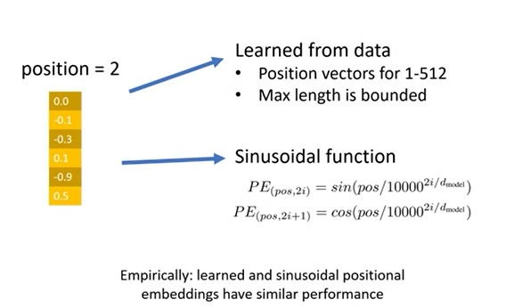
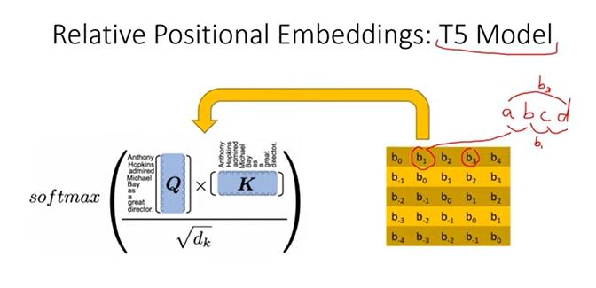
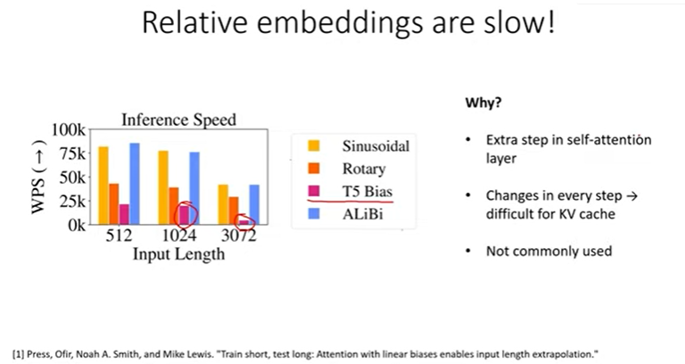
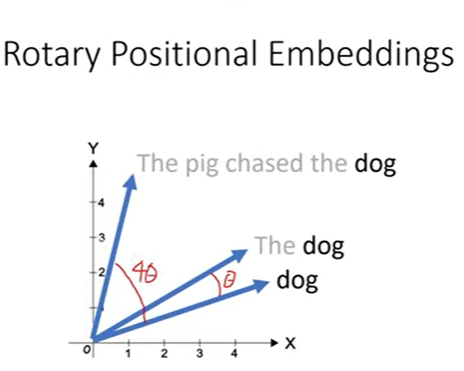
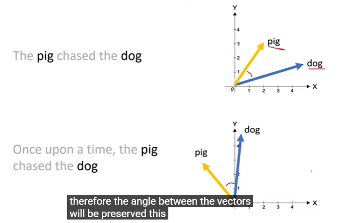
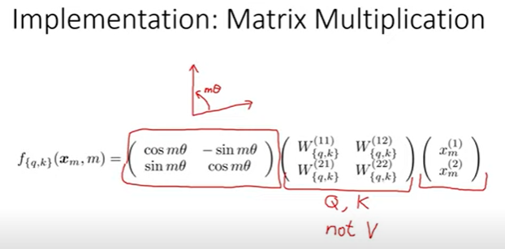
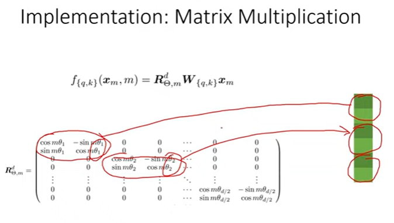
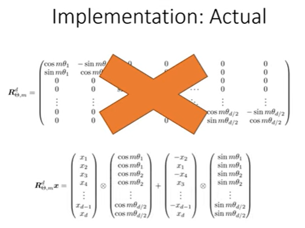

**SOURCE https://www.youtube.com/watch?v=o29P0Kpobz0&list=TLPQMTYwNjIwMjTbxWqBbI_SAg&index=3**

## Notes

### Absolute positional embeddings

- ofc remember that positional embeddings are added to word embeddings
- Yellow wala is positional embedding - either can be learned or sin wala
- **Problem**: Every position embdd is independent of each other (same 'distance' between 1-2 and 1-500)

### Relative positional embeddings -- used in T5 model 
- Learn embdd for every pair of tokens!
- So cannot add position vector to word vector
- instead learn a matrix - each positional pair shown as a bias (float)

- advantage: *same bias everywhere for a given relative distance* (observe yellow matrix values)
- can extend to arbitrary long sentence length
- but slowwww (See image below)

### Rotory positional embeddings -- best of both
- instead of adding position vector to word vector, instead rotate the word vectoryy by the position 

- posn embedd of dog word at 4th position = posn embedd of dog word at 1st position rotated by 4 units
- **Advantage**: vectors for beginning of sentence reamains the same - easier to cache
- retaive distance is preserved i.e. angle remains same for embdd vectors <--> words with same relative distance ==> easier to take dot product and hence attention

### implementation
- simply rotation matrix multiplication for 2d case (by angle m*$\theta$), where m is absolute position. x is the vector to rotate
- We apply Q, K vectors before rotation to x -> preserves rotational invariance. 
- Rotation only to  Q and K and not V

- essentially split the vector into pairs of two. then apply the transformation to each pair. Each pair is given a different rotation

- actually implemented in two steps instead of big matrix multiplication

