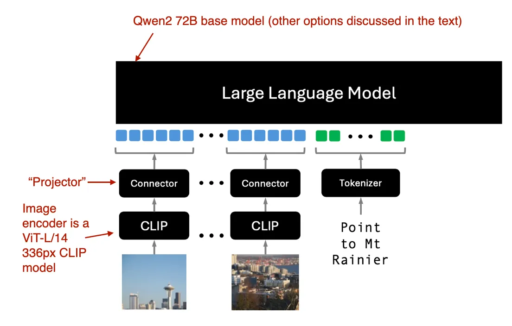

# Understanding Reasoning LLMs
>
> Ref: [Sebastian Raschka's Magazine](https://magazine.sebastianraschka.com/p/understanding-multimodal-llms). This file is my distilled version of that

There are two main approaches to building multimodal LLMs:

* Method A: Unified Embedding Decoder Architecture approach; (like PaliGemma?)

* Method B: Cross-modality Attention Architecture approach.


## Method A: Unified Embedding Decoder Architecture


In the unified embedding-decoder architecture, an image is converted into embedding vectors, similar to how input text is converted into embeddings in a standard text-only LLM.

Image embeddings are generated using an image encoder module. **To process an image, we first divide it into smaller patches, much like breaking words into subwords during tokenization.** These patches are then encoded by a pretrained vision transformer (ViT).


Note that ViTs are often used for classification tasks, so I included the classification head in the figure above. However, in this case, we only need the image encoder part.

### Role of the linear projection

To project the image patches, which are flattened into a vector, into an embedding size compatible with the transformer encoder.


PyTorch code -

```python
import torch


class PatchProjectionLayer(torch.nn.Module):

    def __init__(self, patch_size, num_channels, embedding_dim):
        super().__init__()
        self.patch_size = patch_size
        self.num_channels = num_channels
        self.embedding_dim = embedding_dim
        self.projection = torch.nn.Linear(
            patch_size * patch_size * num_channels, embedding_dim
        )

    def forward(self, x):

        batch_size, num_patches, channels, height, width = x.size()
        x = x.view(batch_size, num_patches, -1)  # Flatten each patch
        x = self.projection(x)  # Project each flattened patch
        return x


# Example Usage:
batch_size = 1
num_patches = 9  # Total patches per image
patch_size = 16  # 16x16 pixels per patch
num_channels = 3  # RGB image
embedding_dim = 768  # Size of the embedding vector

projection_layer = PatchProjectionLayer(patch_size, num_channels, embedding_dim)

patches = torch.rand(
    batch_size, num_patches, num_channels, patch_size, patch_size
)

projected_embeddings = projection_layer(patches)
print(projected_embeddings.shape)

# This prints
# torch.Size([1, 9, 768])
```

> **There are ways to replace linear layers with convolution operations that can be implemented to be mathematically equivalent.** Here, this can be especially handy as we can combine the creation of patches and projection into two lines of code:

```python
layer = torch.nn.Conv2d(3, 768, kernel_size=(16, 16), stride=(16, 16))

image = torch.rand(batch_size, 3, 48, 48)
projected_patches = layer(image)

print(projected_patches.flatten(-2).transpose(-1, -2).shape)
# This prints
# torch.Size([1, 9, 768])
```

### Image vs text tokenization


The purpose of the **projector (a linear projection, also called adapter, adaptor, or connector)** is to project the image encoder outputs into a dimension that matches the dimensions of the embedded text tokens.

Now we simply concatenate image patch embeddings and the text token embeddings (since they have the same embedding dimension) as input to the LLM

> The image encoder we discussed in this section is usually a pretrained vision transformer. A popular choice is [CLIP](https://github.com/openai/CLIP) or [OpenCLIP](https://github.com/mlfoundations/open_clip).

However, there are also versions of Method A that operate directly on patches, such as [Fuyu](https://www.adept.ai/blog/fuyu-8b). Fuyu passes the input patches directly into a linear projection (or embedding layer) to learn its own image patch embeddings rather than relying on an additional pretrained image encoder like other models and methods do. This greatly simplifies the architecture and training setup.

> As good as calling the Linear Layer as the Image Encoder (for Fuyu's setup).

## Method B: Cross-Modality Attention Architecture


We still use the same image encoder setup we discussed previously. However, instead of encoding the patches as input to the LLM, we connect the input patches in the multi-head attention layer via the cross-attention mechanism.

> In the context of multimodal LLM, the encoder is an image encoder.

In cross-attention, we have two different input sources. **Note how $QK^T$ is itself from two sources. The queries usually come from the decoder, and the keys and values typically come from the encoder**


In the context of a multimodal LLM, $x_2$ is the output of an image encoder.

## Unified decoder and cross-attention model training

How we deal with the three major components during model training -


Similar to the development of traditional text-only LLMs, the training of multimodal LLMs also involves two phases: pretraining and instruction finetuning.

* For the image encoder, **CLIP** is commonly used and often **remains unchanged** during the entire training process
* Keeping the **LLM part frozen during the pretraining** phase is also usual, focusing only on training the projector - a linear layer.
* The **LLM is often unfrozen during multimodal instruction finetuning** (stage 2) to allow for more comprehensive updates.
* However, in the cross-attention-based models **(Method B), the cross-attention layers are unfrozen throughout** the entire training process.

### Comparision

| Method A | Method B |
| --- | --- |
|**Easier to implement** since it doesn't require any modifications to the LLM architecture itself | **More computationally efficient** because it doesn't overload the input context with additional image tokens |
| maintains the text-only performance of the original LLM if the LLM parameters are kept frozen during training | ... |

> **NOTE**: Check the second point, it applies to Method A, isn't it?

## Recent multimodal models and methods

This is a brief look at the latest developments

### The Llama 3 Herd of Models

The multimodal Llama 3.2 models, which come in an 11-billion and 90-billion parameter version, are image-text models that use the previously described **cross-attention-based approach.**


*The video and speech parts are visually occluded to focus the attention on the image part.*

Llama 3.2 uses the cross-attention-based approach, which differs a bit from what we discussed earlier. Namely that in multimodal LLM development, **we usually freeze the image encoder (like CLIP) and only update the LLM parameters during pretraining.**

Here, the researchers almost **take the opposite approach: they update the image encoder but do not update the language model's parameters.** They write that this is intentional and done to preserve the text-only capabilities so that the 11B and 90B multimodal models can be used as **drop-in replacements** for the Llama 3.1 8B and 70B text-only model on text tasks.

The training itself is done in multiple iterations, starting with the Llama 3.1 text models. After adding the image encoder and projection (here called "adapter") layers, they pretrain the model on image-text data. Then, they follow up with instruction and preference finetuning.

Instead of adopting a pretrained model such as CLIP as an image encoder, **the researchers used a vision transformer that they pretrained from scratch.** Specifically, they adopted the  ViT-H/14 variant (630 million parameters) of the classic vision transformer architecture ([Dosovitskiy et al., 2020](https://arxiv.org/abs/2010.11929)). They then pretrained the ViT on a dataset of **2.5 billion image-text pairs over five epochs;** this was done before connecting the image encoder to the LLM. (The image encoder takes 224×224 resolution images and divides them into a 14×14 grid of patches, with each patch sized at 16×16 pixels.)

> **As the cross-attention layers add a substantial amount of parameters, they are only added in every fourth transformer block. (For the 8B model, this adds 3B parameters, and for the 70B model, this adds 20 billion parameters.)**

### Molmo and PixMo: Open Weights and Open Data for State-of-the-Art Multimodal Models

The Molmo and paper (September 25, 2024) is notable because it promises to open source not only the model weights but also the dataset and source code similar to the language-only OLMo LLM.

Molmo refers to the model (Multimodal Open Language Model), and PixMo (Pixels for Molmo) is the dataset.



The image encoder employs an off-the-shelf vision transformer, specifically CLIP. The term "connector" here refers to a "projector" that aligns image features with the language model.

### NVLM: Open Frontier-Class Multimodal LLMs

NVIDIA's NVLM paper (September 17, 2024) is particularly interesting because, rather than focusing on a single approach, it explores both methods - Method A in NVLM-D, and Method B in NVLM-X.

Additionally, they develop a hybrid approach (NVLM-H) and provide an apples-to-apples comparison of all three methods.


The concept behind the **hybrid model** (NVLM-H) is to combine the strengths of both methods: **an image thumbnail is provided as input, followed by a dynamic number of patches passed through cross-attention to capture finer high-resolution details.**

The research team finds that:

* NVLM-X **(Method B) demonstrates superior computational efficiency for high-resolution images.**
* NVLM-D **(Method A) achieves higher accuracy in OCR-related tasks.**
* NVLM-H combines the advantages of both methods.

**They found that for NVLM-X, it works well to freeze the original LLM parameters and train only the cross-attention layers during both pretraining and instruction finetuning.**

For the image encoder, instead of using a typical CLIP model, they use **[InternViT-6B](https://arxiv.org/abs/2312.14238), which remains frozen throughout all stages.**

The projector is a multilayer perceptron rather than a single linear layer.

### Qwen2-VL: Enhancing Vision-Language Model’s Perception of the World at Any Resolution

At the core of this work is their so-called "Naive Dynamic Resolution" mechanism. **It allows the model to handle images of varying resolutions without simple downsampling, enabling the input of images in their original resolution.**


**The native resolution input is implemented via a modified ViT by removing the original absolute position embeddings and introducing 2D-RoPE.**

They used a classic vision encoder with 675M parameters and LLM backbones of varying sizes like 1.5B, 7B, 72B.

The training itself consists of 3 stages

1. Pretraining only the image encoder
2. Unfreezing all parameters (including LLM)
3. Freezing the image encoder and instruction-finetuning only the LLM.

### Pixtral 12B

Uses Method A, is the first multimodal model from Mistral AI. The Mistral team shared a few interesting tidbits in their [blog post](https://mistral.ai/news/pixtral-12b/).

Interestingly, they chose not to use a pretrained image encoder, instead training one with 400 million parameters from scratch. For the LLM backbone, they used the 12-billion-parameter [Mistral NeMo](https://mistral.ai/news/mistral-nemo/) model.

Similar to Qwen2-VL, Pixtral also supports variable image sizes natively, as illustrated in the figure below.


### MM1.5: Methods, Analysis & Insights from Multimodal LLM Fine-tuning

Introduces a **mixture-of-experts multimodal model** alongside a dense model similar to Molmo. The models span a wide size range, from 1 billion to 30 billion parameters.

The models described in this paper focus on Method A. In addition, the paper has a series of interesting ablation studies looking into **data mixtures and the effects of using coordinate tokens (bounding boxes)**.


The *[Aria: An Open Multimodal Native Mixture-of-Experts Model](https://arxiv.org/abs/2410.05993)* paper (October 8, 2024) introduces another mixture-of-experts model approach, similar to one of the variants in the Molmo and MM1.5 lineups.

### Aria: An Open Multimodal Native Mixture-of-Experts Model

The Aria model has 24.9 billion parameters, with 3.5 billion parameters allocated per text token. The image encoder ([SigLIP](https://arxiv.org/abs/2303.15343)) has 438-million-parameters.

This model is based on a cross-attention approach with the following overall training procedure:

1. Training the LLM backbone entirely from scratch. **(!!)**

2. Pretraining both the LLM backbone and the vision encoder.

### Baichuan-Omni

Based on Method A


The training process involves a three-stage approach:

1. **Projector training**: Initially, only the projector is trained, while both the vision encoder and the language model (LLM) remain frozen.

2. **Vision encoder training**: Next, the vision encoder is unfrozen and trained, with the LLM still frozen.

3. **Full model training**: Finally, the LLM is unfrozen, allowing the entire model to be trained end-to-end.

The model utilizes the SigLIP vision encoder and incorporates the **[AnyRes](https://arxiv.org/abs/2204.07156) module to handle high-resolution images** through down-sampling techniques.

While the report does not explicitly specify the LLM backbone, it is likely based on the Baichuan 7B LLM, given the model's parameter size and the naming convention.

### Emu3: Next-Token Prediction is All You Need

Emu3 is super interesting as it **demonstrates that it's possible to use transformer decoders for image generation, which is a task typically dominated by diffusion methods.** (However, note that there have been other similar approaches before, such as [Autoregressive Model Beats Diffusion: Llama for Scalable Image Generation](https://arxiv.org/abs/2406.06525).)


The researchers trained Emu3 from scratch and then used [Direct Preference Optimization](https://github.com/rasbt/LLMs-from-scratch/blob/main/ch07/04_preference-tuning-with-dpo/dpo-from-scratch.ipynb) (DPO) to align the model with human preferences.

The architecture includes a vision tokenizer inspired by [SBER-MoVQGAN](https://arxiv.org/abs/2209.09002). The core LLM architecture is based on Llama 2, yet it is trained entirely from scratch.

### Janus: Decoupling Visual Encoding for Unified Multimodal Understanding and Generation

We previously focused on multimodal LLMs for image understanding and just saw one example for image generation with Emu 3 above. Now, Janus paper (October 17, 2024) introduces a **framework that unifies multimodal understanding and generation tasks within a single LLM backbone.**

A key feature of Janus is the **decoupling of visual encoding pathways** to address the distinct requirements of understanding and generation tasks. The researchers argue that

* **Image understanding** tasks require **high-dimensional semantic representations** while
* **Generation** tasks require **detailed local information** and global consistency in images.

 By separating these pathways, Janus effectively manages these differing needs.

The model employs the SigLIP vision encoder. For image generation, it utilizes a [Vector Quantized (VQ)](https://arxiv.org/abs/2406.06525) tokenizer to handle the generation process. The base LLM in Janus is the [DeepSeek-LLM](https://arxiv.org/abs/2401.02954) with 1.3 billion parameters.


The training process for the model in this image follows three stages

1. Only the projector layers and image output layer are trained while the LLM, understanding, and generation encoders remain frozen
2. The LLM backbone and text output layer are unfrozen, allowing for unified pretraining across understanding and generation tasks
3. The entire model, including the SigLIP image encoder, is unfrozen for supervised fine-tuning, enabling the model to fully integrate and refine its multimodal capabilities.


## Conclusion

Comparing the performance of LLMs and multimodal LLMs on public benchmarks is challenging due to prevalent data contamination, meaning that the test data may have been included in the training data.

Additionally, the architectural components vary so much that making an apples-to-apples comparison is difficult. So, big kudos to the NVIDIA team for developing NVLM in different flavors, which allowed for a comparison between the decoder-only and cross-attention approaches at least.

**In any case, the main takeaway from this article is that multimodal LLMs can be built successfully in many different ways**. Below is a figure that summarizes the different components of the models covered in this article.


