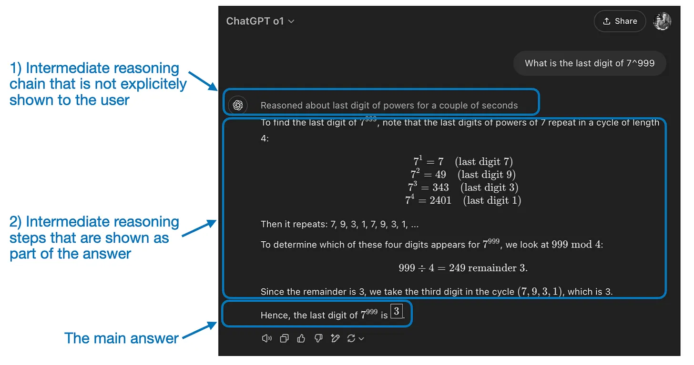
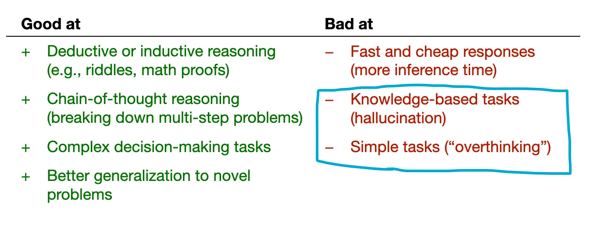
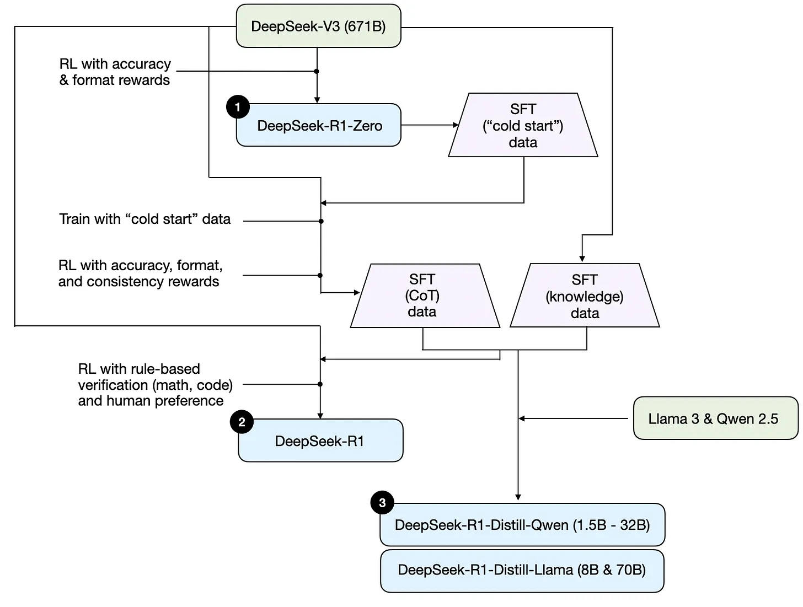
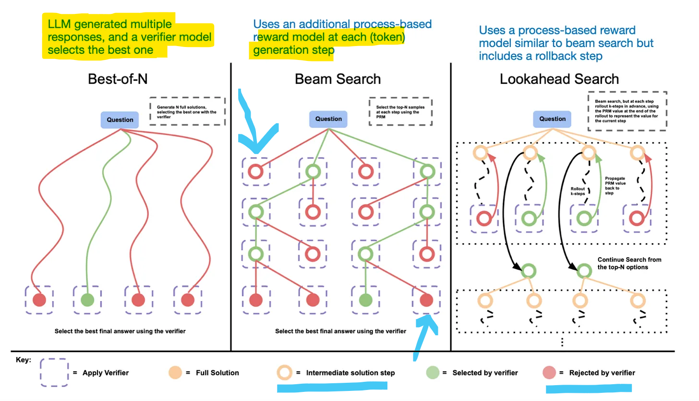
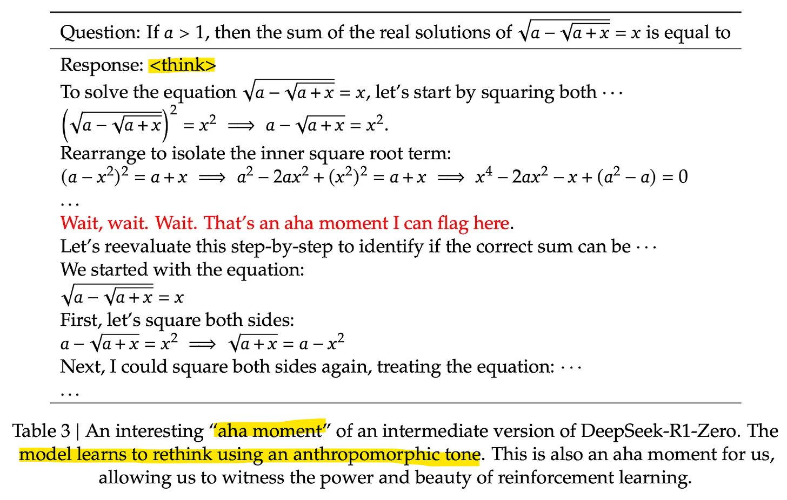
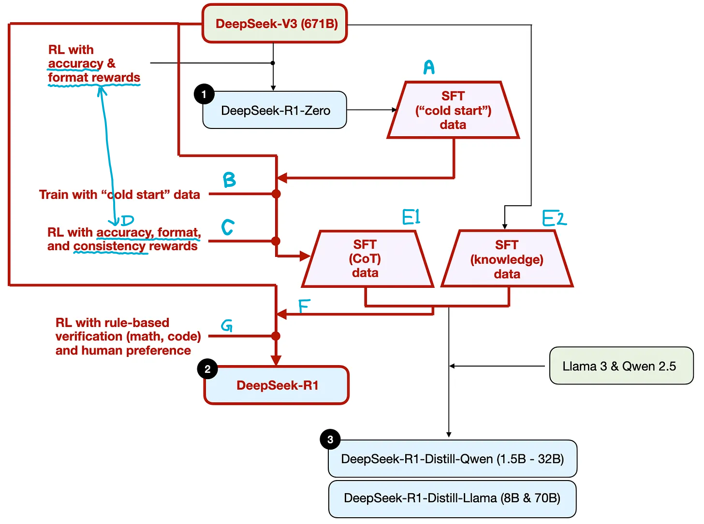
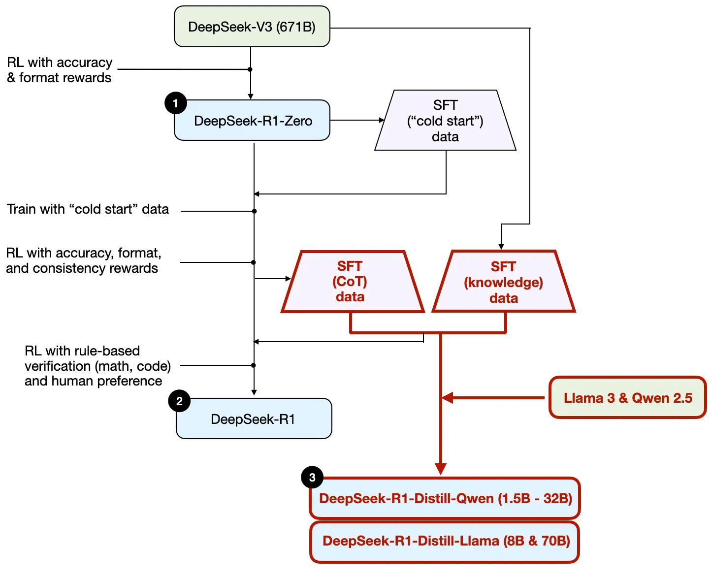
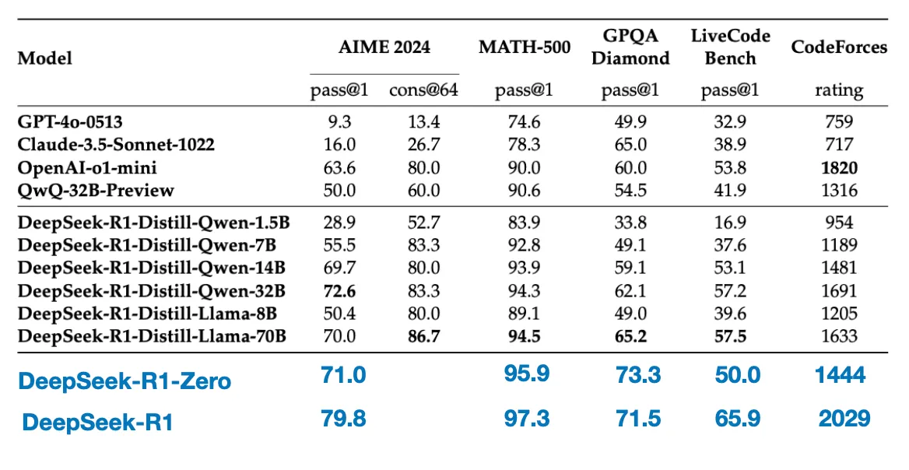

# Understanding Reasoning LLMs
>
> Ref: [Sebastian Raschka's Magazine](https://magazine.sebastianraschka.com/p/understanding-reasoning-llms). This file is my distilled version of that

Intermediate steps in reasoning models can appear in two ways. First, they may be explicitly included in the response. Second, some reasoning LLMs, such as OpenAI's o1, run multiple iterations with intermediate steps that are not shown to the user.

> Reasoning models are typically more expensive to use, more verbose, and sometimes more prone to errors due to "overthinking."

## A brief look at the DeepSeek training pipeline

## The 4 main ways to build and improve reasoning models

### Inference-time scaling

The **CoT** approach can be seen as inference-time scaling because it makes inference more expensive through generating more output tokens

> Note that it doesn't make sense to employ CoT for simpler knowledge-based questions, like "What is the capital of France", which is again a good rule of thumb to find out whether a reasoning model makes sense on your given input query.

Another approach to inference-time scaling is the use of **voting and search strategies.** One simple example is majority voting where we have the LLM generate multiple answers, and we select the correct answer by majority vote.

*Different search-based methods rely on a process-reward-based model to select the best answer. Annotated figure from the LLM Test-Time Compute paper <https://arxiv.org/abs/2408.03314>*

> I suspect that OpenAI's o1 and o3 models use inference-time scaling, which would explain why they are relatively expensive compared to models like GPT-4o.

### Pure reinforcement learning (RL)

One of my personal highlights from the **DeepSeek R1 paper is their discovery that reasoning emerges as a behavior from pure reinforcement learning (RL).**

DeepSeek-R1-Zero was trained **exclusively** with reinforcement learning without an initial SFT stage as highlighted in the diagram earlier on three DeepSeek models.

For rewards, instead of using a reward model trained on human preferences, they employed two types of rewards: an accuracy reward and a format reward.

- The **accuracy reward** uses the **LeetCode compiler** to verify coding answers and a **deterministic system** to evaluate mathematical responses.

- The **format reward** relies on an **LLM judge** to ensure responses **follow the expected format**, such as placing reasoning steps inside `<think>` tags.

Surprisingly, this approach was **enough for the LLM to develop basic reasoning skills**. The researchers observed an "Aha!" moment, where the model began generating reasoning traces as part of its responses despite not being explicitly trained to do so, as shown in the figure below

### Supervised finetuning and reinforcement learning (SFT + RL)

DeepSeek-R1, DeepSeek’s flagship reasoning model, improves upon DeepSeek-R1-Zero by incorporating additional **supervised fine-tuning (SFT) and reinforcement learning (RL)** to improve its reasoning performance.

Note that it is **actually common to include an SFT stage before RL**, as seen in the standard RLHF pipeline. OpenAI's o1 was likely developed using a similar approach.

> "cold start" refers to the fact that this data was produced by DeepSeek-R1-Zero, which itself had not been trained on any supervised fine-tuning (SFT) data.

Following the diagram -

- **(A)** Use DeepSeek-R1-Zero to generate what they call "cold-start" SFT data.
- Using this cold-start SFT data, DeepSeek then trained the model via instruction fine-tuning **(B)**, followed by another reinforcement learning stage **(C)**. This RL stage retained the same accuracy and format rewards used in DeepSeek-R1-Zero’s RL process.
- However **(D)**, they added a consistency reward to prevent language mixing, which occurs when the model switches between multiple languages within a response.

- The RL stage was followed by another round of SFT data collection.
  - In this phase, the most recent model checkpoint was used to generate 600K Chain-of-Thought (CoT) SFT examples **(E1)**, while an additional 200K knowledge-based SFT examples were created using the DeepSeek-V3 base model **(E2)**.

- **(F)** These 600K + 200K SFT samples were then used for instruction-finetuning DeepSeek-V3 base before following up with a final round of RL.
- In this stage **(G)**, they again used rule-based methods for accuracy rewards for math and coding questions, while human preference labels used for other question types.

All in all, this is very similar to regular RLHF except that the SFT data contains (more) CoT examples. And the RL has verifiable rewards in addition to human preference-based rewards.

### Pure supervised finetuning (SFT) and distillation

However, in the context of LLMs, distillation does not necessarily follow the classical knowledge distillation approach used in deep learning.

Instead, **here distillation refers to instruction fine-tuning smaller LLMs, such as Llama 8B and 70B and Qwen 2.5 models (0.5B to 32B), on an SFT dataset generated by larger LLMs.** Specifically, these larger LLMs are DeepSeek-V3 and an intermediate checkpoint of DeepSeek-R1. In fact, **the SFT data used for this distillation process is the same dataset that was used to train DeepSeek-R1,** as described in the previous section.

### Performance
>
> Observe how the `DeepSeek-R1-Distill-Qwen-1.5B` is still better than `Claude-3.5-Sonnet-1022` in so many benchmarks!

Interestingly, the results suggest that **distillation is far more effective than pure RL for smaller models.** This aligns with the idea that RL alone may not be sufficient to induce strong reasoning abilities in models of this scale, whereas SFT on high-quality reasoning data c

## Developing reasoning models on a limited budget

Fortunately, model distillation offers a more cost-effective alternative. The DeepSeek team demonstrated this with their **R1-distilled models, which achieve surprisingly strong reasoning performance despite being significantly smaller** than DeepSeek-R1.

### Sky-T1

[article about Sky-T1](https://novasky-ai.github.io/posts/sky-t1/), a fascinating project where a small team trained (distilled) an open-weight 32B model using only 17K SFT samples. The total cost? **Just $450**.

According to their benchmarks, Sky-T1 performs roughly on par with o1, which is impressive given its low training cost.

### TinyZero

TinyZero, a 3B parameter model that replicates the DeepSeek-R1-Zero approach. It costs less than $30 to train.

Surprisingly, even at just 3B parameters, **TinyZero exhibits some emergent self-verification abilities**, which supports the idea that reasoning can emerge through pure RL, even in small models.
