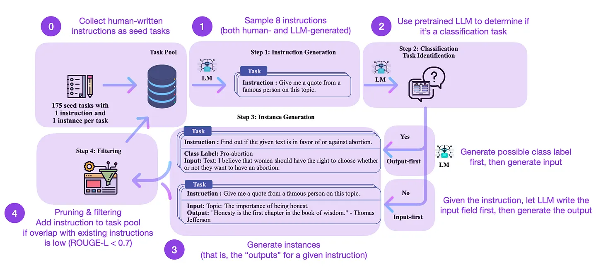

# Understanding LLMs

> Ref: [Sebastian Raschka's Magazine](https://magazine.sebastianraschka.com/p/understanding-large-language-models)

## BART

BERT-type encoder-style LLMs are usually preferred for predictive modeling tasks, whereas GPT-type decoder-style LLMs are better at generating texts. To get the best of both worlds, the BART paper above combines both the encoder and decoder parts (not unlike the original transformer).

## Cramming: Training a Language Model on a Single GPU in One Day

In this paper, the researchers trained a masked language model / encoder-style LLM (here: BERT) for **24h on a single GPU**. For comparison, the original 2018 BERT paper trained it on 16 TPUs for four days. **An interesting insight is that while smaller models have higher throughput, smaller models also learn less efficiently**. Thus, larger models do not require more training time to reach a specific predictive performance threshold.
> Wait what? larger models do not require more training time?

## Scaling Down to Scale Up: A Guide to Parameter-Efficient Fine-Tuning

This survey reviews more than 40 papers on parameter-efficient finetuning methods (including popular techniques such as prefix tuning, adapters, and low-rank adaptation) **to make finetuning (very) computationally efficient.**

## Scaling Language Models: Methods, Analysis & Insights from Training Gopher

**Both LayerNorm and RMSNorm are preferred over BatchNorm since they don't depend on the batch size** and doesn't require synchronization, which is an advantage in distributed settings with smaller batch sizes. However, **RMSNorm is generally said to stabilize the training in deeper architectures.**

Reveal that **increasing model sizes benefits tasks like comprehension, fact-checking, and the identification of toxic language the most**. However, tasks related to **logical and mathematical reasoning benefit less from architecture scaling.**

## Training Compute-Optimal Large Language Models

This paper introduces the **70-billion parameter Chinchilla model that outperforms the popular 175-billion parameter GPT-3 model** on generative modeling tasks. However, its **main punchline is that contemporary large language models are "significantly undertrained."**

The paper defines the linear scaling law for large language model training. For example, while Chinchilla is only half the size of GPT-3, **it outperformed GPT-3 because it was trained on 1.4 trillion (instead of just 300 billion) tokens.**
> In other words, the number of training tokens is as vital as the model size.

### Pythia: A Suite for Analyzing Large Language Models Across Training and Scaling

Pythia is a suite of open-source LLMs (70M to 12B parameters) to study how LLMs evolve over the course of training. The main insights of the Pythia study are -

- Training on **duplicated data** (due to how LLMs are trained, this means training for more than one epoch) **does not benefit or hurt performance.**

- **Training order does not influence memorization.** This is unfortunate because if the opposite were true, we could mitigate undesirable verbatim memorization issues by reordering the training data.

- **Pretrained term frequency influences task performance. For instance, few-shot accuracy tends to be higher for more frequent terms.**

- **Doubling the batch size halves the training time but doesn't hurt convergence.**

## Training Language Models to Follow Instructions with Human Feedback

In this so-called **InstructGPT** paper, the researchers use a reinforcement learning mechanism with humans in the loop **(RLHF)**.

- They start with a pretrained GPT-3 base model and fine-tune it further using supervised learning on prompt-response pairs generated by humans (Step 1).
- Next, they ask humans to rank model outputs to train a reward model (step 2).
- Finally, they use the reward model to update the pretrained and fine-tuned GPT-3 model using reinforcement learning via proximal policy optimization (step 3).

As a sidenote, this paper is also known as the **paper describing the idea behind ChatGPT** – according to the recent rumors, ChatGPT is a scaled-up version of InstructGPT that has been fine-tuned on a larger dataset.

## Self-Instruct: Aligning Language Model with Self Generated Instruction

**Self-Instruct is one (almost annotation-free) way to align pretrained LLMs with instructions.** How does this work? In a nutshell, it's a 4-step process:

- Seed (populate) task pool with a set of human-written instructions (175 in this case). Sample instructions from the pool.
- Use a pretrained LLM (like GPT-3) to determine the task category.
- Given the new instruction, let a pretrained LLM generate the response.
- Collect, prune, and filter the responses before adding them to the task pool.

In practice, this works relatively well based on the ROUGE scores.

For example, a Self-Instruct-finetuned LLM outperforms the GPT-3 base LLM (1) and can compete with an LLM pretrained on a large human-written instruction set (2). And self-instruct can also benefit LLMs that were already finetuned on human instructions (3).

But of course, the gold standard for evaluating LLMs is to ask human raters. Based on human evaluation, Self-Instruct outperforms base LLM, and LLMs trained on human instruction datasets in supervised fashion (SuperNI, T0 Trainer). **But interestingly, Self-Instruct does not outperform methods trained via reinforcement learning with human feedback (RLHF)**

> NOTE: All the content is taken from Sebastian's Blog. Including the para below -

Which is more promising, human-generated instruction datasets or self-instruct-datasets? I vote for both. Why not start with a human-generated instruction dataset like the 15k instructions from databricks-dolly-15k and then scale this with self-instruct?
