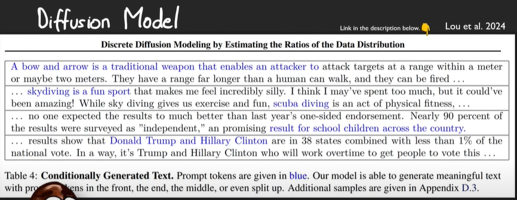
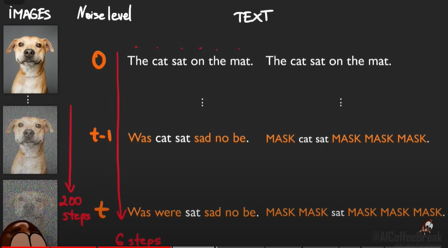
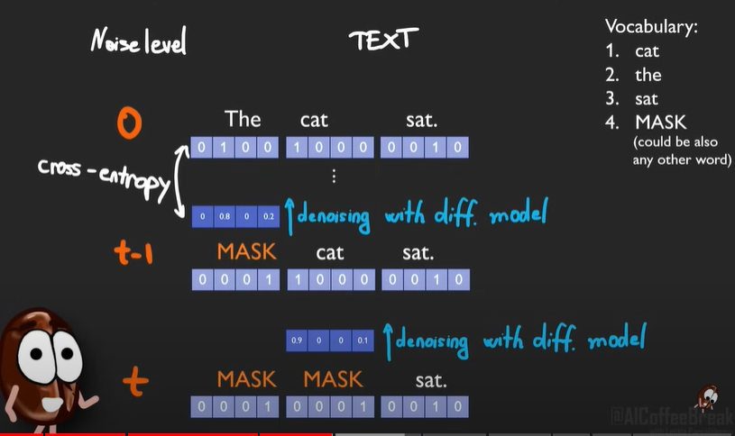
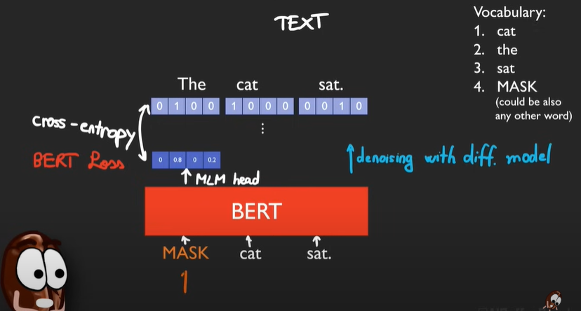
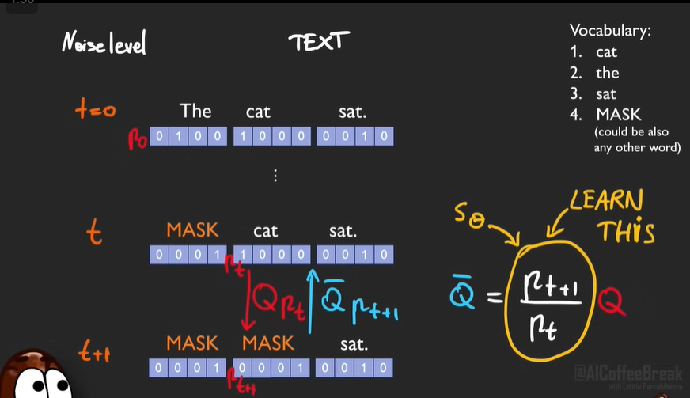
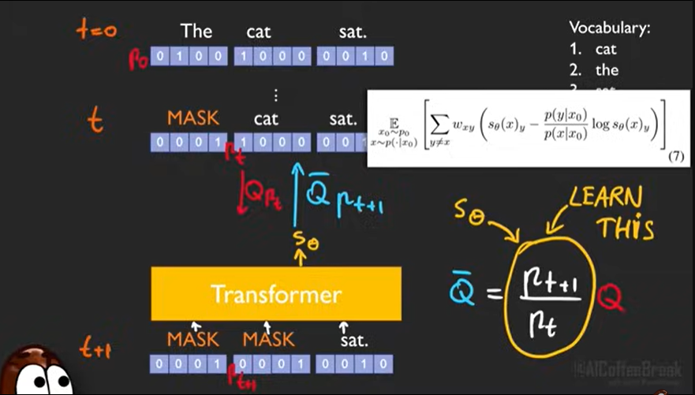
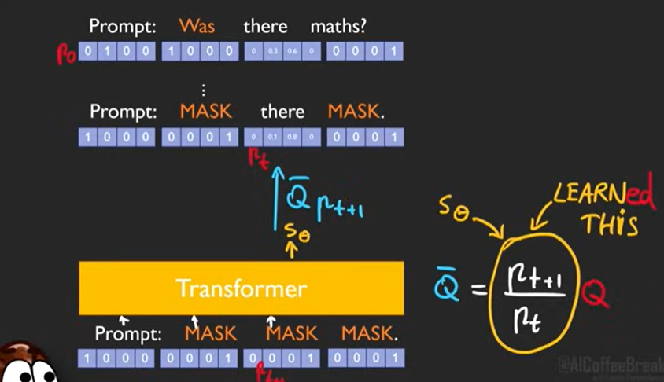

# Discrete Diffusion Modeling by Estimating the Ratios of the Data Distribution (Lou et.al.)
> The paper won the #ICML2024 best paper award! 👏

> Notes source: AI Coffee Break with Letitia (https://www.youtube.com/watch?v=K_9wQ6LZNpI) 

> Paper source: https://arxiv.org/abs/2310.16834 

So far diffusion models only for images, video, sound. We can sequentially add noise (forward process) and train a model (unet) for predicting the noise (backward process). Everything moves smoothly, specially with Gaussian distributions.

But text is discrete! \
**Text diffusion models can generate text with prompts positioned anywhere.**

Note how image diffusion in 200 steps is simpler, but text diffusion in 6 steps is almost full masked!

## Solution: Discrete Diffusion
Instead of diffusion on the tokens, we perform **diffusion on Tokens' probability vector** (like softmax output)

Mask the probs. Denoise the masked tokens wrt probs only. Finally give the $cross-entropy~loss^{*}$ between actual and 'denoised' versions

## Similarity with BERT
Yes, BERT is also indirectly a text diffusion model, but with around **15% masked tokens rate**, whereas for diffusion model it goes upto 100%

If we try 100% masked tokens to generate tokens from BERT, it will do badly because it wasn't trained on so mnay masked tokens.

## Actual Process
Diffusion process is like linear operation, using matrices. Inverse of this diffusion (backward) turns out to be a scaled version (involving probs distribution) of the forward diffusion. \
The ratio is called  `concrete score`\
> Refer equation 1, 2, 3 of paper

Learn $S_{\theta}$ from the loss. Now keep using this $S_{\theta}$ on the noisy probabilities to generate text.

## Nice Points
* Achieved this with a 320M param model