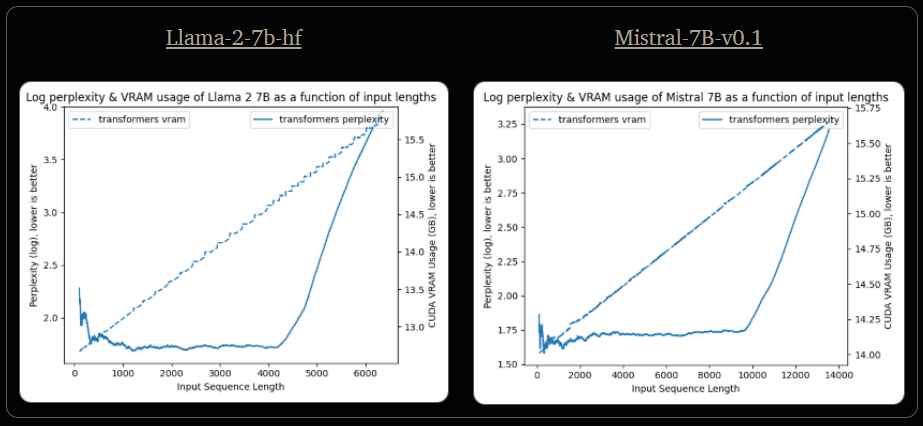
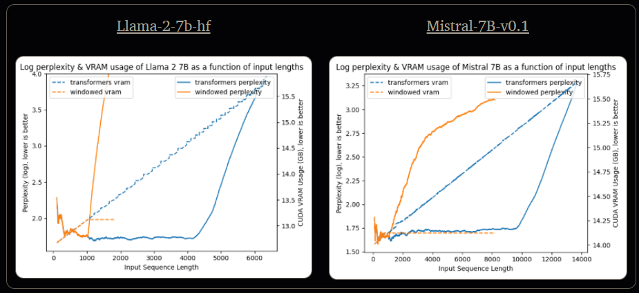
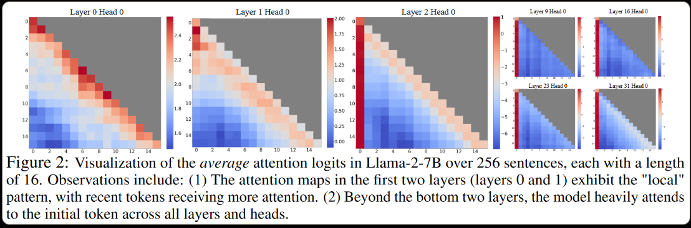
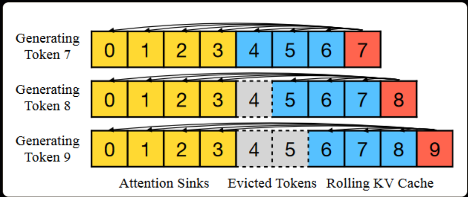
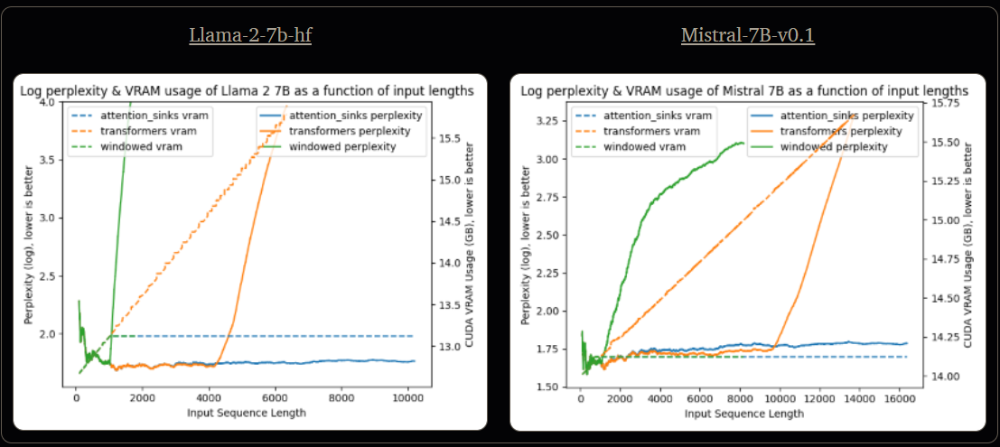
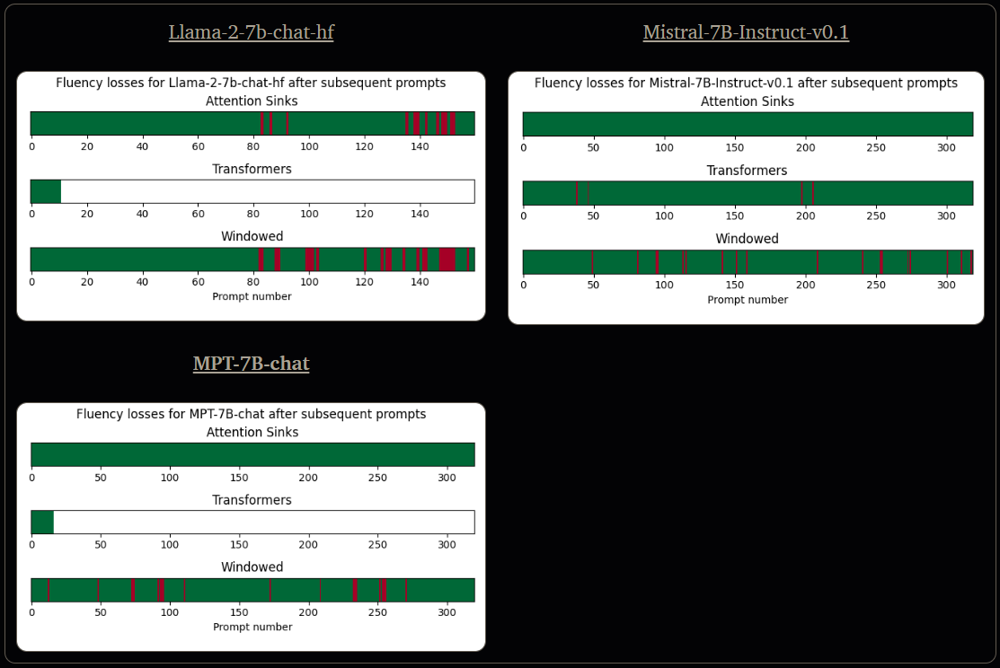

# Attention Sinks in LLMs for endless fluency

> Taken from Tom Aarsen's awesome blog on HuggingFace [here](https://huggingface.co/blog/tomaarsen/attention-sinks). He released a drop in replacement for the `AutoModel` class that implements attention sinks. What a legend!
@article{xiao2023streamingllm,
    title={Efficient Streaming Language Models with Attention Sinks},
    author={Xiao, Guangxuan and Tian, Yuandong and Chen, Beidi and Han, Song and Lewis, Mike},
    journal={arXiv},
    year={2023}
}

* [Tl;dr](#tldr "Tl;dr")

* [Table of Contents](#table-of-contents "Table of Contents")

* [Limitations for Chat-Assistant LLMs](#limitations-for-chat-assistant-llms "Limitations for Chat-Assistant LLMs")

* [Window Attention](#window-attention "Window Attention")

* [Attention Sinks](#attention-sinks "Attention Sinks")
  * [Attention Sinks - Perplexity Experiments](#attention-sinks---perplexity-experiments "Attention Sinks - Perplexity Experiments")

  * [Attention Sinks - Endless Generation Experiments](#attention-sinks---endless-generation-experiments "Attention Sinks - Endless Generation Experiments")

  * [Attention Sinks - Chat Assistant Experiment](#attention-sinks---chat-assistant-experiment "Attention Sinks - Chat Assistant Experiment")

  * [Attention Sinks - Benchmark Conclusion](#attention-sinks---benchmark-conclusion "Attention Sinks - Benchmark Conclusion")

* [Attention Sinks in Practice](#attention-sinks-in-practice "Attention Sinks in Practice")

* [FAQ](#faq "FAQ")

* [Learn More](#learn-more "Learn More")

* [Citation](#citation "Citation")

[](#tldr)Tl;dr
----------------------------------------------------------------------------------------------------------------------------------------------------------------------------------------------------------------------------------------------------------------------------------------------------------------------------------------------------------------------------------------------------------------------------------------------------------------------------------------------------------------------------------------------------------------------------------------------------------------------------------------------------------------------------------------------------------------------------------------------------------------------------------------------------------------------------------------------------------------------------------------------------------------------------------------------------------------------------------------------------------------------------------------------------------------------------------------------------------------------------------------------------------------------------------------------------------------------------------------

Using window attention with attention sink tokens allows pretrained chat-style LLMs, such as all Llama, Mistral, MPT, Falcon, and GPT-NeoX (Pythia) models, to stay fluent across hundreds of subsequent prompts, unlike when these models are loaded using `transformers`. `Furthermore, this approach allows for constant memory usage, while most LLMs loaded with`transformers`have linear space complexity resulting in memory issues.`

Using this form of attention is as simple as importing your model class from [`attention_sinks`](https://github.com/tomaarsen/attention_sinks) rather than `transformers`:

```py
from attention_sinks import AutoModel
model = AutoModel.from_pretrained("mistralai/Mistral-7B-Instruct-v0.1", device_map="auto")
```

[](#table-of-contents)Table of Contents
---------------------------------------

* [Limitations for Chat-Assistant LLMs](#limitations-for-chat-assistant-llms)
* [Window Attention](#window-attention)
* [Attention Sinks](#attention-sinks)
  * [Attention Sinks - Perplexity Experiments](#attention-sinks---perplexity-experiments)
  * [Attention Sinks - Endless Generation Experiments](#attention-sinks---endless-generation-experiments)
  * [Attention Sinks - Chat Assistant Experiment](#attention-sinks---chat-assistant-experiment)
  * [Attention Sinks - Benchmark Conclusion](#attention-sinks---benchmark-conclusion)
* [Attention Sinks in Practice](#attention-sinks-in-practice)
* [FAQ](#faq)
* [Learn More](#learn-more)
* [Citation](#citation)

[](#limitations-for-chat-assistant-llms)Limitations for Chat-Assistant LLMs
---------------------------------------------------------------------------

Large Language Models (LLMs) have taken the industry by storm and fast-forwarded the field of chatbots and virtual assistants. LLMs seem particularly adept at acting as a (specialised) personal assistant, but they suffer from various limitations. In this blogpost, we will focus on the following two major restrictions:

* **VRAM usage**: Many LLMs (e.g. [Llama 2](https://huggingface.co/meta-llama/Llama-2-7b-hf)) suffer from linear space complexity during inference time. In a chat-assistant setting, this means that the VRAM limit of your device will constrain the ability for the user to keep prompting sequentially.

* **Loss of Fluency**: All LLMs that have been trained so far suffer from a loss of fluency as the input grows too long. When this occurs, the model will lose the ability to produce language, and starts generating e.g. endless newlines, arbitrary characters (`0OgOATO0OATO`), broken unicode (`���`) or repeated words (`assistant: assistant: assistant: assistant:`).

    Most LLMs experience this behaviour after the input length has exceeded the pre-training length. For example, [Llama 2 7B](https://huggingface.co/meta-llama/Llama-2-7b-hf) encounters this after exceeding 4096 tokens, while [Mistral-7B-v0.1](https://huggingface.co/mistralai/Mistral-7B-v0.1) loses fluency after about 10k tokens.

These limitations are trivially shown in practice, for example by making an LLM predict the next token of a book given all previous tokens. `The average negative log-likelihood loss of this prediction is called the log perplexity, and its a metric commonly used to show the quality of a LLM. A lower log perplexity corresponds with a lower average loss, and so lower is preferred`. VRAM is also easily measured, and both metrics are plotted in the following figures:



See [Perplexity](https://github.com/tomaarsen/attention_sinks#benchmark-setups) for more information on the scripts to generate these figures.

These limitations heavily inhibit the ability to use LLMs as chat-assistants in production environments.

[](#window-attention)Window Attention
-------------------------------------

A simple attempt to counteract problem 1 (VRAM Usage) is to simply limit the number of tokens fed to the LLM. Building this on top of [`transformers`](https://github.com/huggingface/transformers) is a fairly involved process, but the gist is that every time a token is generated, the `past_key_values` cache is shrunk to the window size if the current size exceeds it.

For my experiments, I used a window size of just 1024 tokens. The results can be seen in the following figures:



`The window attention indeed keeps the memory usage constant once it has generated 1024 tokens, but the log perplexity immediately shoots up once it exceeds this window size`. This makes it equally infeasible of an approach as loading the models using `transformers`.

[](#attention-sinks)Attention Sinks
-----------------------------------

[Xiao et al., 2023](https://arxiv.org/abs/2309.17453) `noticed that when window attention is applied, the model loses fluency immediately even after the very first token is evicted from the window. They noticed an interesting phenomenon of autoregressive LLMs: the first few tokens make up for a shockingly large amount of the attention score, even if the tokens are not semantically important.`

This behaviour is visualized in the following Figure:


`Beyond the first two layers, almost all attention is placed in the first few tokens, which the authors call **attention sinks**. The intuition is that if the next token to be generated has no match with any of the prior tokens, then the Softmax operation still forces the attention to sum up to 1. As a result, the LLM learns to offload the attention score into the first few tokens.`

`Consequently, when the first token falls outside of the window during window attention, the LLM can no longer offload the attention scores into that token. As a result, the attention score is distributed across all other tokens, again summing to 1. This leads to tokens unexpectedly having high attention scores even if they are not a strong match for the token to be generated. The outcome: the model "collapses" and loses fluency.`

Upon discovering this finding, the authors proposed an adaptation of the window attention which **always** keeps the initial 4 tokens, i.e. the attention sink tokens, of the sequence in the window. This can be visualized like so:


Furthermore, when adding positional information to the cache tokens, the approach uses positions inside of the cache rather than the positions in the real text. As a result, the attention sink tokens are always close to the remainder of the tokens, allowing them to effectively be used for offloading attention.

To give a toy example, we'll consider a scenario with a window size of 10, including 4 attention sink tokens, and a text which is just a space separated alphabet. When generating, the model sees:

```
A
A B
A B C
A B C D
A B C D E
A B C D E F
A B C D E F G
A B C D E F G H 
A B C D E F G H I
A B C D E F G H I J
A B C D F G H I J K
A B C D G H I J K L
A B C D H I J K L M
...

```

With these assigned positions:

```
0
0 1
0 1 2
0 1 2 3
0 1 2 3 4
0 1 2 3 4 5
0 1 2 3 4 5 6
0 1 2 3 4 5 6 7
0 1 2 3 4 5 6 7 8
0 1 2 3 4 5 6 7 8 9
0 1 2 3 4 5 6 7 8 9
0 1 2 3 4 5 6 7 8 9
0 1 2 3 4 5 6 7 8 9
...

```

`In short, the assigned position depend solely on the positions in the cache, not the positions in the full text.`

### [](#attention-sinks---perplexity-experiments)Attention Sinks - Perplexity Experiments

For my experiments using the attention sinks, I adapted my window attention implementation to include 4 attention sink tokens that never leave the window, and kept the window size at 1024. The results can be seen in the following figures:



See results for Falcon-7B, MPT-7B and Pythia-6.9B [here](https://github.com/tomaarsen/attention_sinks#perplexity).

`The results are striking: LLMs using window attention with attention sinks have the best of both worlds: constant space complexity and a stable perplexity. [Xiao et al., 2023](https://arxiv.org/abs/2309.17453) show that the perplexity stays stable for up to 4 million tokens, after which they ran out of data (!).`

Note that the log perplexity of the attention sinks approach is slightly higher (i.e. worse) than the baseline at ~8000 tokens. This is because the attention sinks only uses a window size of 1024 tokens. This window size can be increased to e.g. 8192 tokens, and the log perplexity will match the baseline at 8000 tokens _and_ keep the memory constant at ~14.85GB.

### [](#attention-sinks---endless-generation-experiments)Attention Sinks - Endless Generation Experiments

Critics claim that perplexity is an imperfect metric for measuring LLM quality, for example because it does not actually requires the model to generate tokens. To show that attention sinks really works, I generate up to 10.000 tokens using [`Llama-2-7B`](https://huggingface.co/meta-llama/Llama-2-7b-hf) using the three approaches described in this blogpost: default, e.g. `transformers`, `windowed` and `attention_sinks`.

If a model started losing fluency, then I terminated the generation. I've uploaded the full logs of each of the approaches on my repository.

* `transformers`: [Full logs](https://github.com/tomaarsen/attention_sinks/blob/main/demo/endless_logs/transformers/meta-llama/Llama-2-7b-hf.txt): This model loses fluency after ~1900 tokens and starts endlessly generating broken unicode characters like `🤖🧠👨‍���������������������` ❌.
* window attention [Full logs](https://github.com/tomaarsen/attention_sinks/blob/main/demo/endless_logs/windowed/meta-llama/Llama-2-7b-hf.txt): This model loses fluency after ~1000 tokens, generates hundreds of newlines interspersed with text like `OOOMMO̶OANOOAMOO̶OMMO` ❌.
* [`attention_sinks`](https://github.com/tomaarsen/attention_sinks) [Full logs](https://github.com/tomaarsen/attention_sinks/blob/main/demo/endless_logs/attention_sinks/meta-llama/Llama-2-7b-hf.txt): Fluent for the full 10k tokens of the test ✅.

See [Fluency during endless generation](https://github.com/tomaarsen/attention_sinks#benchmark-setups) for more information on the scripts to reproduce these results.

### [](#attention-sinks---chat-assistant-experiment)Attention Sinks - Chat Assistant Experiment

The attention sinks approach is extremely well suited for chat-style LLM applications, as it remains much more fluent than just loading the models using `transformers`, and it uses much less memory. Thus, a natural benchmark is to experiment with the various approaches in a common chat-assistant scenario.

In this benchmark, I sent subsequent prompts from [MT-Bench](https://huggingface.co/datasets/HuggingFaceH4/mt_bench_prompts) through the model and automatically detect when fluency gets lost. This simulates a scenario where a chat assistant is prompted with hundreds of prompts in the same history, during which the model has to deal with histories of tens of thousands of tokens.

I automatically classified a response as a failure if it:

* contains less than 26 different characters, and
* is more than 1000 tokens long.

In practice, this heuristic seems to accurately detect losses of fluency. I've plotted the findings in the following figures:



See [Fluency across subsequent prompts for chat-style LLMs](https://github.com/tomaarsen/attention_sinks#benchmark-setups) for more information on the scripts to reproduce these results.

For Llama-2-7b-chat, `transformers` runs out of VRAM, so it can only handle a handful of subsequent prompts. For MPT-7B-chat, a `RuntimeError` is encountered for `transformers` when the input length exceeds 2048. These figures clearly show that loading models using `attention_sinks` has a very positive impact on the fluency of the models across subsequent prompts. However, as can be seen for Llama-2-7B-chat-hf, it does not completely avoid all fluency issues.

### [](#attention-sinks---benchmark-conclusion)Attention Sinks - Benchmark Conclusion

The benchmarks described in this blogpost, as well as the additional benchmarks for MPT, Pythia an Falcon models that I have described in my [`attention_sinks` repository](https://github.com/tomaarsen/attention_sinks), clearly indicate that attention sinks can be effectively used on pretrained LLMs to counteract model instabilities and losses in fluency. This additional stability comes at no additional cost, and even allows for constant memory usage instead of the linear memory usage of most LLMs.

Attention sinks should be considered by any organization or user looking to use assistant-style LLMs.

[](#attention-sinks-in-practice)Attention Sinks in Practice
-----------------------------------------------------------

There is often a notable gap between state of the art research and what practitioners can reasonably use. However, I'm glad to say that attention sinks can be added to any pretrained LLM at near to no additional effort.

I have released the [`attention_sinks`](https://github.com/tomaarsen/attention_sinks) Python module, which acts as a drop-in replacement for the `transformers` API. This Python module supports all models using the Llama, Mistral, Falcon, MPT and GPT-NeoX (Pythia) architectures, and can be used like so:

```py
from attention_sinks import AutoModel
model = AutoModel.from_pretrained("mistralai/Mistral-7B-Instruct-v0.1", device_map="auto")
```

This will automatically add an Attention Sink KV Cache to the model that correctly keeps the attention sinks in the window. You can configure this cache using the following arguments:

* `attention_sink_size`, `int`, defaults to 4: The number of initial tokens to use as the attention sink. These tokens are always included in the Attention Sink KV Cache.
* `attention_sink_window_size`, `int`, defaults to 1020: The size of the sliding window, i.e. the number of "recent tokens" to include in the Attention Sink KV Cache. A larger window size costs more memory. Making this larger than the LLM its context window is not recommended, as the LLM will still only be able to process the last `context window` tokens.

The total window size will be the sum of these two arguments, e.g. 1024 by default.

For example, loading Llama-2-7B-chat with a larger window size can be done like so:

```py
from attention_sinks import AutoModel
model = AutoModel.from_pretrained(
    "meta-llama/Llama-2-7b-chat-hf",
    device_map="auto",
    attention_sink_size=4,
    attention_sink_window_size=4092,
)
```

See the [Streaming Demo](https://github.com/tomaarsen/attention_sinks/blob/main/demo/streaming.py) for a script that can be executed to simulate hundreds of subsequent prompts fed to your chosen LLM. (Note, you might have to change up the chat template).

[](#faq)FAQ
-----------

This FAQ was primarily written by [Xiao et al., 2023](https://arxiv.org/abs/2309.17453):

1. **What does "working on infinite-length inputs" imply for LLMs?**

    Handling infinite-length text with LLMs presents challenges. Notably, storing all previous Key and Value (KV) states demands significant memory, and models might struggle to generate text beyond their training sequence length. Attention Sink models addresses this by retaining only the most recent tokens and attention sinks, discarding intermediate tokens. This enables the model to generate coherent text from recent tokens without a cache reset — a capability not seen in earlier methods.

2. **Is the context window of LLMs expanded?**

    No. The context window remains unchanged. Only the most recent tokens and attention sinks are retained, discarding middle tokens. This means the model can only process the latest tokens. The context window remains constrained by its initial pre-training. For instance, if Llama-2 is pre-trained with a context window of 4096 tokens, then the maximum cache size for an Attention Sink model on Llama-2 remains 4096.

3. **Can I input an extensive text, like a book, into an Attention Sink model for summarization?**

    While you can input a lengthy text, the model will only recognize the latest tokens. Thus, if a book is an input, an Attention Sink model might only summarize the concluding paragraphs, which might not be very insightful. As emphasized earlier, we neither expand the LLMs' context window nor enhance their long-term memory. An Attention Sink model's strength lies in generating fluent text from recent tokens without needing a cache refresh.

4. **What is the ideal use case for Attention Sink models?**

    Attention Sink models are optimized for streaming applications, such as multi-round dialogues. It's ideal for scenarios where a model needs to operate continually without requiring extensive memory or dependency on past data. An example is a daily assistant based on LLMs. Attention Sink models would let the model function continuously, basing its responses on recent conversations without needing to refresh its cache. Earlier methods would either need a cache reset when the conversation length exceeded the training length (losing recent context) or recompute KV states from recent text history, which can be time-consuming.

5. **How does the Attention Sink approach relate to recent works on context extension?**

    The Attention Sink method is orthogonal to recent context extension methods and can be integrated with them. In the context of Attention Sink models, "context extension" refers to the possibility of using a larger cache size to store more recent tokens. For a practical demonstration, refer to Figure 9 in the [paper](https://arxiv.org/abs/2309.17453), where LongChat-7B-v1.5-32K and Llama-2-7B-32K-Instruct are adapted with Attention Sinks.

[](#learn-more)Learn More
-------------------------

Check out the following sources for more information on this topic:

* My [`attention_sinks`](https://github.com/tomaarsen/attention_sinks) repository.
* The ["Efficient Streaming Language Models with Attention Sinks" paper](https://arxiv.org/abs/2309.17453) by Xiao et al., 2023.
* The [StreamingLLM research repository](https://github.com/mit-han-lab/streaming-llm) by the MIT HAN Lab.

[](#citation)Citation
---------------------

```
@article{xiao2023streamingllm,
    title={Efficient Streaming Language Models with Attention Sinks},
    author={Xiao, Guangxuan and Tian, Yuandong and Chen, Beidi and Han, Song and Lewis, Mike},
    journal={arXiv},
    year={2023}
}

```
