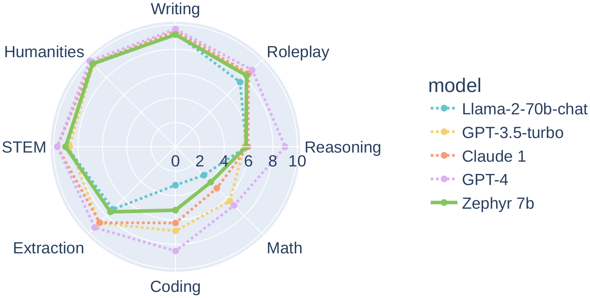

> The page is taken from Vinija Jain's blog post. All credits to her. Available at https://vinija.ai/nlp/papers/. I do feel that these summaries are LLM-generated (just looking at the sentences), however, everything is useful.

> As I read through the blog, I will add notes or make text in bold. 

# Vinija's Notes • NLP • Research Papers
*   [Introduction](#introduction)
*   [Ilya Sutskever’s Reading List](#ilya-sutskevers-reading-list)
    *   [The First Law of Complexodynamics](#the-first-law-of-complexodynamics)
    *   [The Unreasonable Effectiveness of Recurrent Neural Networks](#the-unreasonable-effectiveness-of-recurrent-neural-networks)
    *   [Understanding LSTM Networks](#understanding-lstm-networks)
    *   [Recurrent Neural Network Regularization](#recurrent-neural-network-regularization)
    *   [Keeping Neural Networks Simple by Minimizing the Description Length of the Weights](#keeping-neural-networks-simple-by-minimizing-the-description-length-of-the-weights)
    *   [Pointer Networks](#pointer-networks)
    *   [ImageNet Classification with Deep Convolutional Neural Networks](#imagenet-classification-with-deep-convolutional-neural-networks)
    *   [Order Matters: Sequence to Sequence for Sets](#order-matters-sequence-to-sequence-for-sets)
    *   [GPipe: Easy Scaling with Micro-Batch Pipeline Parallelism](#gpipe-easy-scaling-with-micro-batch-pipeline-parallelism)
    *   [Deep Residual Learning for Image Recognition](#deep-residual-learning-for-image-recognition)
    *   [Multi-Scale Context Aggregation by Dilated Convolutions](#multi-scale-context-aggregation-by-dilated-convolutions)
    *   [Neural Message Passing for Quantum Chemistry](#neural-message-passing-for-quantum-chemistry)
    *   [Attention Is All You Need](#attention-is-all-you-need)
    *   [Neural Machine Translation by Jointly Learning to Align and Translate](#neural-machine-translation-by-jointly-learning-to-align-and-translate)
    *   [Identity Mappings in Deep Residual Networks](#identity-mappings-in-deep-residual-networks)
    *   [A Simple Neural Network Module for Relational Reasoning](#a-simple-neural-network-module-for-relational-reasoning)
    *   [Variational Lossy Autoencoder](#variational-lossy-autoencoder)
    *   [Relational Recurrent Neural Networks](#relational-recurrent-neural-networks)
    *   [Quantifying the Rise and Fall of Complexity in Closed Systems: The Coffee Automaton](#quantifying-the-rise-and-fall-of-complexity-in-closed-systems-the-coffee-automaton)
    *   [Neural Turing Machines](#neural-turing-machines)
    *   [Deep Speech 2: End-to-End Speech Recognition in English and Mandarin](#deep-speech-2-end-to-end-speech-recognition-in-english-and-mandarin)
    *   [Scaling Laws for Neural Language Models](#scaling-laws-for-neural-language-models)
    *   [A Tutorial Introduction to the Minimum Description Length Principle](#a-tutorial-introduction-to-the-minimum-description-length-principle)
    *   [Machine Super Intelligence](#machine-super-intelligence)
    *   [Kolmogorov Complexity and Algorithmic Randomness](#kolmogorov-complexity-and-algorithmic-randomness)
    *   [Stanford’s CS231n Convolutional Neural Networks for Visual Recognition](#stanfords-cs231n-convolutional-neural-networks-for-visual-recognition)
*   [Meta](#meta)
    *   [Preference Discerning with LLM-Enhanced Generative Retrieval](#preference-discerning-with-llm-enhanced-generative-retrieval)
    *   [Byte Latent Transformer: Patches Scale Better Than Tokens](#byte-latent-transformer-patches-scale-better-than-tokens)
*   [HuggingFace](#huggingface)
    *   [GAIA:A Benchmark for General AI Assistants](#gaiaa-benchmark-for-general-ai-assistants)
    *   [Zephyr: Direct Distillation of LM Alignment](#zephyr-direct-distillation-of-lm-alignment)
*   [Stanford](#stanford)
    *   [Lost in the Middle: How Language Models Use Long Contexts](#lost-in-the-middle-how-language-models-use-long-contexts)
*   [Misc](#misc)
    *   [Precise Zero-Shot Dense Retrieval without Relevance Labels](#precise-zero-shot-dense-retrieval-without-relevance-labels)
    *   [ALCUNA: Large Language Models Meet New Knowledge](#alcuna-large-language-models-meet-new-knowledge)
    *   [The Perils & Promises of Fact-checking with Large Language Models](#the-perils--promises-of-fact-checking-with-large-language-models)
    *   [Mulberry: Empowering MLLM with o1-like Reasoning and Reflection via Collective Monte Carlo Tree Search](#mulberry-empowering-mllm-with-o1-like-reasoning-and-reflection-via-collective-monte-carlo-tree-search)
    *   [Context-DPO: Aligning Language Models for Context-Faithfulness](#context-dpo-aligning-language-models-for-context-faithfulness)
    *   [Do NOT Think That Much for 2+3=? On the Overthinking of o1-Like LLMs](#do-not-think-that-much-for-23-on-the-overthinking-of-o1-like-llms)

Introduction
------------

*   Up until now, in all the sections previously, we’ve looked through many of the foundational elements of NLP.
*   Now, lets talk about the current research within this domain. As I make my way through more papers, I’ll keep updating this page with all the information I think is vital to share!

Ilya Sutskever’s Reading List
-----------------------------

*   Ilya Sutskever shared a list of 30 papers with John Carmack and said, “If you really learn all of these, you’ll know 90% of what matters today”. Below we will review these [papers/resources](https://arc.net/folder/D0472A20-9C20-4D3F-B145-D2865C0A9FEE):

### [The First Law of Complexodynamics](https://scottaaronson.blog/?p=762)

> *   Author: Scott Aaronson
*   The article “The First Law of Complexodynamics” discusses an intriguing question posed by Sean Carroll at the FQXi’s Setting Time Aright conference, which brought together experts from various fields to discuss the nature of time. **Carroll’s question revolves around why the complexity of physical systems seems to increase, hit a maximum, and then decrease over time, unlike entropy, which consistently increases**.
*   The article explains that entropy measures how disordered a system is and increases monotonically. However, complexity behaves differently, **peaking at intermediate times before decreasing**. To delve into this phenomenon, the author introduces concepts from Kolmogorov complexity. **Kolmogorov complexity is defined as the length of the shortest computer program that can produce a given string**. A related concept, sophistication, measures the complexity of a string as the shortest program describing a set of which the string is a typical member.
*   To address Carroll’s question, the author proposes the concept of “complextropy” as a measure of complexity that considers computational resource bounds. **Complextropy should reflect the number of bits in the shortest efficient program that outputs a sample from a set such that the target string appears random with respect to that set. The conjecture is that complextropy will be small at the beginning and end of a system’s evolution but large at intermediate times, mirroring the observed pattern in complexity.**
*   Proving this conjecture, either theoretically or empirically, presents challenges, particularly due to the difficulty of computing complextropy. **One practical approach suggested is using the size of a gzip compressed file as an approximation for Kolmogorov complexity**. The author mentions an ongoing research project aimed at empirically verifying the conjecture using this method.
*   The article also the idea that complexity, or complextropy, changes over time, peaking at intermediate stages. The author suggests using computational resource bounds to define this measure and discusses both theoretical and empirical approaches to validating the conjecture that complexity behaves in this manner. This exploration provides valuable insights into understanding the dynamic nature of complexity in physical systems.

### [The Unreasonable Effectiveness of Recurrent Neural Networks](https://karpathy.github.io/2015/05/21/rnn-effectiveness/)

> *   Author: Andrej Karpathy
*   The article “The Unreasonable Effectiveness of Recurrent Neural Networks” by Andrej Karpathy dives into the amazing abilities of Recurrent Neural Networks (RNNs). Karpathy talks about his first experience with training RNNs for image captioning, where even with random settings, the RNN started making believable image descriptions. This success was surprising because many people thought RNNs were hard to train, showing just how simple and powerful they can be.
*   RNNs are special because they can handle sequences of vectors, making them perfect for tasks that involve sequences as input and output. **Unlike regular neural networks that deal with fixed-size inputs and outputs, RNNs can work with sequences of any length, making them very useful in many areas**. Karpathy explains that **RNNs work by keeping a hidden state that stores information from previous inputs, allowing them to “remember” past data.**
*   Karpathy goes into detail about how RNNs work, including a simple interface where an input vector affects the output vector and considers all previous inputs. He shows how RNNs update their hidden state using matrix multiplications and non-linear functions. He also mentions Long Short-Term Memory (LSTM) networks, which are a more advanced type of RNN that solve some practical issues and are widely used.
*   To show how powerful RNNs can be, Karpathy describes training character-level language models. By feeding a large amount of text into an RNN, it learns to predict the next character in a sequence, allowing it to create text one character at a time. He gives examples of RNN-generated text from different sources, like Paul Graham’s essays, Shakespeare’s works, Wikipedia articles, algebraic geometry in LaTeX, Linux source code, and baby names. These examples show how RNNs can learn complex structures, grammar, and context from raw text.
*   Karpathy also talks about the training process and how the text generated by the RNN improves over time, showing how the model gradually gets better at understanding language. He visualizes the inner workings of the RNN, showing how different neurons react to specific patterns, like URLs or markdown syntax, which helps explain how the model learns.
*   Finally, Karpathy encourages readers to try out RNNs using the code he shared on GitHub, highlighting the fun and educational aspects of training character-level language models. He briefly touches on the bigger picture of RNN research and their growing importance in fields like natural language processing, computer vision, and machine learning. The article wraps up with a fun note, showing an RNN-generated sample from the article itself, proving how effective and versatile RNNs are.

### [Understanding LSTM Networks](https://colah.github.io/posts/2015-08-Understanding-LSTMs/)

> *   Author: Christopher Olah
*   The article “Understanding LSTM Networks” by Christopher Olah explains the structure and functioning of Long Short-Term Memory (LSTM) networks, a special kind of Recurrent Neural Network (RNN) that addresses the limitations of traditional RNNs in handling long-term dependencies.
*   Olah begins by highlighting the limitations of traditional neural networks and RNNs in maintaining persistent information, which is crucial for tasks involving sequences and lists, such as language modeling, translation, and speech recognition.
*   **RNNs have loops that allow information to persist, making them suitable for sequential data. However, they struggle with long-term dependencies, where relevant information from earlier inputs is needed much later in the sequence.**
*   The article introduces LSTMs, designed to overcome this limitation. LSTMs have a unique architecture that includes a cell state and three gates (input, forget, and output) that regulate the flow of information. These gates allow LSTMs to remember and forget information selectively, making them effective in learning long-term dependencies.
*   **The forget gate decides what information to discard from the cell state, the input gate determines which new information to add, and the output gate controls what information is passed to the next step.**
*   Olah explains the step-by-step functioning of LSTMs using diagrams and notations, making it easier to understand the complex interactions within the network. He also discusses variations of LSTMs, such as **peephole connections and Gated Recurrent Units (GRUs)**, which offer different ways to handle long-term dependencies.
*   The article concludes by emphasizing the significance of LSTMs in achieving remarkable results in various applications and hints at future advancements in RNN research, such as attention mechanisms and Grid LSTMs, which further enhance the capabilities of neural networks.

### [Recurrent Neural Network Regularization](https://arxiv.org/abs/1409.2329v5)

> *   Authors: Wojciech Zaremba, Ilya Sutskever, Oriol Vinyals
*   The paper “Recurrent Neural Network Regularization” presents a novel method for applying dropout to Long Short-Term Memory (LSTM) networks to mitigate overfitting. **Traditional dropout techniques are ineffective for Recurrent Neural Networks (RNNs) due to noise amplification in recurrent connections**, which hampers learning. The authors propose a specialized dropout application that targets only non-recurrent connections in LSTMs, preserving the network’s ability to retain information over long sequences while reducing overfitting.
*   The study demonstrates significant performance improvements across various tasks, including language modeling, speech recognition, machine translation, and image caption generation. In language modeling, regularized LSTMs achieved better word-level perplexity on the Penn Tree Bank dataset compared to non-regularized models. **The medium and large regularized LSTMs showed substantial reductions in perplexity, highlighting the efficacy of the proposed method.**
*   For speech recognition, the authors tested their method on an internal Google Icelandic Speech dataset, showing that dropout improves frame accuracy, a critical metric correlating with Word Error Rate (WER). Regularized LSTMs achieved better generalization, indicating the potential of the proposed regularization technique for improving acoustic modeling.
*   In machine translation, the method was evaluated on the WMT’14 English to French dataset. The regularized LSTM outperformed non-regularized models, demonstrating higher BLEU scores, which measure translation quality. Although the regularized LSTM did not surpass the phrase-based LIUM SMT system, the results affirmed that dropout enhances translation performance.
*   The image caption generation task involved testing the dropout variant on an LSTM model that converts image vectors into captions. The authors used the MSCOCO dataset for this evaluation. The results showed that dropout helps improve caption quality, with regularized models performing comparably to model ensembles.
*   Overall, the paper establishes that correctly applying dropout to LSTMs effectively reduces overfitting and enhances performance across diverse applications. The authors suggest that this approach can be extended to other RNN architectures, potentially broadening the scope of improved regularization in neural networks.

### [Keeping Neural Networks Simple by Minimizing the Description Length of the Weights](https://www.cs.toronto.edu/~hinton/absps/colt93.pdf)

> *   Authors: Geoffrey E. Hinton and Drew van Camp
*   The paper “Keeping Neural Networks Simple by Minimizing the Description Length of the Weights” by Hinton and van Camp introduces a method to regularize neural networks by penalizing the information content in the weights. The key idea is to add Gaussian noise to the weights and adapt the noise level during training to balance the trade-off between the network’s error and the complexity of the weights.
*   The Minimum Description Length (MDL) Principle underpins this method, suggesting that the best model minimizes the total cost of describing both the model and the errors it makes. For neural networks, this translates to minimizing the bits required to encode the weights and the discrepancies between the predicted and actual outputs.
*   By applying Gaussian noise to the weights, the authors effectively control the precision of weight values. This approach helps in reducing overfitting, especially in scenarios with limited training data. The noise level is adjusted to optimize the network’s performance while keeping the weights as simple as possible.
*   The method involves computing the derivatives of both the expected squared error and the information content in the weights. These derivatives are calculated efficiently without resorting to time-consuming Monte Carlo simulations, provided the output units are linear.
*   The authors introduce the concept of “noisy weights” where adding Gaussian noise allows for a more compact encoding of the weights. This noisy weight approach leverages the MDL principle to communicate weights more efficiently, balancing the trade-off between weight precision and the network’s error.
*   The study explores the application of this technique across different tasks, including language modeling, speech recognition, and image caption generation. The results show that the proposed regularization method significantly improves generalization by reducing overfitting.
*   Additionally, the paper discusses the benefits of using an adaptive mixture of Gaussians for encoding the weights. This mixture model adapts to the distribution of the weights during training, further enhancing the network’s ability to generalize from limited data.
*   Preliminary experiments on a high-dimensional task with scarce training data demonstrate that the new method allows for fitting complex non-linear models effectively. The results suggest that this approach is slightly better than traditional weight-decay methods, offering a new perspective on regularizing neural networks.
*   The authors conclude by acknowledging that while the new method shows promise, more experimental work is needed to determine its competitiveness with other statistical techniques for handling non-linear tasks with limited training data. They also highlight the potential for further refinements to enhance its performance.

### [Pointer Networks](https://arxiv.org/abs/1506.03134v2)

> *   Authors: Oriol Vinyals, Meire Fortunato, Navdeep Jaitly
*   The paper “Pointer Networks” introduces a novel neural architecture designed to learn the conditional probability of an output sequence with elements that are discrete tokens corresponding to positions in an input sequence. This model, called Pointer Networks (Ptr-Nets), addresses the limitation of existing sequence-to-sequence models and Neural Turing Machines, which struggle with variable-sized output dictionaries. Ptr-Nets leverage a neural attention mechanism to select members of the input sequence as the output, making them particularly effective for problems such as sorting variable-sized sequences and various combinatorial optimization tasks.
    
*   **Key Contributions:**
    *   The Ptr-Net architecture is proposed to handle variable-length dictionaries using a softmax probability distribution as a pointer. This method is simple, effective, and enables the model to generalize to different input and output lengths.
    *   Ptr-Nets are applied to three challenging geometric problems: computing planar convex hulls, Delaunay triangulations, and the planar Travelling Salesman Problem (TSP). The models learn to produce approximate solutions purely from training examples, demonstrating significant improvements over sequence-to-sequence models with input attention.
    *   The learned models generalize beyond the maximum lengths they were trained on, showing the robustness and versatility of Ptr-Nets in handling variable-sized input and output sequences.
*   **Models:**
    *   **Sequence-to-Sequence Model:** This baseline model uses an encoder-decoder RNN framework to map an input sequence to an output sequence, but it requires a fixed output dictionary size. It uses Long Short Term Memory (LSTM) networks to estimate conditional probabilities, but struggles with tasks where the output size depends on the input length.
    *   **Content Based Input Attention:** An enhancement over the vanilla sequence-to-sequence model, this method introduces an attention mechanism that allows the decoder to focus on different parts of the input sequence. However, it still assumes a fixed output dictionary size.
    *   **Pointer Networks (Ptr-Net):** Ptr-Nets modify the attention mechanism to function as pointers, selecting elements from the input sequence as the output. This allows Ptr-Nets to handle variable-sized output dictionaries and solve combinatorial optimization problems effectively.
*   **Empirical Results:**
    *   **Convex Hull:** Ptr-Nets significantly outperform both the LSTM and LSTM with attention models on the convex hull problem. The Ptr-Net achieves high accuracy and nearly 100% area coverage, demonstrating its effectiveness in handling this combinatorial task.
    *   **Delaunay Triangulation:** Ptr-Nets achieve high triangle coverage and accuracy, showing their capability in solving the Delaunay triangulation problem. Although accuracy decreases for larger input sizes, the model still performs competitively.
    *   **Travelling Salesman Problem (TSP):** Ptr-Nets are tested on the planar symmetric TSP, demonstrating the ability to learn competitive solutions. The model performs well on small-scale TSP instances and generalizes to larger instances, though with some performance degradation.
*   **Conclusion:**
    *   The Ptr-Net architecture successfully addresses the challenge of variable-length output dictionaries, outperforming traditional sequence-to-sequence models on fixed input size problems. By using attention mechanisms to solve combinatorial optimization problems, Ptr-Nets open up new possibilities for neural networks to tackle a broader class of problems without artificial constraints. Future work will explore the application of Ptr-Nets to other combinatorial problems such as sorting, aiming to further demonstrate their versatility and effectiveness.

### [ImageNet Classification with Deep Convolutional Neural Networks](https://proceedings.neurips.cc/paper_files/paper/2012/file/c399862d3b9d6b76c8436e924a68c45b-Paper.pdf)

> *   Authors: Alex Krizhevsky, Ilya Sutskever, Geoffrey E. Hinton
*   The paper “ImageNet Classification with Deep Convolutional Neural Networks” details the development and training of a large, deep convolutional neural network (CNN) designed to classify images from the ImageNet dataset. The network achieved significant improvements in classification accuracy, surpassing previous state-of-the-art results on the ImageNet Large Scale Visual Recognition Challenge (ILSVRC) 2010 and 2012 datasets.
    
*   **Key Contributions:**
    *   The CNN architecture consists of five convolutional layers followed by three fully-connected layers, culminating in a 1000-way softmax output layer. This design leverages the hierarchical nature of image data, with convolutional layers capturing local features and fully-connected layers integrating these features for final classification.
    *   To accelerate training, the network uses Rectified Linear Units (ReLUs) instead of traditional tanh or sigmoid neurons. ReLUs help in reducing the likelihood of the vanishing gradient problem and enable faster convergence during training.
    *   The network was trained on two GPUs using a model parallelism approach, where different layers of the network were distributed across the GPUs. This setup allowed the handling of large models that would not fit into the memory of a single GPU.
    *   Local Response Normalization (LRN) was employed to improve generalization by normalizing the activities of neurons within the same layer, mimicking a form of lateral inhibition observed in real neurons.
    *   Overlapping pooling was used to downsample the spatial dimensions of the feature maps. Unlike traditional non-overlapping pooling, overlapping pooling helps to retain more information and reduce overfitting.
    *   To combat overfitting, the authors used data augmentation techniques, including image translations, horizontal reflections, and principal component analysis (PCA) jittering on the RGB values. These techniques increased the effective size of the training dataset and improved generalization.
    *   Dropout was applied to the fully-connected layers, randomly setting a fraction of the neurons to zero during training. This regularization technique prevents complex co-adaptations of neurons and enhances the robustness of the learned features.
*   **Empirical Results:**
    *   On the ILSVRC-2010 dataset, the CNN achieved a top-1 error rate of 37.5% and a top-5 error rate of 17.0%, which was significantly better than previous methods.
    *   On the ILSVRC-2012 dataset, the network obtained a top-5 error rate of 18.2%. When combined with predictions from multiple models, this error rate was further reduced to 15.3%, substantially outperforming the second-best entry, which had a top-5 error rate of 26.2%.
    *   Qualitative analysis of the learned features showed that the network captured various types of frequency- and orientation-selective kernels in the early layers and more abstract features in deeper layers.
*   **Conclusion:**
    *   The paper demonstrates that large, deep CNNs can achieve state-of-the-art results on challenging image classification tasks using purely supervised learning. The depth and complexity of the network are crucial for its performance, as evidenced by the degradation in accuracy when any convolutional layer is removed.
    *   The success of the network opens up possibilities for further advancements in computer vision by leveraging even larger datasets and more powerful computational resources. The methods and techniques developed in this work have since become foundational in the field of deep learning and computer vision.

### [Order Matters: Sequence to Sequence for Sets](https://arxiv.org/pdf/1511.06391)

> *   Authors: Oriol Vinyals, Samy Bengio, Manjunath Kudlur
*   The paper “Order Matters: Sequence to Sequence for Sets” explores the significance of input and output order in sequence-to-sequence (seq2seq) models, especially for tasks where the input or output is a set rather than a naturally ordered sequence. The authors propose methods to adapt seq2seq models for handling sets and demonstrate the impact of order on performance across various tasks.
    
*   **Key Contributions:**
    *   The authors highlight the limitations of traditional seq2seq models when dealing with sets, where the order of elements does not matter. They show that the order in which input and output data are presented significantly affects the learning and performance of these models.
    *   They introduce an extension to the seq2seq framework to handle input sets in a principled way. This involves using an attention mechanism to process unordered sets, allowing the model to remain invariant to the input order.
    *   For output sets, the authors propose a loss function that searches over possible orders during training to find the optimal arrangement, improving the model’s ability to generalize and perform accurately.
*   **Experiments and Results:**
    *   **Language Modeling:** The authors experiment with different orderings of input sentences and show that reversing the order of words in the source sentence can improve performance in machine translation tasks. They also find that for parsing tasks, the choice of traversal order (depth-first vs. breadth-first) significantly impacts the model’s accuracy.
    *   **Combinatorial Problems:** The paper demonstrates the importance of ordering in combinatorial problems such as sorting numbers and computing convex hulls. For example, sorting the input points by angle simplifies the convex hull computation, leading to faster training and higher accuracy.
    *   **Graphical Models:** The authors create artificial datasets with star-like graphical models and show that it is easier to learn the joint probability distribution when the head variable is presented first. This experiment highlights the significance of choosing the optimal order for modeling complex dependencies among random variables.
*   **Model Architecture:**
    *   **Read, Process, Write Model:** The proposed model consists of three components: a reading block that embeds each input element, a processing block that performs computation over the embeddings using an attention mechanism, and a writing block that produces the output sequence using a pointer network. This architecture ensures permutation invariance and effectively handles input sets.
    *   **Attention Mechanisms:** The authors leverage attention mechanisms to integrate information from variable-length input structures, maintaining the order invariance property crucial for handling sets.
    *   **Finding Optimal Orderings:** To address the challenge of determining the best output order, the authors propose an algorithm that explores different orderings during training. By sampling from the probability distribution over possible orders, the model can identify and reinforce the most suitable order for the task.
*   **Conclusion:**
    *   The paper concludes that order significantly influences the performance of seq2seq models when dealing with sets. The proposed methods for handling input and output sets improve the generalization and accuracy of the models. The authors demonstrate the effectiveness of their approach through various experiments, including sorting, language modeling, parsing, and graphical model estimation. This work opens up new possibilities for extending seq2seq models to a broader range of tasks that involve unordered sets.

### [GPipe: Easy Scaling with Micro-Batch Pipeline Parallelism](https://arxiv.org/abs/1811.06965)

> *   Authors: Yanping Huang, Youlong Cheng, Ankur Bapna, Orhan Firat, Mia Xu Chen, Dehao Chen, HyoukJoong Lee, Jiquan Ngiam, Quoc V. Le, Yonghui Wu, Zhifeng Chen
*   The paper “GPipe: Easy Scaling with Micro-Batch Pipeline Parallelism” introduces GPipe, a scalable model-parallelism library designed to enable efficient training of large neural networks by partitioning models across multiple accelerators. GPipe overcomes memory limitations and achieves almost linear speedup by using a novel batch-splitting pipelining algorithm.
    
*   **Key Contributions:**
    *   **GPipe Architecture:** The GPipe library partitions a neural network into smaller sub-sequences of layers, or “cells,” which are distributed across multiple accelerators. This setup allows the training of models that exceed the memory capacity of a single accelerator.
    *   **Batch-Splitting Pipeline Parallelism:** GPipe divides each mini-batch of training data into smaller micro-batches. These micro-batches are then processed in a pipelined manner across the different accelerators, ensuring high hardware utilization and minimizing idle time.
    *   **Synchronous Gradient Descent:** The library uses synchronous mini-batch gradient descent, where gradients are accumulated across all micro-batches before being applied to update the model parameters. This approach ensures consistent gradient updates regardless of the number of partitions.
*   **Experiments and Results:**
    *   **Image Classification:** GPipe was used to train a 557-million-parameter AmoebaNet model on the ImageNet-2012 dataset. The model achieved a top-1 accuracy of 84.4%, demonstrating the effectiveness of GPipe in scaling large convolutional networks.
    *   **Multilingual Neural Machine Translation:** GPipe enabled the training of a single 6-billion-parameter, 128-layer Transformer model on a corpus spanning over 100 languages. This model outperformed individually trained bilingual models, highlighting GPipe’s ability to handle diverse and large-scale NLP tasks.
*   **Performance Optimization:**
    *   **Re-materialization:** To reduce activation memory requirements, GPipe supports re-materialization, where only output activations at partition boundaries are stored during the forward pass. The required activations are recomputed during the backward pass, reducing peak memory usage.
    *   **Load Balancing:** The partitioning algorithm aims to balance the computational load across accelerators by minimizing the variance in the estimated costs of all cells. This optimization ensures efficient pipeline execution.
*   **Design Features and Trade-Offs:**
    *   **Flexibility:** GPipe supports any neural network that can be expressed as a sequence of layers, providing a versatile solution for various architectures and tasks.
    *   **Efficiency:** By minimizing communication overhead and utilizing batch-splitting pipeline parallelism, GPipe achieves near-linear scaling with the number of accelerators, even in environments with limited inter-device communication bandwidth.
    *   **Training Stability:** The use of synchronous gradient updates ensures stable and consistent training across different partitioning configurations, making GPipe reliable for large-scale model training.
*   **Conclusion:**
    *   The GPipe library offers an efficient and flexible approach to scaling deep neural networks beyond single-accelerator memory limits. Its batch-splitting pipelining algorithm allows for significant improvements in training throughput and model capacity. GPipe’s design principles ensure that it can be applied to a wide range of machine learning tasks, from image classification to multilingual machine translation, with strong empirical results. The library’s ability to handle large models and achieve near-linear speedup positions it as a valuable tool for advancing deep learning research and applications.

### [Deep Residual Learning for Image Recognition](https://arxiv.org/abs/1512.03385)

*   **Authors**: Kaiming He, Xiangyu Zhang, Shaoqing Ren, Jian Sun
*   **Affiliation**: Microsoft Research
    
*   This seminal paper introduces the concept of deep residual networks (ResNets), which significantly ease the training of networks that are substantially deeper than those used previously. By utilizing residual blocks that allow layers to fit a residual mapping instead of directly attempting to fit a desired underlying mapping, ResNets facilitate the training process and improve the accuracy from increased depth.

Key innovations and findings from the paper include:

1.  **Residual Learning Framework**: The layers in ResNet learn residual functions with reference to the layer inputs, which simplifies the learning process because the network learns to modify the identity mapping rather than having to estimate the full output.
2.  **Ease of Optimization**: The residual blocks make deeper networks easier to optimize because they mitigate the problem of vanishing gradients by using shortcut connections that perform identity mapping.
3.  **Superior Performance on Deep Networks**: Extensive experiments demonstrate that ResNets, with their deeper architectures, outperform traditional networks on major datasets like ImageNet and CIFAR-10. For instance, ResNets with a depth of up to 152 layers show better performance and lower complexity compared to VGG nets.
4.  **Broad Applicability**: The paper also highlights the effectiveness of ResNets across various tasks beyond image classification, such as object detection and localization, through adaptations like bottleneck designs that enhance computational efficiency.

*   These contributions have had a profound impact on the field of deep learning, influencing a wide range of subsequent research and applications in both academia and industry.

### [Multi-Scale Context Aggregation by Dilated Convolutions](https://arxiv.org/abs/1511.07122)

*   **Authors**: Fisher Yu, Vladlen Koltun
*   **Affiliations**: Princeton University, Intel Labs
    
*   The paper “Multi-Scale Context Aggregation by Dilated Convolutions” presents a novel approach for improving semantic segmentation by leveraging dilated convolutions. This method allows convolutional neural networks to systematically aggregate multi-scale contextual information without losing resolution.
    
*   Key Contributions:
    
    1.  **Dilated Convolutions**:
    
    *   Introduces the concept of dilated convolutions, which enable exponential expansion of the receptive field without reducing resolution or coverage.
    *   Dilated convolutions, also known as atrous convolutions, are crucial for dense prediction tasks as they support the aggregation of multi-scale context while preserving spatial resolution.

1.  **Multi-Scale Context Aggregation**:
    *   Proposes a new convolutional network module that aggregates multi-scale contextual information, enhancing the performance of dense prediction architectures like semantic segmentation.
    *   The network uses a rectangular prism of convolutional layers with varying dilation factors, eliminating the need for pooling or subsampling layers, thereby maintaining high resolution throughout the network.
2.  **Simplified Network Design**:
    *   Simplifies existing image classification networks adapted for dense prediction by removing unnecessary components and layers that do not contribute to performance.
    *   Specifically, removes the last two pooling and striding layers in the VGG-16 network and uses dilated convolutions in subsequent layers to maintain high-resolution outputs.
3.  **Controlled Experiments**:
    *   Conducts experiments on the Pascal VOC 2012 dataset to evaluate the performance of the proposed context module.
    *   Demonstrates that the context module reliably increases accuracy when integrated into existing semantic segmentation architectures, both with and without structured prediction methods like Conditional Random Fields (CRFs) and CRF-RNNs.
4.  **Performance Improvement**:
    *   The context module enhances the accuracy of semantic segmentation models, outperforming previous state-of-the-art models on the Pascal VOC 2012 test set.
    *   The simplified front-end module alone achieves higher accuracy compared to prior models, indicating the effectiveness of removing vestigial components.

*   Experiments:
    *   **Dataset**: Uses the Pascal VOC 2012 dataset augmented with additional annotations for training.
    *   **Training Procedure**: Employs stochastic gradient descent (SGD) with specific learning rates and momentum, and evaluates the performance on both validation and test sets.
    *   **Evaluation**: The context module and simplified front-end are tested against models like FCN-8s and DeepLab, showing significant improvements in mean Intersection over Union (IoU) scores.
*   Conclusion:
    *   The paper demonstrates that dilated convolutions are highly effective for dense prediction tasks, allowing for the integration of multi-scale context without loss of resolution.
    *   The proposed context module and the simplified front-end module provide substantial performance gains in semantic segmentation.
    *   The approach suggests a shift towards dedicated architectures for dense prediction, moving away from adaptations of image classification networks.

### [Neural Message Passing for Quantum Chemistry](https://arxiv.org/pdf/1704.01212)

> *   Authors: Justin Gilmer, Samuel S. Schoenholz, Patrick F. Riley, Oriol Vinyals, George E. Dahl
*   The paper “Neural Message Passing for Quantum Chemistry” introduces Message Passing Neural Networks (MPNNs), a framework for supervised learning on molecular graphs that is invariant to molecular symmetries. The goal is to predict quantum mechanical properties of molecules, which is crucial in fields such as drug discovery and materials science.
*   **Introduction**:
    *   The paper emphasizes the need for machine learning models capable of predicting molecular properties directly from their structure without relying on handcrafted features. Previous methods relied heavily on feature engineering, which limits generalizability and performance.
    *   MPNNs unify several existing neural network models that operate on graph-structured data and allow for learning molecular properties directly from raw molecular graphs.
*   **Methodology**:
    *   **Message Passing Phase**: In this phase, nodes (atoms) exchange information with their neighbors through message functions. Each node updates its state based on the messages received from its neighbors and its current state.
        *   Formally, for a graph\\(G\\) with node features\\(x\_v\\) and edge features\\(e\_{vw}\\), the messages\\(m^{t+1}\_v\\) and node updates\\(h^{t+1}\_v\\) are given by: \\(m^{t+1}\_v = \\sum\_{w \\in N(v)} M\_t(h^t\_v, h^t\_w, e\_{vw})\\) \\(h^{t+1}\_v = U\_t(h^t\_v, m^{t+1}\_v)\\)
        *   The message function\\(M\_t\\) and update function\\(U\_t\\) are learned during training.
    *   **Readout Phase**: After the message passing phase, a readout function\\(R\\) aggregates the node states to produce the final output. The readout function must be invariant to permutations of the nodes to ensure the model’s invariance to graph isomorphism.
*   **Key Contributions**:
    *   **State of the Art Results**: The authors demonstrate that MPNNs achieve state-of-the-art performance on the QM9 dataset, a benchmark for predicting quantum mechanical properties of small organic molecules. MPNNs predict properties such as atomization energies, fundamental vibrational frequencies, and electronic properties with high accuracy.
    *   **Chemical Accuracy**: The models achieve chemical accuracy (within the error margin acceptable in chemistry) for 11 out of 13 properties in the QM9 dataset.
    *   **Scalability**: The paper also explores methods to scale MPNNs to larger graphs, making them more computationally efficient without sacrificing performance. This includes the use of “virtual graph elements” and modifications like the “towers” structure.
*   **Results**:
    *   The authors provide extensive empirical results showing the superiority of MPNNs over traditional methods that rely on feature engineering. They demonstrate that MPNNs can learn complex molecular interactions directly from the data.
    *   They compare different variants of MPNNs and show that models using edge network message functions and set2set readout functions perform particularly well.
*   **Conclusion**:
    *   The study establishes MPNNs as a powerful tool for molecular property prediction, highlighting their potential to replace feature engineering with end-to-end learning from raw molecular graphs.
    *   Future work suggested includes improving the generalization to larger molecular graphs and further optimizing the computational efficiency of MPNNs.

### [Attention Is All You Need](https://arxiv.org/abs/1706.03762)

*   **Authors**: Ashish Vaswani, Noam Shazeer, Niki Parmar, Jakob Uszkoreit, Llion Jones, Aidan N. Gomez, Łukasz Kaiser, Illia Polosukhin
*   **Affiliations**: Google Brain, Google Research, University of Toronto
    
*   The paper “Attention Is All You Need” introduces the Transformer, a novel neural network architecture that relies entirely on self-attention mechanisms, dispensing with recurrence and convolutions entirely. This model architecture significantly improves computational efficiency and parallelization, leading to state-of-the-art performance in various sequence transduction tasks such as machine translation.
    
*   Key Contributions:
    1.  **Transformer Architecture**:
        *   The Transformer uses a novel architecture based solely on attention mechanisms, enabling the model to draw global dependencies between input and output without using sequence-aligned RNNs or convolutions.
        *   The architecture comprises an encoder-decoder structure where both the encoder and decoder are composed of multiple identical layers, each consisting of a multi-head self-attention mechanism followed by a position-wise fully connected feed-forward network.
    2.  **Self-Attention Mechanism**:
        *   **Scaled Dot-Product Attention**: This is the core component of the self-attention mechanism, where the dot products of the query with all keys are computed, scaled, and passed through a softmax function to obtain the weights on the values.
        *   **Multi-Head Attention**: Allows the model to jointly attend to information from different representation subspaces at different positions by performing multiple attention operations in parallel, each with different learned linear projections.
    3.  **Positional Encoding**:
        *   Since the Transformer model does not use recurrence to handle sequence order, positional encodings are added to the input embeddings to inject information about the position of each token in the sequence. The authors use sine and cosine functions of different frequencies for these encodings.
    4.  **Training Efficiency and Performance**:
        *   The Transformer model achieves superior performance on machine translation tasks while being more parallelizable and requiring significantly less time to train compared to RNN-based models.
        *   For the WMT 2014 English-to-German translation task, the Transformer achieves a BLEU score of 28.4, outperforming previous state-of-the-art models by over 2 BLEU points. Similarly, it achieves a BLEU score of 41.8 on the WMT 2014 English-to-French translation task with much less training time.
    5.  **Generalization to Other Tasks**:
        *   The Transformer model generalizes well to other tasks beyond machine translation. The paper demonstrates its effectiveness in English constituency parsing, achieving competitive results with less task-specific tuning.
    6.  **Advantages Over Previous Models**:
        *   The Transformer reduces the path length between long-range dependencies to a constant number of operations, unlike RNNs and convolutional models, which grow linearly or logarithmically with the sequence length.
        *   This reduction in path length improves the model’s ability to learn dependencies between distant positions, leading to better performance in sequence transduction tasks.
*   Experimental Results:
    *   **Machine Translation**: The Transformer sets new benchmarks in BLEU scores for both English-to-German and English-to-French translation tasks, showcasing its superior translation quality and training efficiency.
    *   **Model Variations**: The paper explores various modifications to the Transformer architecture, including the number of attention heads and the size of attention key/value dimensions, demonstrating the robustness and flexibility of the model.
    *   **English Constituency Parsing**: The model achieves high F1 scores on the Penn Treebank dataset, indicating its capability to generalize to different natural language processing tasks.
*   Conclusion:
    *   The Transformer represents a significant advancement in sequence transduction models, providing a highly efficient and effective alternative to traditional RNN and convolution-based architectures.
    *   Its reliance on self-attention mechanisms not only improves performance but also allows for greater parallelization, making it suitable for a wide range of applications in natural language processing and beyond.

### [Neural Machine Translation by Jointly Learning to Align and Translate](https://arxiv.org/pdf/1409.0473)

*   **Author**: Dzmitry Bahdanau, KyungHyun Cho, Yoshua Bengio
*   **Abstract**: Neural machine translation (NMT) is an emerging approach that builds a single neural network to maximize translation performance. Unlike traditional methods, NMT uses encoder-decoder architectures to translate sentences. This paper introduces a method allowing the model to search for relevant parts of a source sentence during translation, enhancing performance.
*   **Key Concepts**:
    *   **Encoder-Decoder Model**: The basic architecture for NMT, where the encoder converts a source sentence into a fixed-length vector, and the decoder generates the translation.
    *   **Fixed-Length Vector Bottleneck**: A significant limitation of traditional encoder-decoder models is the fixed-length vector, which hampers performance, especially for long sentences.
    *   **Attention Mechanism**: This model introduces an attention mechanism that enables the decoder to focus on relevant parts of the source sentence dynamically. This improves translation quality by addressing the fixed-length vector bottleneck.
*   **Proposed Model**:
    *   **Bidirectional RNN Encoder**: Encodes the input sentence into a sequence of vectors rather than a single vector, capturing more context.
    *   **Attention-Based Decoder**: Computes a weighted sum of these vectors for each target word, allowing the model to focus on different parts of the source sentence for each target word.
*   **Performance**:
    *   The proposed model outperforms traditional RNN encoder-decoder models, especially with longer sentences.
    *   Achieves comparable results to state-of-the-art phrase-based systems on English-to-French translation tasks.
    *   Qualitative analysis shows that the alignments produced by the model are linguistically plausible.
*   **Experiment**:
    *   The models were tested on the WMT ’14 English-to-French translation task.
    *   The proposed model demonstrates significant improvements over the basic encoder-decoder model in BLEU scores.
*   **Conclusion**:
    *   The attention mechanism significantly enhances the NMT model’s ability to handle long sentences and complex linguistic structures.
    *   Future work should address handling unknown or rare words to further improve translation performance.

### [Identity Mappings in Deep Residual Networks](https://arxiv.org/abs/1603.05027)

*   **Authors**: Kaiming He, Xiangyu Zhang, Shaoqing Ren, Jian Sun
*   **Affiliations**: Microsoft Research
    
*   The paper “Identity Mappings in Deep Residual Networks” explores the role of identity mappings in the architecture of deep residual networks (ResNets), which are used extensively in computer vision tasks. The authors analyze the propagation of forward and backward signals in ResNets and propose modifications to improve training and generalization.
    
*   Key Contributions:
    1.  **Analysis of Identity Mappings**:
        *   The authors focus on the importance of identity mappings in ResNets, which allow the forward and backward signals to propagate directly from one residual block to any other block.
        *   They demonstrate that when using identity mappings as skip connections and after-addition activation functions, the training process becomes easier and the network’s generalization improves.
    2.  **Proposed Residual Unit**:
        *   A new residual unit design is proposed, incorporating identity mappings both as skip connections and after-addition activations.
        *   This design ensures that the signal can be directly propagated between blocks, simplifying the training process and improving the network’s ability to generalize.
    3.  **Empirical Validation**:
        *   The authors conduct a series of ablation experiments to support the importance of identity mappings.
        *   Results show that their proposed modifications lead to lower training errors and improved test accuracy on benchmark datasets such as CIFAR-10, CIFAR-100, and ImageNet.
    4.  **Deep Residual Networks**:
        *   They train extremely deep networks, including a 1001-layer ResNet on CIFAR-10 and CIFAR-100, and a 200-layer ResNet on ImageNet.
        *   These deep networks achieve state-of-the-art performance, demonstrating the effectiveness of the proposed modifications.
*   Experimental Results:
    *   **CIFAR-10 and CIFAR-100**:
        *   A 1001-layer ResNet achieves 4.62% error on CIFAR-10 and demonstrates superior performance on CIFAR-100 as well.
        *   The proposed identity mapping improves training convergence and generalization compared to the original ResNet design.
    *   **ImageNet**:
        *   A 200-layer ResNet trained on ImageNet achieves better accuracy than the original 152-layer ResNet, showing the scalability of the proposed identity mapping approach.
*   Conclusion:
    *   The study reveals that identity mappings play a crucial role in the efficiency of deep residual networks.
    *   By incorporating identity mappings both in skip connections and after-addition activation, the proposed design simplifies training and enhances generalization.
    *   The findings suggest significant potential for further exploiting network depth in modern deep learning architectures.

### [A Simple Neural Network Module for Relational Reasoning](https://arxiv.org/abs/1706.01427)

*   **Authors**: Adam Santoro, David Raposo, David G.T. Barrett, Mateusz Malinowski, Razvan Pascanu, Peter Battaglia, Timothy Lillicrap
*   **Affiliations**: DeepMind, London, United Kingdom
    
*   The paper “A Simple Neural Network Module for Relational Reasoning” introduces the concept of Relation Networks (RNs) as a module for neural networks to solve tasks that require relational reasoning. The paper demonstrates the effectiveness of RNs across multiple domains, including visual question answering, text-based question answering, and reasoning about dynamic physical systems.
    
*   Key Contributions:
    1.  **Introduction of Relation Networks (RNs)**:
        *   RNs are designed to explicitly compute relations between pairs of objects, making them suitable for tasks that involve relational reasoning.
        *   The RN is a plug-and-play module that can be added to existing neural network architectures, enhancing their ability to reason about relationships.
    2.  **Application to Visual Question Answering (CLEVR)**:
        *   The authors tested RNs on the CLEVR dataset, which requires complex relational reasoning about visual scenes.
        *   The RN-augmented model achieved state-of-the-art performance, surpassing human accuracy on the CLEVR benchmark.
    3.  **Sort-of-CLEVR Dataset**:
        *   The paper introduces the Sort-of-CLEVR dataset, designed to separate relational and non-relational questions explicitly.
        *   Experiments on Sort-of-CLEVR show that RNs significantly outperform standard neural network architectures on relational questions, highlighting the importance of explicit relational reasoning.
    4.  **Text-Based Question Answering (bAbI)**:
        *   RNs were also applied to the bAbI suite of tasks, which involve various types of reasoning such as deduction and induction.
        *   The RN-augmented model successfully solved 18 out of 20 bAbI tasks, demonstrating its versatility and effectiveness in text-based relational reasoning.
    5.  **Dynamic Physical Systems**:
        *   The paper explores the use of RNs for reasoning about dynamic physical systems, such as inferring connections between moving objects and counting the number of connected systems.
        *   RNs achieved high accuracy in these tasks, showcasing their ability to handle complex relational inferences in physical simulations.
*   Model Details:
*   **Architecture**:
    *   RNs operate on sets of objects, where each object is represented by a feature vector.
    *   The RN computes pairwise relations using a function\\(g\_{\\theta}\\) and aggregates these relations using a function\\(f\_{\\phi}\\), allowing the network to infer and reason about the relationships between objects.
        
    *   **Training**:
        *   The models were trained using standard optimization techniques, such as the Adam optimizer, and were evaluated on various benchmarks to validate their performance.
*   Results:
*   **CLEVR**:
    *   The RN-augmented model achieved 95.5% accuracy on the CLEVR dataset, significantly outperforming previous models that lacked explicit relational reasoning components.
        
    *   **Sort-of-CLEVR**:
        *   On the Sort-of-CLEVR dataset, the RN-augmented model achieved over 94% accuracy on both relational and non-relational questions, while standard models struggled with relational questions.
    *   **bAbI**:
        *   The RN model passed 18 out of 20 tasks, demonstrating its capability to handle different types of reasoning required by the bAbI tasks.
    *   **Dynamic Physical Systems**:
        *   RNs accurately inferred connections and counted connected systems, showing their effectiveness in reasoning about physical interactions.
*   Conclusion:
    *   The introduction of Relation Networks provides a powerful tool for enhancing neural networks with relational reasoning capabilities.
    *   RNs are versatile and can be applied to a wide range of tasks, including visual and text-based question answering and reasoning about physical systems.
    *   The success of RNs across diverse domains highlights their potential as a general solution for tasks requiring relational reasoning.

### [Variational Lossy Autoencoder](https://arxiv.org/pdf/1611.02731)

> *   Authors: Xi Chen, Diederik P. Kingma, Tim Salimans, Yan Duan, Prafulla Dhariwal, John Schulman, Ilya Sutskever, Pieter Abbeel
*   Published: ICLR 2017
*   Institutions: UC Berkeley, OpenAI
    
*   
    
*   **Key Concepts:**
    1.  **Representation Learning:** Aims to expose certain aspects of observed data to make it suitable for downstream tasks like classification. VLAE focuses on capturing global structures and discarding detailed textures.
    2.  **Variational Autoencoder (VAE):** VAEs typically combine a probabilistic generative model with an inference model to optimize a lower bound on the data’s log-likelihood.
    3.  **Autoregressive Models:** These models, like RNNs, MADE, and PixelCNN, handle data dependencies in sequences, allowing for robust density estimation.
*   **Technical Highlights:**
    1.  **Combination of VAE and Autoregressive Models:**
        *   Traditional VAEs may not use the latent code effectively when powerful decoders like RNNs are employed.
        *   The authors propose using a local receptive field in the decoder to ensure the latent code captures global structures.
    2.  **Bits-Back Coding and Information Preference:**
        *   Bits-Back Coding is an information-theoretic view of Variational Inference.
        *   The model minimizes the expected code length by subtracting the extra information transmitted through the approximate posterior.
    3.  **Lossy Code via Explicit Information Placement:**
        *   By designing the decoder to model only local dependencies, the VLAE forces the latent code to capture global information.
        *   This results in a lossy compression that retains essential global structures while discarding local details.
    4.  **Learned Prior with Autoregressive Flow:**
        *   The prior distribution\\(p(z; \\theta)\\) is parameterized with an autoregressive model, improving the efficiency of Bits-Back Coding.
        *   Autoregressive flow (AF) transforms a simple noise source into a complex latent code, enhancing the model’s expressive power.
*   **Experiments and Results:**
    1.  **Datasets:**
        *   The model is evaluated on binary image datasets (MNIST, OMNIGLOT, Caltech-101 Silhouettes) and CIFAR10.
    2.  **Performance:**
        *   **MNIST:** The VLAE achieves new state-of-the-art results, outperforming models like PixelRNN and IAF VAE.
        *   **OMNIGLOT and Caltech-101:** Significant improvements in log-likelihood compared to previous models.
        *   **CIFAR10:** VLAE demonstrates competitive performance, achieving state-of-the-art results among variational latent-variable models.
    3.  **Visualization:**
        *   The authors provide visualizations of original and decompressed images from VLAE, showing that the model captures global structures while regenerating plausible local details.
*   **Conclusion:**
*   The Variational Lossy Autoencoder (VLAE) effectively combines the strengths of VAEs and autoregressive models, enabling controllable representation learning and improved density estimation. The model’s design ensures that the latent code captures essential global information, making it suitable for various generative tasks. Future work includes extending VLAE to other data types, such as audio and video, and designing task-specific representations to enhance semi-supervised learning.

### [Relational Recurrent Neural Networks](https://arxiv.org/pdf/1806.01822)

*   **Authors:** Adam Santoro, Ryan Faulkner, David Raposo, Jack Rae, Mike Chrzanowski, Théophane Weber, Daan Wierstra, Oriol Vinyals, Razvan Pascanu, Timothy Lillicrap
*   **Institution:** DeepMind, University College London
*   **Abstract:** The paper “Relational Recurrent Neural Networks” investigates the limitations of standard memory-based neural network architectures, such as LSTMs, in handling tasks that require complex relational reasoning. The authors introduce a new memory module, the Relational Memory Core (RMC), which employs multi-head dot product attention to allow memories to interact. The RMC shows improved performance on tasks requiring relational reasoning across sequential information, including reinforcement learning, program evaluation, and language modeling.
    
*   **Key Points:**
    *   **Relational Reasoning Deficits in Standard Architectures:** Standard memory architectures like LSTMs often struggle with tasks that involve understanding complex relational reasoning between entities.
    *   **Introduction of Relational Memory Core (RMC):** The RMC employs multi-head dot product attention, allowing for interactions between memories, thus improving the model’s ability to perform relational reasoning.
    *   **Application and Results:**
        *   **Toy Task for Relational Reasoning:** A toy task was developed to stress test relational reasoning of sequential information, demonstrating the superior performance of RMC over standard architectures.
        *   **Reinforcement Learning:** In the Mini PacMan task, the RMC significantly outperformed LSTM, particularly when trained with full observation, nearly doubling the performance.
        *   **Language Modeling:** The RMC achieved lower perplexity scores across language modeling tasks, demonstrating improved data efficiency and better modeling of frequent words.
    *   **Model Design and Functionality:**
        *   **Memory Interactions:** The RMC allows for interactions between memory slots using multi-head dot product attention, which improves the model’s capacity for relational reasoning over time.
        *   **Task Performance:** The RMC outperformed standard architectures in tasks such as partially observed reinforcement learning, program evaluation, and language modeling.
*   **Conclusion:** The introduction of the RMC shows that explicit modeling of memory interactions can enhance the performance of neural networks on tasks that require complex relational reasoning across sequential information. The study emphasizes the importance of enabling interactions between memory vectors to improve relational reasoning capabilities in recurrent neural networks.

### [Quantifying the Rise and Fall of Complexity in Closed Systems: The Coffee Automaton](https://arxiv.org/pdf/1405.6903)

> *   Authors: Scott Aaronson, Sean M. Carroll, Lauren Ouellette
*   The paper explores the behavior of complexity in closed systems, comparing it to entropy which increases monotonically. The authors use a two-dimensional cellular automaton, simulating the mixing of “coffee” and “cream,” to model and measure complexity, referred to as “apparent complexity,” defined as the Kolmogorov complexity of a coarse-grained state.
    
*   **Introduction**: The paper begins by contrasting entropy with complexity. While entropy increases over time, complexity appears to rise, reach a maximum, and then fall. The authors aim to quantify this pattern using a simple automaton model.
    
*   **Background**: Several concepts of entropy and complexity are discussed:
    *   **Entropy**: Boltzmann entropy, Gibbs entropy, Shannon entropy, and Kolmogorov complexity.
    *   **Complexity**: Different measures of complexity are introduced, including apparent complexity, sophistication, logical depth, and light-cone complexity.
*   **Apparent Complexity**: Defined as the Kolmogorov complexity of a denoised or smoothed version of a state. This measure aims to capture the “interesting” non-random information in a system.
    
*   **Sophistication**: A measure based on Kolmogorov complexity, aiming to capture the amount of non-random information in a system. It involves finding a set S such that a string x is a generic element of S.
    
*   **Logical Depth**: Introduced by Bennett, it measures the time taken by the shortest program to output a string, capturing the “computational effort” to produce a state.
    
*   **Light-Cone Complexity**: Proposed by Shalizi et al., it measures the mutual information between the past and future light-cones of a point in a spacetime history, reflecting the predictive information content.
    
*   **Coffee Automaton Models**:
    *   **Interacting Model**: Particles interact, swapping positions if they are adjacent and different.
    *   **Non-Interacting Model**: Particles move independently in random walks.
*   **Experiment and Results**:
    *   The automaton begins with separated coffee and cream, mixing over time.
    *   **Coarse-Graining**: The state is averaged over local regions to produce a coarse-grained version.
    *   **Measurements**: Complexity and entropy are estimated using file compression (e.g., gzip) of the fine-grained and coarse-grained states.
    *   Results show complexity increasing, peaking, and then decreasing, while entropy steadily increases.
*   **Adjusted Coarse-Graining**:
    *   To reduce artifacts from thresholding, an adjustment method is introduced, enhancing the robustness of complexity measurements.
*   **Conclusions and Further Work**:
    *   The coarse-graining approach effectively mirrors human intuition of complexity.
    *   Future work could explore other metrics like light-cone complexity and improve theoretical foundations for complexity measures.

### [Neural Turing Machines](https://arxiv.org/abs/1410.5401)

*   **Author**: Alex Graves, Greg Wayne, Ivo Danihelka
*   **Summary**:
    *   **Introduction**:
        *   The paper introduces Neural Turing Machines (NTMs), a novel architecture that combines neural networks with external memory resources. This setup is inspired by the structure of a Turing Machine but is differentiable end-to-end, allowing it to be trained using gradient descent.
    *   **Foundational Research**:
        *   **Psychology and Neuroscience**: Discusses working memory as a system involving short-term storage and manipulation of information, typically associated with the prefrontal cortex and basal ganglia.
        *   **Cognitive Science and Linguistics**: Highlights the evolution of cognitive science and the debates around connectionist theories, variable-binding, and recursive processing, which are critical for human cognition and language processing.
        *   **Recurrent Neural Networks**: Describes RNNs and Long Short-Term Memory (LSTM) networks, emphasizing their ability to handle sequences and their Turing-completeness, which allows them to simulate any algorithm given sufficient resources.
    *   **Neural Turing Machines**:
        *   NTMs combine a neural network controller with a memory matrix. This memory can be read from and written to using differentiable operations, making the entire system trainable via gradient descent.
        *   **Reading and Writing**: NTMs perform read and write operations using a weighting mechanism over the memory locations, which allows both fine-grained control and robust data storage.
        *   **Addressing Mechanisms**: NTMs employ both content-based and location-based addressing to efficiently manage memory operations. Content-based addressing focuses on the similarity of stored values, while location-based addressing facilitates iteration and random access.
        *   **Controller Network**: The architecture can use either a recurrent (LSTM) or feedforward neural network as the controller, with each choice offering different advantages.
    *   **Experiments**:
        *   The paper presents experiments on various tasks, such as copying, repeat copy, associative recall, dynamic N-grams, and priority sorting. NTMs demonstrated superior performance and generalization capabilities compared to standard LSTMs.
        *   **Copy Task**: NTMs learned to store and recall sequences more effectively than LSTMs, showing better generalization to longer sequences.
        *   **Repeat Copy Task**: NTMs excelled at repeating sequences a specified number of times, leveraging their memory and addressing mechanisms.
        *   **Associative Recall**: NTMs performed well in recalling items based on associative queries, using their ability to manage complex data structures.
        *   **Dynamic N-Grams**: NTMs adapted quickly to changing predictive distributions, outperforming LSTMs.
        *   **Priority Sort**: NTMs were capable of sorting data based on priorities, showcasing their algorithmic learning capabilities.
    *   **Conclusion**:
        *   NTMs represent a significant step towards more general and powerful neural network architectures. Their ability to learn and generalize simple algorithms opens up new possibilities for applications in machine learning and artificial intelligence.
*   This paper introduces the Neural Turing Machine architecture, highlighting its foundation, structure, and performance in various algorithmic tasks, demonstrating its potential to revolutionize neural network capabilities by integrating external memory and addressing mechanisms.

### [Deep Speech 2: End-to-End Speech Recognition in English and Mandarin](https://arxiv.org/pdf/1512.02595)

*   **Authors:** Baidu Research – Silicon Valley AI Lab
    
*   **Abstract:** The paper presents Deep Speech 2, an end-to-end deep learning model for speech recognition that can handle both English and Mandarin Chinese. The approach replaces traditional ASR pipelines with neural networks, enabling robustness to noisy environments, accents, and different languages. Leveraging high-performance computing techniques, the model achieves a significant speedup, allowing for rapid experimentation and model improvements. The system demonstrates competitive performance with human transcribers on several benchmarks and can be efficiently deployed in online settings with low latency.
    
*   **Introduction:** Traditional ASR systems rely on multiple hand-engineered components, making them complex and hard to adapt to new languages or environments. Deep Speech 2 simplifies this by using deep learning to train a single model end-to-end. The system achieves high accuracy in both English and Mandarin, and can be quickly iterated upon thanks to efficient high-performance computing techniques.
    
*   **Model Architecture:** The model architecture includes multiple layers, such as convolutional layers for feature extraction and recurrent layers for temporal modeling. Key improvements over previous models include the use of Batch Normalization for faster convergence and SortaGrad for efficient training on varying-length sequences. The system also explores different recurrent unit types, like GRUs, and employs striding and row convolution for better performance and deployability.
    
*   **Training Data:** Training leverages extensive datasets, with 11,940 hours of English speech and 9,400 hours of Mandarin speech. Data augmentation techniques, such as adding noise, enhance robustness to different environments. The training process involves using large minibatches distributed over multiple GPUs, with synchronous SGD to maintain reproducibility.
    
*   **Results:**
    *   **English:** Deep Speech 2 outperforms human transcribers on several read speech benchmarks, such as WSJ and LibriSpeech. It also shows significant improvements in handling accented and noisy speech, though it still lags behind human performance in very noisy conditions.
    *   **Mandarin:** The system achieves competitive results with human transcribers on short voice-query utterances. Architectural improvements, such as deeper networks and Batch Normalization, significantly enhance performance.
*   **Deployment:** The system is designed for efficient deployment in production environments, using techniques like Batch Dispatch to ensure low latency when handling multiple user streams. This makes it suitable for real-time applications.
    
*   **Conclusion:** Deep Speech 2 represents a significant advancement in end-to-end speech recognition, demonstrating high accuracy across different languages and conditions. Its ability to leverage large datasets and high-performance computing techniques allows for rapid development and deployment of robust ASR systems.
    
*   This summary covers the main findings and contributions of the Deep Speech 2 paper, highlighting its end-to-end deep learning approach, architectural innovations, and significant performance improvements in both English and Mandarin speech recognition.

### Scaling Laws for Neural Language Models

*   **Authors**: Jared Kaplan, Sam McCandlish, Tom Henighan, Tom B. Brown, Benjamin Chess, Rewon Child, Scott Gray, Alec Radford, Jeffrey Wu, Dario Amodei
*   **Institution**: OpenAI, Johns Hopkins University
    
*   The paper “Scaling Laws for Neural Language Models” explores empirical scaling laws that describe the relationship between language model performance and factors such as model size, dataset size, and computational resources used for training. The study finds that performance scales predictably according to power laws over several orders of magnitude. Key findings include:

1.  **Power-law relationships**: Language model performance improves predictably with increases in model size (number of parameters), dataset size (number of tokens), and compute (floating point operations). These improvements follow simple power-law relationships.
2.  **Model size and data efficiency**: Larger models are significantly more sample-efficient, meaning they require fewer data points to achieve the same level of performance compared to smaller models.
3.  **Optimal compute allocation**: For a fixed compute budget, it is most efficient to train very large models on a relatively modest amount of data and to stop training before full convergence.
4.  **Minimal architectural effects**: Performance depends strongly on scale (size, data, compute) and weakly on specific architectural hyperparameters such as network width or depth.

*   Key Equations
*   **Model performance as a function of parameters**: -\\(L(N) = \\left( \\frac{N\_c}{N} \\right)^{\\alpha\_N}\\)
    *   Where\\(L\\) is the loss,\\(N\\) is the number of non-embedding parameters,\\(N\_c\\) is a constant, and\\(\\alpha\_N\\) is the scaling exponent.
*   **Dataset size relationship**: -\\(L(D) = \\left( \\frac{D\_c}{D} \\right)^{\\alpha\_D}\\)
    *   Where\\(D\\) is the dataset size in tokens,\\(D\_c\\) is a constant, and\\(\\alpha\_D\\) is the scaling exponent.
*   **Compute efficiency**: -\\(L(C\_{\\text{min}}) = \\left( \\frac{C\_{\\text{min}, c}}{C\_{\\text{min}}} \\right)^{\\alpha\_{\\text{min}, C}}\\)
    *   Where\\(C\_{\\text{min}}\\) is the minimum compute required,\\(C\_{\\text{min}, c}\\) is a constant, and\\(\\alpha\_{\\text{min}, C}\\) is the scaling exponent.
*   **Sample efficiency**: Larger models trained with the same amount of data achieve better performance due to their improved ability to utilize the data.
*   **Training dynamics**: Training curves follow predictable power-laws, allowing early extrapolation to predict the final performance of the model.
*   **Generalization**: Performance on different datasets improves consistently with the performance on the training dataset, suggesting that better in-distribution performance translates to better out-of-distribution performance.
*   **Model size vs. dataset size**: As model size increases, the dataset size should be scaled sublinearly to avoid overfitting, implying that moderately increasing data is sufficient for much larger models.
*   **Compute-efficient training**: Optimal performance is achieved by training very large models for fewer steps, using relatively small datasets compared to the model size.
    
*   These findings provide a framework for understanding and predicting the performance of large-scale neural language models, guiding future research and practical applications in optimizing model training and deployment.

### [A Tutorial Introduction to the Minimum Description Length Principle](https://arxiv.org/pdf/math/0406077)

> *   Authors: Peter Grünwald
*   This paper provides an extensive introduction and technical exposition on Rissanen’s Minimum Description Length (MDL) Principle. The tutorial is structured to offer both a conceptual and a technically precise exploration of MDL, making the ideas accessible first at a conceptual level and then delving into mathematical specifics.
    
*   Key Technical Details:
    1.  **MDL and Data Compression**: The MDL Principle is introduced as a method of statistical modeling and inference that views learning and model selection through the lens of data compression. It encapsulates the idea that the best model of a dataset is the one that compresses the data most effectively, balancing model complexity and goodness of fit.
        
    2.  **Kolmogorov Complexity and MDL**: The tutorial discusses Kolmogorov Complexity as a theoretical foundation of MDL, describing it as the length of the shortest possible description of a string in some fixed universal language.
        
    3.  **Practical MDL**: This involves approximations of ideal MDL to make it applicable in real-world scenarios, where exact computation of Kolmogorov Complexity is not feasible. Practical implementations often use statistical models and coding schemes that approximate the Kolmogorov Complexity.
        
    4.  **Refined and Crude MDL**: The distinction between crude MDL, which approximates the model cost without considering the exact fit, and refined MDL, which provides a more precise model by considering both the cost of the model and the cost of fitting the model to the data, is elaborated.
        
    5.  **MDL for Model Selection**: MDL is particularly highlighted for its utility in model selection, where it serves as a criterion to choose between competing models by evaluating which model provides the best compression of the data.
        
    6.  **Statistical and Information Theoretic Underpinnings**: The tutorial introduces the basic concepts of information theory relevant to MDL, such as entropy, mutual information, and the relationship between probability and codelength, primarily through the Kraft Inequality and the Information Inequality.
        
    7.  **Applications and Extensions**: The document discusses various applications of MDL in areas like coding, machine learning, and statistical inference, showing how MDL can be a unifying approach in understanding and applying concepts across these domains.
        
*   The document serves as a comprehensive introduction to MDL, providing essential insights into both the theoretical and practical aspects of the principle. It emphasizes the importance of MDL in selecting models that are not just good at fitting the data, but also in providing meaningful insights in a parsimonious way .

### [Machine Super Intelligence](https://www.vetta.org/documents/Machine_Super_Intelligence.pdf)

*   Shane Legg’s dissertation, “Machine Super Intelligence,” presents an extensive analysis of the challenges and theoretical foundations underlying the development of superintelligent machines. Key technical discussions in the thesis include:

1.  **Framework for Intelligence Measures:** Legg introduces a formal measure of machine intelligence that encompasses both theoretical and practical aspects. This measure is designed to evaluate the ability of a system to achieve a variety of goals in different environments, which is fundamental to the concept of superintelligence.
    
2.  **Superintelligence Pathways:** The dissertation explores various pathways that could potentially lead to superintelligence, including enhancement of human intelligence via biological means, machine learning algorithms, brain-computer interfaces, and self-improving AI systems. Legg evaluates the feasibility of each pathway and their potential impacts on developing a superintelligent system.
    
3.  **Algorithmic Insights into Intelligence:** Detailed discussions are provided on the role of algorithms in simulating or replicating human-like intelligence. This includes analyses of existing machine learning techniques and their limitations, and how they might evolve to handle more complex, abstract tasks associated with higher intelligence.
    
4.  **Theoretical Models of Machine Learning:** Legg delves into theoretical models that could underpin superintelligent AI, discussing concepts like the Bayesian framework for machine learning, the role of reinforcement learning in decision-making processes, and the potential of recursive self-improvement algorithms that could lead AI to reach or surpass human intelligence levels.
    
5.  **Safety and Control:** A significant portion of the thesis is dedicated to the implications of AI superintelligence, particularly the problems of control and safety. Legg discusses strategies to ensure that superintelligent systems operate within human-intended boundaries, which is crucial to prevent undesirable or catastrophic scenarios.
    

*   These components of Legg’s dissertation provide a deep theoretical foundation for understanding and advancing toward the development of superintelligent AI systems, while also addressing the critical issues of control and safety in such developments.

### [Kolmogorov Complexity and Algorithmic Randomness](https://www.lirmm.fr/~ashen/kolmbook-eng-scan.pdf)

*   The book “Kolmogorov Complexity and Algorithmic Randomness” by A. Shen, V. A. Uspensky, and N. Vereshchagin offers a comprehensive overview of the fundamental concepts of Kolmogorov complexity and algorithmic randomness. Here are the detailed technical insights and frameworks discussed in the book:
    
*   **Definition and Significance**: Kolmogorov complexity is defined as the shortest binary program (in the sense of Turing machine code) that can generate a given string and then halt. The complexity measures the amount of information contained in the string, essentially quantifying its randomness.
*   **Unpredictability and Random Sequences**: Algorithmic randomness enhances the understanding of what makes a sequence random. This is crucial for fields like cryptography and theories of computation, where randomness ensures security and efficiency.
    
*   Theoretical Foundations
    *   **Formalisms and Proofs**: The authors delve into formal definitions, providing rigorous proofs to support the theoretical underpinnings of algorithmic information theory.
    *   **Incompressibility Method**: A significant portion of the book is dedicated to explaining the incompressibility method, which uses Kolmogorov complexity to prove lower bounds on the resources needed for solving computational problems.
*   Practical Applications
    *   **Data Compression**: The principles of Kolmogorov complexity are directly applicable to data compression, where the objective is to encode data in the shortest form possible.
    *   **Psychological Models**: The book explores how human perceptions of randomness and complexity can be modeled using algorithmic information theory.
*   Advanced Topics
    *   **Mutual Information**: Detailed discussions on mutual information in the context of Kolmogorov complexity, exploring how information can be shared or transferred between different parts of a string or between different strings.
    *   **Conditional Complexity**: The concept of conditional complexity, or the complexity of one string given another, is thoroughly explained, which helps in understanding the dependencies and relationships in data.
*   Mathematical Rigor
    *   **Deep Mathematical Analysis**: The book is rich with mathematical discussions that provide a deep understanding of the concepts. It includes complex proofs and theoretical explorations that are essential for advanced studies in computer science and mathematics.
*   **Future Directions**: The concluding sections discuss the limitations of current theories and potential areas for further research. The authors speculate on the future applications of algorithmic information theory in emerging technologies and sciences.
    
*   This book is a valuable resource for researchers, scholars, and students interested in the deep mathematical structures that underlie information theory, computer science, and related disciplines. It not only provides a rigorous introduction to Kolmogorov complexity and algorithmic randomness but also explores their implications in practical and theoretical domains.

### [Stanford’s CS231n Convolutional Neural Networks for Visual Recognition](https://cs231n.github.io/)

*   **Purpose**: The course introduces students to the fundamental concepts in convolutional neural networks (ConvNets) and their application in image recognition and processing tasks. ConvNets are a category of Neural Networks that have proven very effective in areas such as image recognition and classification.
*   **Architectural Advantage**: ConvNets inherently take advantage of the 2D structure of input data, which makes them particularly well-suited for image processing. Unlike regular dense neural networks, ConvNets preserve the spatial hierarchy between pixels to manage the computational complexity involved in processing large images.
    
*   Core Components of ConvNets
    *   **Layers**: The primary layers used in ConvNets include Convolutional Layer, Pooling Layer, and Fully Connected Layer (Dense Layer).
        *   **Convolutional Layer**: Applies a convolution operation to the input, passing the result to the next layer. This layer’s parameters consist of a set of learnable filters that are spatially small but extend through the full depth of the input volume.
        *   **Pooling (Subsampling or Downsampling) Layer**: Commonly used to reduce the spatial dimensions (width and height) of the input volume for the next convolutional layer. It helps to reduce the number of parameters and computation in the network.
        *   **Fully Connected Layer**: Neurons in a fully connected layer have full connections to all activations in the previous layer. This layer typically computes the class scores, resulting in the volume size of \[1x1xN\] where N is the number of classes.
*   Training ConvNets
    *   **Loss Functions**: Training involves defining a loss function (like cross-entropy loss), which measures how good the network’s predictions are compared to the actual labels.
    *   **Backpropagation**: Uses the chain rule of calculus to iteratively compute gradients for each weight in the network, effectively training the model by minimizing the loss function using techniques like stochastic gradient descent.
*   Practical Challenges
    *   **Overfitting**: A major challenge when training ConvNets, particularly when the number of parameters is large compared to the number of training samples. Techniques like Dropout, Data Augmentation, and L2 Regularization are used to mitigate this issue.
    *   **Hyperparameter Tuning**: Includes selecting learning rates, learning rate decay, regularization constants, and more.
*   Advanced Topics
    *   **Batch Normalization**: A technique to improve the training speed and stability of artificial neural networks. It normalizes the inputs for each mini-batch, maintaining the mean output close to 0 and the output standard deviation close to 1.
    *   **Transfer Learning and Fine-tuning**: Techniques where a network developed for a specific task is reused as the starting point for a model on a second task. Particularly effective when modeling datasets that do not have a large number of labeled training samples.

### [Preference Discerning with LLM-Enhanced Generative Retrieval](https://arxiv.org/abs/2412.08604)

> *   Authors: Fabian Paischer, Liu Yang, Linfeng Liu, Shuai Shao, Kaveh Hassani, Jiacheng Li, Ricky Chen, Zhang Gabriel Li, Xialo Gao, Wei Shao, Xue Feng, Nima Noorshams, Sem Park, Bo Long, Hamid Eghbalzadeh
    
*   The paper introduces **preference discerning**, shown below from the origina paper, improving personalization by explicitly conditioning recommendations on user preferences expressed in natural language. 
*   **Preference extraction and integration**:
    *   Utilizes large language models (LLMs) to derive user preferences from interaction histories, reviews, and other data.
    *   Integrates these preferences into a generative retrieval framework, enabling dynamic adaptation to user context.
*   **Benchmark development**:
    *   Proposes a comprehensive evaluation framework with five axes:
        *   Preference-based recommendations.
        *   Sentiment following (handling positive and negative sentiments).
        *   Fine-grained and coarse-grained preference steering.
        *   History consolidation (managing conflicting or evolving preferences).
    *   Tests how well systems discern and act on user preferences in diverse scenarios.
*   **Introduction of Mender model**: 
    *   A multimodal generative model achieving state-of-the-art results.
    *   Two variants:
        *   **MenderTok**: Processes preferences and history as token sequences, supporting fine-tuning.
        *   **MenderEmb**: Uses embeddings for efficiency but sacrifices fine-tuning capabilities.
    *   Leverages pre-trained LLMs for integrating preferences and interaction history.
*   **Performance and results**:
    *   Mender significantly improves metrics like Recall@10 and NDCG@10 over state-of-the-art baselines.
    *   Demonstrates strong capabilities in preference-based recommendations and fine-grained steering.
    *   Struggles with coarse-grained steering and sentiment following, highlighting areas for future work.
*   **Key contributions**:
    *   Introduces a new paradigm that combines user interaction history with explicit natural language preferences.
    *   Develops a robust benchmark that evaluates nuanced aspects of preference-aware recommendations.
    *   Commits to open-sourcing benchmarks and tools to foster further innovation.
*   **Impact and challenges**:
    *   Advances personalization in recommendation systems by enabling explicit, dynamic preference steering.
    *   Identifies limitations in current systems, particularly in handling coarse-grained steering and negative sentiment.
    *   Suggests future work in scaling LLMs and improving model generalization for broader applications.

### [Byte Latent Transformer: Patches Scale Better Than Tokens](https://ai.meta.com/research/publications/byte-latent-transformer-patches-scale-better-than-tokens/)

> *   Authors: Artidoro Pagnoni, Ram Pasunuru, Pedro Rodriguez, John Nguyen, Benjamin Muller, Margaret Li, Chunting Zhou, Lili Yu, Jason Weston, Luke Zettlemoyer, Gargi Ghosh, Mike Lewis, Ari Holtzman†, Srinivasan Iyer
    
*   The Byte Latent Transformer (BLT) is a groundbreaking tokenizer-free architecture that achieves parity with token-based large language models (LLMs) in performance at scale while delivering significant improvements in inference efficiency and robustness. By directly processing raw byte sequences, BLT eliminates the reliance on static tokenization, introducing a more flexible and scalable approach to language modeling.
    
*   Core Technical Features:
    
    1.  **Dynamic Patching via Entropy-Based Grouping:**
        *   BLT segments input byte streams into variable-length patches based on the entropy of the next-byte prediction.
        *   Higher-entropy regions (complex segments) are allocated more computational resources, while predictable regions are processed more efficiently.
        *   This patching mechanism ensures efficient use of compute and enhances adaptability to input complexity.
    2.  **Three-Tier Architecture (depicted below from the paper):** 
        *   **Local Encoder:**
            *   Transforms input bytes into patch representations using lightweight transformer layers with cross-attention.
            *   Incorporates hash-based n-gram embeddings to enrich byte-level context.
        *   **Latent Transformer:**
            *   Processes patch representations using a global autoregressive transformer.
            *   Dynamically adjusts compute by varying patch size and transformer depth, optimizing for inference and training efficiency.
        *   **Local Decoder:**
            *   Reconstructs byte sequences from patch outputs via multi-head cross-attention.
            *   Enables robust generation with seamless integration of byte-level granularity.
    3.  **Efficient Scaling and Robustness:**
        *   **Dynamic Compute Allocation:** Adapts model capacity dynamically, focusing compute where it is most needed.
        *   **Inference Efficiency:** Achieves up to 50% savings in inference FLOPs compared to token-based models by leveraging longer patches.
        *   **Noise Resilience:** Exhibits enhanced robustness to noisy inputs and performs well on tasks requiring character-level manipulation.
        *   **Scalability:** Simultaneously increases model size and patch size while maintaining a fixed computational budget, enabling better scaling trends than token-based architectures.
    4.  **Performance Benchmarks:**
        *   BLT achieves comparable or superior performance to leading token-based models (e.g., LLaMA 3) across a range of tasks, including reasoning, long-tail generalization, and low-resource language translation.
        *   Demonstrates better scaling behavior in FLOP-controlled studies, with models improving as patch size increases.

HuggingFace
-----------

### [GAIA:A Benchmark for General AI Assistants](https://scontent-sjc3-1.xx.fbcdn.net/v/t39.2365-6/441903294_1131492964728662_1145973121044474930_n.pdf?_nc_cat=103&ccb=1-7&_nc_sid=3c67a6&_nc_ohc=owLHt-bAwSMQ7kNvgFXVfLQ&_nc_zt=14&_nc_ht=scontent-sjc3-1.xx&_nc_gid=AESa3HVVlO8RskrJv1hvEnt&oh=00_AYBz3c_ZDjtOuFICi0Jsg7rTh5MZIRvv9uEPrbMbgiZDSQ&oe=67812D30)

*   **Authors**: Grégoire Mialon, Clémentine Fourrier, Craig Swift, Thomas Wolf, Yann LeCun, and Thomas Scialom.
    
*   **Introduction of GAIA Benchmark**: The paper introduces GAIA, a new benchmark designed for evaluating General AI Assistants. GAIA focuses on real-world, conceptually simple tasks requiring advanced abilities such as reasoning, multi-modal understanding, and tool-use proficiency.
    
*   **Unique Benchmark Design**: GAIA includes 466 carefully curated questions that are simple for humans but challenging for AI, ensuring robustness against gaming and emphasizing interpretability and practicality.
    
*   **Challenging AI Models**: While humans achieve a 92% success rate on GAIA, advanced AI models like GPT-4 with plugins score as low as 15%-30%, highlighting a significant performance gap and the benchmark’s potential to drive progress in AI research.
    
*   **Open Framework for Community Expansion**: The benchmark includes methodology and guidelines for crafting questions, encouraging the AI community to extend and adapt GAIA for broader evaluation scenarios, including safety and multi-modality.
    

### [Zephyr: Direct Distillation of LM Alignment](https://arxiv.org/pdf/2310.16944.pdf)

> *   Authors: Lewis Tunstall, Edward Beeching, Nathan Lambert, Nazneen Rajani, Kashif Rasul, Younes Belkada, Shengyi Huang, Leandro von Werra, Clementine Fourrier, Nathan Habib, Nathan Sarrazin, Omar Sanseviero, Alexander M. Rush, and Thomas Wolf
*   The paper introduces a technique termed “distilled direct preference optimization” (dDPO), designed to align a small language model (LM) to user intent via distillation, eliminating the need for human feedback. Furthermore, the study presents a 7B parameter language model named Zephyr, which is specifically tailored to align with user intent. Their approach has 3 main steps:
    1.  Distilled Supervised Fine-Tuning (dSFT): They first fine-tune the base 7B Mistral model using the UltraChat dataset, which contains 1.4M dialogues generated by having a large proprietary teacher model like GPT-3.5 Turbo converse with itself. This provides a strong initialization for the student model.
    2.  AI Feedback (AIF) Collection: An ensemble of diverse open chat models (e.g. Claude, Falcon) are used to generate responses to prompts from the UltraFeedback dataset. These responses are then scored by a powerful teacher model like GPT-4. The top scoring response is taken as the “chosen” response and one random lower scoring response as the “rejected” response. This provides training pairs of good vs bad responses.
    3.  Distilled Direct Preference Optimization (dDPO): The dSFT model is further optimized by training it to rank the “chosen” responses higher than “rejected” responses from the AIF collection step. This is done by directly optimizing a preference likelihood objective on the static AIF data without needing to sample from the model during training.
*   They apply this approach to train Zephyr-7B, starting from Mistral-7B. First dSFT using UltraChat (1.4M examples from GPT-3.5), then AIF from UltraFeedback (64K prompts ranked by GPT-4), then dDPO.
*   Results:
    *   Zephyr-7B sets a new SOTA for 7B models on MT-Bench (7.34 score) and AlpacaEval (90.6% win rate), surpassing prior best dSFT and PPO distillation methods.
    *   It matches performance of 70B RLHF models like LLaMA2 on MT-Bench.
    *   Ablations show dSFT is necessary before dDPO, and overfitting dDPO can still improve performance.
*   The key technical innovation is direct distillation of preferences without human involvement, through dSFT then dDPO, achieving strong alignment for small 7B models.
*   The resulting 7B Zephyr model sets a new SOTA for alignment and conversational ability compared to other 7B models. It even outperforms the 70B LLaMA2 model on the MT-Bench benchmark.
*   Key advantages are that it requires no human labeling or feedback, scales easily to larger models, and can be trained in just a few hours on commercially available hardware. Limitations are potential biases inherited from the teacher models and lack of safety considerations. Overall, it demonstrates the surprising efficacy of distillation and preference learning for aligning smaller open models.
*   The image below [(source)](https://huggingface.co/HuggingFaceH4/zephyr-7b-beta) gives a graphical sense of Zephyr’s performance on tasks as compared with our LLMs.

<!--  -->

Stanford
--------

### [Lost in the Middle: How Language Models Use Long Contexts](https://arxiv.org/abs/2302.12345)

*   This paper by Liu et al. from Stanford University, University of California Berkeley, and Samaya AI, focuses on analyzing language models’ performance in tasks that require identifying relevant information in long input contexts. The research particularly highlights issues in multi-document question answering and key-value retrieval tasks, revealing a significant degradation in performance when relevant information is situated in the middle of lengthy contexts.
*   The study involved an experimental setup for multi-document question answering. Models were tasked with identifying relevant information from a set of documents to answer questions. The researchers manipulated both the length of the input context and the position of the relevant information to observe changes in task performance.
*   Several state-of-the-art open and closed language models were evaluated. Among the open models were MPT-30B-Instruct, capable of handling up to 8192 tokens, and LongChat-13B (16K), which extends the context window to 16384 tokens. Closed models included GPT-3.5-Turbo and its variant with an expanded context length of 16K tokens, as well as Claude-1.3 and Claude-1.3 (100K).
*   **The results revealed a distinct U-shaped performance curve across these models. They performed best when relevant information appeared at the beginning or end of the input context. However, the performance significantly declined when accessing information in the middle of long contexts, challenging the efficacy of extended-context models in utilizing their input effectively.**
*   A synthetic key-value retrieval task was also used to assess models’ ability to retrieve exact matches from an input context. The task’s simplicity varied across models, with some achieving near-perfect performance, while others struggled with larger contexts.
*   The study also explored the impact of model architecture on context usage, comparing decoder-only and encoder-decoder models. Encoder-decoder models like Flan-T5-XXL and Flan-UL2 exhibited more stable performance across various contexts. However, they also began to show performance degradation with sequences longer than their training-time context windows.
*   The impact of query-aware contextualization was examined. While this dramatically improved performance in the key-value retrieval task, it had only a minimal effect on the multi-document question answering task.
*   Instruction fine-tuning’s effect was analyzed by comparing models like MPT-30B and MPT-30B-Instruct, both fine-tuned for instructions. Both models showed similar U-shaped performance curves, indicating that instruction fine-tuning alone is not responsible for these trends.
*   In a case study on open-domain question answering, the research found that model performance does not always improve with an increase in the amount of context provided. The study observed that performance saturates before retriever recall, suggesting that providing too much context may not be beneficial and could potentially reduce accuracy.

Misc
----

### [Precise Zero-Shot Dense Retrieval without Relevance Labels](https://arxiv.org/abs/2212.10496)

*   The paper by Gao, Ma, Lin, and Callan from Carnegie Mellon University and University of Waterloo introduces Hypothetical Document Embeddings (HyDE), a novel approach for fully zero-shot dense retrieval in the absence of relevance labels. HyDE utilizes instruction-following language models (like InstructGPT) to generate a hypothetical document capturing relevance patterns, although these documents may contain inaccuracies or fictional details.
*   Dense retrieval has been effective across various tasks and languages but creating an effective fully zero-shot dense retrieval system without relevance labels remains challenging. Traditional methods like negative mining, distillation, and task-specific pre-training have been proposed to enhance supervised dense retrieval models, yet zero-shot dense retrieval still presents difficulties.
*   HyDE’s methodology involves two main steps: generating a hypothetical document that answers the query, and then encoding this document into an embedding vector using an unsupervised contrastively learned encoder like Contriever. This process pivots away from traditional dense retrieval’s reliance on relevance judgments, instead utilizing a language model’s ability to generate relevant content.
*   Experiments conducted with HyDE used InstructGPT and Contriever models, along with datasets such as TREC DL19, DL20 (based on MS-MARCO), and a collection from the BEIR dataset for web search, question answering, fact verification, and non-English retrieval tasks. The results showed that HyDE outperforms the state-of-the-art unsupervised dense retriever Contriever and is comparable to fine-tuned retrievers across these tasks and languages.
*   The paper concludes by reflecting on HyDE’s novel approach to relevance modeling, which shifts from traditional numerical relevance scores to leveraging natural language generation models. This paradigm suggests a future where the need for relevance labels might be eliminated, and relevance modeling and instruction understanding can be delegated to more powerful and flexible language models. HyDE is practical in the initial stages of a search system’s life, providing performance comparable to fine-tuned models without reliance on relevance labels.

### [ALCUNA: Large Language Models Meet New Knowledge](https://arxiv.org/pdf/2310.14820.pdf)

> *   Authors: Xunjian Yin, Baizhou Huang, and Xiaojun Wan
*   The paper proposes a new method called KnowGen to generate artificial entities with new knowledge by making changes to the attributes and relationships of existing entities. This simulates the natural process of new knowledge emerging in the real world.
*   KnowGen is applied to structured biological taxonomic data from the EOL database to create artificial organisms. This results in a benchmark dataset called ALCUNA for evaluating large language models (LLMs) on their ability to handle new knowledge.
*   ALCUNA contains questions testing the model’s knowledge understanding, differentiation, and association abilities when faced with new entities.
*   Several popular LLMs like ChatGPT, Alpaca, Vicuna, and ChatGLM are evaluated on ALCUNA in zero-shot and few-shot settings. The results show these models still struggle with reasoning between new and existing knowledge.
*   Analysis reveals factors impacting model performance on new knowledge like entity similarity, contextual knowledge, and input representation format.
*   The paper argues benchmarks with truly new knowledge like ALCUNA are important to drive progress in LLMs’ ability to understand and reason with new information, as opposed to existing knowledge already seen during training.
*   The artificial nature of the knowledge in ALCUNA makes it reusable as a standard benchmark to assess different models on new knowledge without having to collect new data repeatedly.
*   This paper proposes a novel method to automatically generate new structured knowledge for evaluating LLMs’ capabilities in more realistic and challenging settings involving unfamiliar information. The ALCUNA benchmark constructed using this approach provides insights into current model limitations and opportunities for improvement.

### [The Perils & Promises of Fact-checking with Large Language Models](https://arxiv.org/pdf/2310.13549.pdf)

> *   Authors: Dorian Quelle & Alexandre Bovet
*   The paper evaluates using large language models (LLMs) like GPT-3.5 and GPT-4 for automated fact-checking of claims. This is important as LLMs are being used more in high stakes domains like research and journalism.
*   They test the models on two datasets: PolitFact (US political claims) and a multilingual dataset from Data Commons. The models are evaluated with and without providing contextual information from web searches.
*   Motivation: Fact-checking is important to combat misinformation, but manual fact-checking has limited capacity. Large language models (LLMs) like GPT-3.5 and GPT-4 are increasingly used for writing and information gathering, so understanding their fact-checking abilities is critical.
    
*   Methods: Evaluated GPT-3.5 and GPT-4 on fact-checking claims from PolitiFact and a multilingual dataset. Tested models with and without retrieving context from Google. Compared performance across languages.
    
*   Key Results:
    *   GPT-4 outperformed GPT-3.5 overall.
    *   Providing context significantly improved accuracy, highlighting the importance of evidence gathering.
    *   Models struggled with ambiguous “half-true” type verdicts.
    *   **Performance varied across languages - non-English claims saw a boost when translated to English first.**

    *   No sharp drop in accuracy after GPT-3.5/4 training cutoff dates, suggesting continued learning from human feedback.
*   Limitations:
    *   Biased evaluation due to use of GPT-4 as a scorer.
    *   Did not explore model scaling or curating better training data.
    *   Safety/ethics of potential misinformation not addressed.
*   Implications:
    *   LLMs show promise for assisting human fact-checkers but cannot fully automate the process yet.
    *   Critical examination of LLM reasoning is important before deployment.
    *   Understanding model limitations and language-specific differences is key.
    *   Continued learning after initial training needs more investigation.

### [Mulberry: Empowering MLLM with o1-like Reasoning and Reflection via Collective Monte Carlo Tree Search](https://arxiv.org/pdf/2412.18319)

*   **Introduction of Collective Monte Carlo Tree Search (CoMCTS):**
    *   A novel adaptation of MCTS that incorporates collective learning, leveraging insights from multiple MLLMs to collaboratively explore reasoning paths.
    *   Iterative operations—Expansion, Simulation and Error Positioning, Backpropagation, and Selection—enable efficient and effective reasoning path discovery.
    *   CoMCTS resolves the common issue of single-model reasoning being trapped in low-quality nodes, achieving a reasoning success rate of 80.2% and significantly reducing average search iterations to 12.7.
*   **Creation of Mulberry-260k Dataset:**
    *   A multimodal dataset of 260,000 examples with detailed reasoning trees for each question, including explicit intermediate steps and both correct and reflective reasoning paths.
    *   Reflective reasoning, a standout feature, incorporates transitions from erroneous reasoning nodes to correct ones, enhancing the training of models with step-by-step reasoning and error correction capabilities.
*   **Impact on Reasoning Performance:**
    *   Models trained with CoMCTS-generated data, such as the Mulberry series, exhibit significant improvements on benchmarks like MathVista and MMMU.
    *   Mulberry-11B outperforms its baseline (LLaMA-3.2-11B-Vision-Instruct) by 7.5%, while Mulberry-8B trained on Mulberry-260k achieves gains of 5.7% to 11.0% over other competitive models.
    *   Reflective reasoning data enhances performance by 0.8% in ablation studies, demonstrating the complementarity of effective and reflective reasoning paths.
*   **Algorithmic Innovations:**
    *   The unified reasoning tree constructed by CoMCTS integrates collective insights and both positive and negative reasoning nodes, offering a rich training resource.
    *   Iterative refinement through collective search allows reasoning beyond the limitations of single-model methods.
    *   By using collective learning, CoMCTS includes contributions from small and large models alike, proving its scalability and robustness.
*   **Generalization and Scalability:**
    *   Mulberry-260k demonstrates strong generalization, benefiting models not directly involved in the CoMCTS process.
    *   The dataset’s flexibility accommodates reasoning tasks of varying complexity, with an average of 7.5 reasoning steps, ranging from 6.8 for simple tasks to 8.9 for complex ones.
*   **Experimental Superiority:**
    *   CoMCTS outperforms other tree search methods, including Omega-MCTS and ReST-MCTS, in both effectiveness and efficiency.
    *   Benchmark evaluations reveal that Mulberry models consistently exceed state-of-the-art performance in step-by-step reasoning and reflection, validating the effectiveness of CoMCTS-generated data.

### [Context-DPO: Aligning Language Models for Context-Faithfulness](https://arxiv.org/pdf/2412.15280)

*   **Authors:** Baolong Bi, Shaohan Huang, Yiwei Wang, Tianchi Yang, Zihan Zhang, Haizhen Huang, Lingrui Mei, Junfeng Fang, Zehao Li, Furu Wei, Weiwei Deng, Feng Sun, Qi Zhang, Shenghua Liu.
*   **Context-DPO Framework:** Introduces Direct Preference Optimization (DPO) to align large language models (LLMs) for context-faithfulness, addressing the challenge of conflicting contextual and parametric knowledge in Retrieval-Augmented Generation (RAG) systems.
*   **ConFiQA Benchmark:** Develops a benchmark with single-hop (QA), multi-hop (MR), and multi-conflict (MC) datasets to evaluate models’ adherence to counterfactual contexts, simulating real-world scenarios with knowledge conflicts.
*   **Experimental Results:** Demonstrates significant context-faithfulness improvements (up to 280%) across tasks and model architectures (e.g., Llama2-7B, Mistral-7B), outperforming supervised fine-tuning (SFT) and prompt-based baselines without compromising generative capabilities.
*   **Mechanistic Insights:** Analyzes token-level logits to show that Context-DPO enhances the generation of context-faithful responses by prioritizing key tokens tied to contextual information over parametric knowledge.

### [Do NOT Think That Much for 2+3=? On the Overthinking of o1-Like LLMs](https://arxiv.org/pdf/2412.21187)

*   **Authors**: Xingyu Chen, Jiahao Xu, Tian Liang, Zhiwei He, Jianhui Pang, Dian Yu, Linfeng Song, Qiuzhi Liu, Mengfei Zhou, Zhuosheng Zhang, Rui Wang, Zhaopeng Tu, Haitao Mi, and Dong Yu.
    
*   **Identification of Overthinking in o1-like Models**: This paper highlights a critical inefficiency in o1-like models, showing they allocate excessive computational resources to simple problems without improving accuracy or diversity.
    
*   **Novel Efficiency Metrics**: The authors introduce two efficiency metrics—outcome efficiency and process efficiency—to comprehensively evaluate the intelligent use of computational resources during model inference.
    
*   **Strategies to Mitigate Overthinking**: The study proposes methods like self-training, response simplification, and preference optimization (e.g., focusing on “First Correct Solutions” or “Greedily Diverse Solutions”) to streamline reasoning processes while preserving accuracy.
    
*   **Experimental Validation**: Across datasets of varying difficulty (e.g., GSM8K, MATH500), the proposed methods demonstrated a 48.6% reduction in computational overhead while maintaining or even enhancing performance.