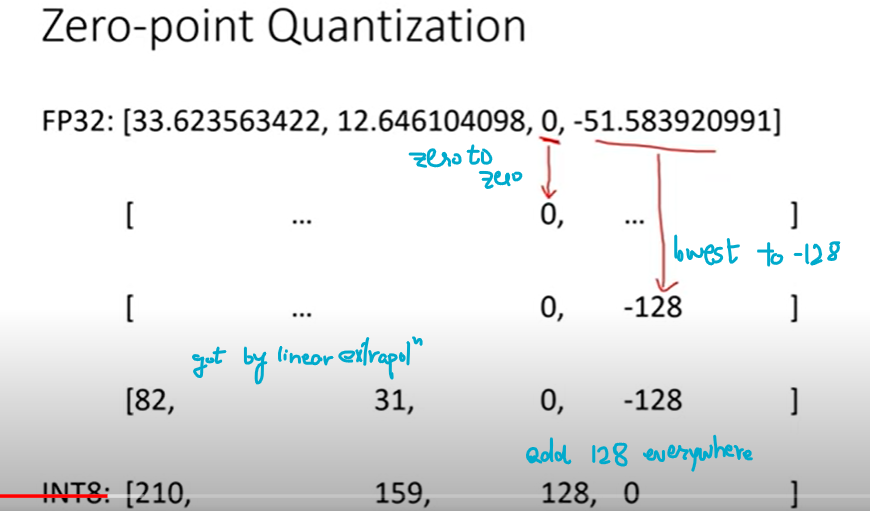
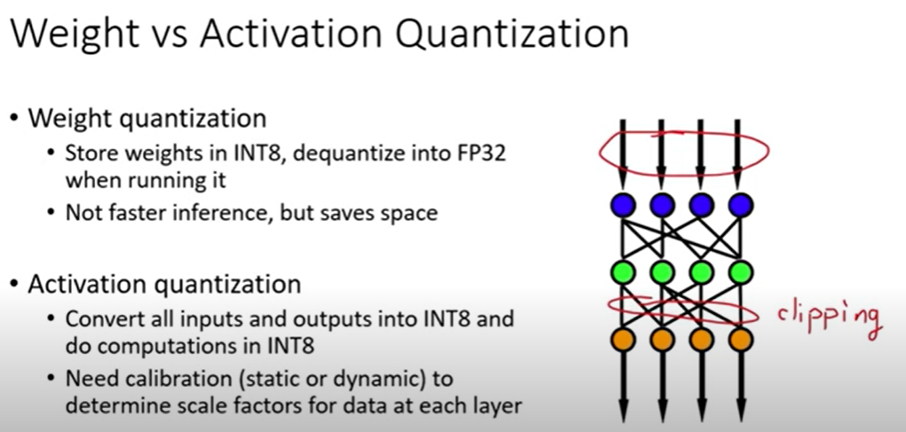
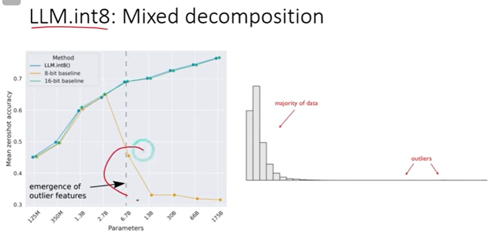
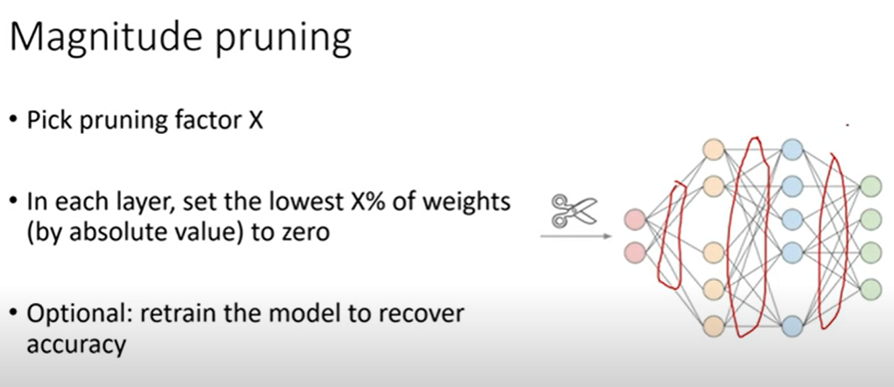

**source https://www.youtube.com/watch?v=UcwDgsMgTu4&list=TLPQMTYwNjIwMjTbxWqBbI_SAg&index=5**

## quantisation

**IMPORTANT**

- LARGE LLMs (>7B params) with quantisation doesn't work because of loss of info about outliers; since number of bins are limited then outliers cannot be handled nicely. 
- The paper **llm.int8** suggests that model performance drops to even zero for such LARGE LLMs. Outliers should be quantised seperately.

## Pruning

## Use ONNX formatttt!!!!

