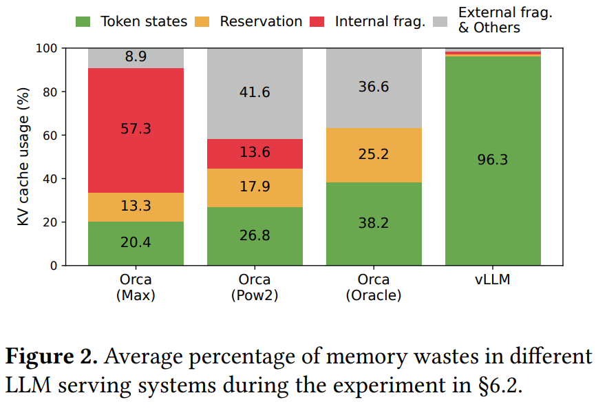
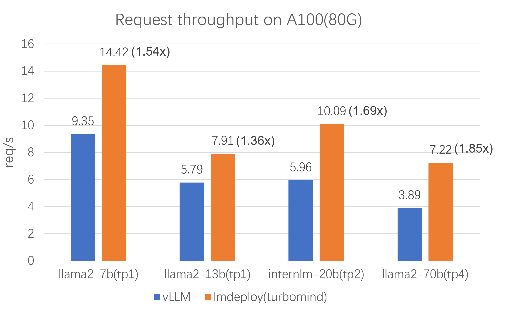
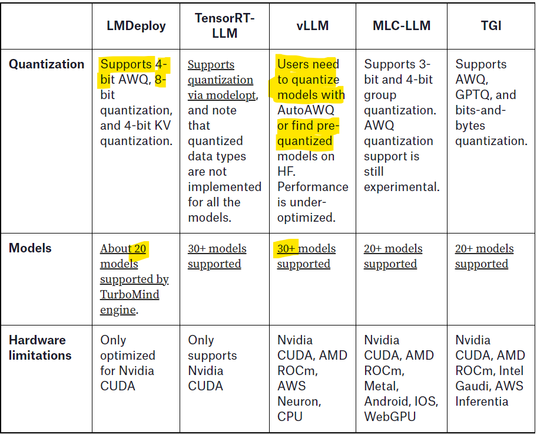

# Initial Info


# Spec Decode Directory

The `spec_decode` directory has the draft workers:

- **TP1DraftModelRunner**  
  Located at: `vllm/spec_decode/draft_model_runner.py`  
  Class:  
  ```python
  class TP1DraftModelRunner(ModelRunner)
  ```

- **MedusaWorker**  
    Located at: `vllm/spec_decode/medusa_worker.py`  
    Medusa is a simple framework that democratizes the acceleration techniques for LLM generation with multiple decoding heads ([source](https://github.com/FasterDecoding/Medusa#introduction)) \
    Class:  
    ```python
    class MedusaWorker
    ```

- **NGramWorker**  
    Located at: `vllm/spec_decode/ngram_worker.py`  
    Class:  
    ```python
    class NGramWorker
    ```
    Provides a light drafter without the need for a model. The current `NGramWorker` **only implements prompt lookup decoding**.
    

It also houses the target worker:

- **TargetModelRunner**  
    Located at: `vllm/spec_decode/target_model_runner.py`  
    Class:  
    ```python
    class TargetModelRunner(ModelRunner)
    ```
    Specialized model runner for speculative decoding target model.

  > In speculative decoding, the log probabilities selected (of draft model?) finally may not be the same ones as selected by the target model sampling. This means that the time spent in the log probability calculation of the target model is time wasted **since we calculate log probabilities after deciding which tokens are accepted -- didn't understand fully** . For this reason, disabling log probabilities in the target model will make decoding faster. The model runner sets the `SamplingMetadata` parameters according to whether log proba...


The Rejection Sampler is located at outside this directory somehow

- **RejectionSampler**
  Located at: `vllm/model_executor/layers/rejection_sampler.py`
  Class:
    ```python
    class RejectionSampler(SpecDecodeStochasticBaseSampler)
    ``` 
    It has methods like `init`, `forward`, and helper methods such as:
    - `_get_accepted`
    - `_get_recovered_plots`
    - `_batch_modified_rejection_sampling`


# Offline Batched Inference

The `LLM` class is the main class for running offline inference with the `vLLM` engine. The `SamplingParams` class specifies the parameters for the sampling process.

```python
from vllm import LLM, SamplingParams

prompts = [
    "Hello, my name is",
    "The president of the United States is",
    "The capital of France is",
    "The future of AI is"
]

sampling_params = SamplingParams(temperature=0.8, top_p=0.95)
llm = LLM(model="facebook/opt-125m")
outputs = llm.generate(prompts, sampling_params)

# Print the outputs.
for output in outputs:
    prompt = output.prompt
    generated_text = output.outputs[0].text
    print(f"Prompt: {prompt!r} Generated text: {generated_text!r}")
```


## SamplingParams

The `SamplingParams` class is located at `vllm/sampling_params.py`. Expectedly, the `BeamSearchParams` class is in the same file.

> **NOTE:** Liked this little SamplingType class - simple integer values mapped to the types.


```python
class SamplingType(IntEnum):
    GREEDY = 0
    RANDOM = 1
    RANDOM_SEED = 2
```

The `SamplingParams` class takes common arguments like `top_p`, `top_k`, and `temperature`. It follows the sampling parameters from the [OpenAI text completion API](https://platform.openai.com/docs/api-reference/completions/create).

The class also includes checks on the parameters to raise a lot of `ValueError`(s) when required. This is taken care of in the following method
```python
def _verify_args(self) -> None
```


> **NOTE:** Got a question about `@property`, `@cached_property` decorator – and its differences from the `@staticmethod` decorator. After all, the `@property` decorator allows you to define methods in a class that can be accessed like attributes – method can be accessed without parantheses. `@cached_property` is similar but the results are cached.  But then saw that `@staticmethod` does not have access to the instance (`self` param), while `@property` has. 

Example:
```python
class Circle:
    def __init__(self, radius):
        self._radius = radius

    @property
    def area(self):
        return 3.14 * (self._radius ** 2)

c = Circle(5)
print(c.area)
```

## Main LLM Class

Class `LLM` is located at `vllm/entrypoints/llm.py`. The docstring reads - 

```python
"""
An LLM for generating texts from given prompts and sampling parameters. This class includes a **tokenizer**, a **language model** (possibly distributed across multiple GPUs), and GPU memory space allocated for intermediate states (aka **KV cache**). Given a batch of prompts and sampling parameters, **this class generates texts** from the model using an intelligent batching mechanism and efficient memory management.
"""
```

- The `LLM` class is meant for offline inference. For online serving, it is expected to use the `AsyncLLMEngine` class. 
- All arguments are packed in an `EngineArgs` object

The `generate` method is overloaded such that it handles - (i) single (prompt + optional token ids) (ii) multi (prompt + optional token ids), (iii) single (token ids + optional prompt) (iv) multi (token ids + optional prompt), (v) single or multi token ids [pos-only]

Similarly the `encode` method is overloaded. 


> **NOTE:** New concept for me. Apparently not using the `@overload` leads to non-optimal static type checking and non-rich autocompletion for IDEs. Also, using `@overload` seems to be a good practice to explicitly show that we are overloading. Additionally, I've observed a pattern - it might be standard practice as well - usually the way of writing seems to be writing a lot of *empty* methods with the `@overload` decorator. Just before the final *non-empty* mention of the method, there is a little `@deprecate_kwargs` that puts out messages if a given argument has been deprecated. The `llm_engine` implements this too! 


The `generate` method takes in the given prompts and  sampling parameters to return `List[RequestOutput] `

Main components seem to be about validating inputs, running the engine and finally validating the outputs

```python
class LLM:
    ...
    # The encode method generates completions and also batches the inputs. It says for best performance, all prompts should be put into a single list 
    def encode(
        self._validate_and_add_requests(
        prompts=parsed_prompts,
        params=sampling_params,
        ...
        )

        outputs = self._run_engine(use_tqdm=use_tqdm)
        return LLMEngine.validate_outputs(outputs, RequestOutput)
    )
```


Diving deeper, 
- the `self.validate_and_add_requests` calls up `self._add_request` which in turn calls up `self.llm_engine.add_request`
- `_run_engine` first collects unfinished requests by 
```python
num_requests = self.llm_engine.get_num_unfinished_requests()
```
and then for the unfinished requests, runs a step by the llm engine such as 

```python
step_outputs = self.llm_engine.step()
```


Clearly, the `llm_engine` has to be explored. But before that, we should have a look into what are `PoolingParams`. These seem to be coming up quite often.

- **PoolingParams**  
  Located at: `vllm/pooling_params.py`  
  Class:  
  ```python
  class PoolingParams(...)
  ```
  This seems to return an instance of the PoolingParams class itself, after adding *any additional data needed for pooling*. Intuitively, these might be parames used when vLLM is handling multiple sequences - that need to be *pooled* together.


## The LLM Engine

- **LLMEngine**  
  Located at: `vllm/engine/llm_engine.py`  

The `__init__` takes in a lot of config objects. The config object templates are located at: `vllm/config.py`.

```python
model_config,
cache_config,
parallel_config,
scheduler_config,
device_config,
load_config,
lora_config,
speculative_config,
decoding_config,
...
```
This manages requests, schedules the inferences, kv caches and performs distributed excecution. 

### Tokenizer

Diving into the tokenizer, it seems most of the tokenizer content is in the `vllm/transformers_utils/` directory. The main importing tokenizer business happens in the `tokenizer.py`. A lot of type checking, checking for cached tokenizers, instance checks, but at the core lies the `get_tokenizer` function which does 
```python
if tokenizer_mode == "mistral":
        tokenizer = MistralTokenizer.from_pretrained(...)
    else:
        try:
            tokenizer = AutoTokenizer.from_pretrained(tokenizer_name, ...)
        except ValueError as e:
            ...

```
**Haha cool ;)**

> Interstingly, a lot of methods in the `tokenizer_group/base_tokenizer_group.py`, like the `class BaseTokenizerGroup` are *empty*. All the following methods do is to implement a pass only! `check_health`, `get_lora_tokenizer`, `from_config`, `ping`. 


### Request Handling
The (overloaded) `add_request` method takes care of adding a request to the engine’s queue. It processes input prompts and parameters, then creates a `SequenceGroup` which contains all sequences of token generation.

> The addition of request to the queue is not straightforward though. There are multiple intermediate methods that are invoked such as `input_processor` -> `_add_processed_request` -> `_validate_model_inputs` -> `_create_sequence_group_with_sampling` -> `_build_logits_processors` -> return a `SequenceGroup`


An example from the `add_request` method's docstring makes things clearer
```python
# initialize engine
engine = LLMEngine.from_engine_args(engine_args)
# set request arguments
example_prompt = "Who is the president of the United States?"
sampling_params = SamplingParams(temperature=0.0)
request_id = 0

# add the request to the engine
engine.add_request(
   str(request_id),
   example_prompt,
   SamplingParams(temperature=0.0))
# continue the request processing
...
```


Adding requests correctly to the queue lies at the heart of vLLM. This critical Sequence logic is given at `vllm/sequence.py`. I could make out this little heirarchy 
- The `class Sequence` is designed to *store the data, status, and block information of a sequence*. 
- The `class SequenceGroup` extends this logic to hold *a group of sequences that are generated from the same prompt*.
- Lastly, the `class SequenceOutput` and `class CompletionSequenceGroupOutput` handle the model output associated with a sequence and sequence group.

> Interestingly, the `sequence.py` script does this too `from typing import Sequence as GenericSequence` :)


### The Step function
As discussed earlier, the `step()` function is among of the most critical parts of the engine. It performs one iteration of token generation (i.e. decoding) and returns the generated results. Intuitively, the step function returns `RequestOutput or` `EmbeddingRequestOutput` objects.

The method docstring gives a fair bit of information, in a stepwise manner  
- **Step 1:** Schedules the sequences to be executed in the next
    iteration and the token blocks to be swapped in/out/copy.
    - Depending on the scheduling policy,
        sequences may be `preempted/reordered`.
- **Step 2:** Calls the distributed executor to execute the model. 

```python
# excecute model
outputs = self.model_executor.execute_model(execute_model_req) 
...
# Add results to the output_queue
ctx.append_output(outputs=outputs, ...) 
```

- **Step 3:** Processes the model output
    - Decodes the relevant outputs
    - Updates the scheduled sequence groups with model outputs
        based on its `sampling parameters` (`use_beam_search` or not).
    - Frees the finished sequence groups.

- **Step 4:** Creates and returns the newly generated results.


And we have an example too
```python
# initialize engine and request arguments
engine = LLMEngine.from_engine_args(engine_args)
example_inputs = [(0, "What is LLM?",
   SamplingParams(temperature=0.0))]

# Start the engine with an event loop
while True:
    if example_inputs:
        req_id, prompt, sampling_params = example_inputs.pop(0)
        engine.add_request(str(req_id),prompt,sampling_params)

    # continue the request processing
    request_outputs = engine.step()
    for request_output in request_outputs:
        if request_output.finished:
            # return or show the request output

    if not (engine.has_unfinished_requests() or example_inputs):
        break
```


### KV Cache management

The `_initialize_kv_caches` method sets up GPU and CPU blocks for the cache. The method it calls, in turn, nicely takes in the GPU and CPU blocks as input :)

```python
self.model_executor.initialize_cache(num_gpu_blocks, num_cpu_blocks)
```

The team has wrote a method `determine_num_available_blocks()` to get the number of GPU and CPU blocks automatically. This method is heavily used throughout the repo - mostly when a executor is called . \\

Analogously, this super-efficient memory management leads to very less memory being wasted. The image below is from the paper itself.



### Running on (multiple) GPUs/TPUs/Clusters!
Distributed exceution is handled by Executors. The file imports gives us a few hints -
```python
from vllm.executor.executor_base import ExecutorBase
from vllm.executor.gpu_executor import GPUExecutor
from vllm.executor.ray_utils import initialize_ray_cluster
```

The `_get_executor_cls` method is a bit wild. Depending on the specified `device_type` in the `device_config`, it is built to import a ton of executors and sets it to the `executor_class` variable (I've cut the code for clarity) -

```python
elif engine_config.device_config.device_type == "neuron":
    from vllm.executor.neuron_executor import NeuronExecutor # NeuronExecutor
elif engine_config.device_config.device_type == "tpu":
    from vllm.executor.ray_tpu_executor import RayTPUExecutor # RayTPUExecutor
elif engine_config.device_config.device_type == "cpu":
    from vllm.executor.cpu_executor import CPUExecutor # CPUExecutor
elif engine_config.device_config.device_type == "openvino":
    from vllm.executor.openvino_executor import OpenVINOExecutor # OpenVINOExecutor
elif distributed_executor_backend == "mp":
    from vllm.executor.multiproc_gpu_executor import MultiprocessingGPUExecutor # MultiprocessingGPUExecutor
```

### Scheduling the runs
The init method of the engine itself sets the `self.scheduler = [Scheduler(...) for _ in range(parallel_size)]`. Information about the scheduler is present at `vllm/core/scheduler.py`. 

There are a bunch of functions that handle operations like **prefilling**, swapping, aborting, 


## The utils
Found some very creative ways to keep the utils. A lot of flags grouped together. 
```python
# Efficiently import all enc/dec error strings
# rather than having to import all of the above
STR_NOT_IMPL_ENC_DEC_ERR_STRS = {
    "STR_NOT_IMPL_ENC_DEC_SWA": STR_NOT_IMPL_ENC_DEC_SWA,
    "STR_NOT_IMPL_ENC_DEC_PREFIX_CACHE": STR_NOT_IMPL_ENC_DEC_PREFIX_CACHE,
    "STR_NOT_IMPL_ENC_DEC_CHUNKED_PREFILL":
    STR_NOT_IMPL_ENC_DEC_CHUNKED_PREFILL,
    "STR_NOT_IMPL_ENC_DEC_LOGIT_SOFTCAP": STR_NOT_IMPL_ENC_DEC_LOGIT_SOFTCAP,
    "STR_NOT_IMPL_ENC_DEC_LORA": STR_NOT_IMPL_ENC_DEC_LORA,
    "STR_NOT_IMPL_ENC_DEC_PP": STR_NOT_IMPL_ENC_DEC_PP,
    "STR_NOT_IMPL_ENC_DEC_MM": STR_NOT_IMPL_ENC_DEC_MM,
    "STR_NOT_IMPL_ENC_DEC_SPEC_DEC": STR_NOT_IMPL_ENC_DEC_SPEC_DEC,
    "STR_NOT_IMPL_ENC_DEC_BACKEND": STR_NOT_IMPL_ENC_DEC_BACKEND,
    "STR_NOT_IMPL_ENC_DEC_PROMPT_ADAPTER": STR_NOT_IMPL_ENC_DEC_PROMPT_ADAPTER,
    "STR_NOT_IMPL_ENC_DEC_CPU": STR_NOT_IMPL_ENC_DEC_CPU
}
```

- Never knew that the function to deprecate kwargs is also a part of utils. 

- An intersting class that I feel I should incorporate in my projects - 
```python
class FlexibleArgumentParser(argparse.ArgumentParser):
    """ArgumentParser that allows both underscore and dash in names."""
```

## Attention
This was slightly unexpected. This vLLM team actually supports FlashAttention. The methods to get shapes of KV cache, swapping data to corresponding memory - all of it is written well
- **FlashAttention**
    Located at `vllm/attention/backends/flash_attn.py`
    Class: 
    ```python
    class FlashAttentionImpl(AttentionImpl)
    ```
- **BlockSparseAttention**
    Located at `vllm/attention/backends/blocksparse_attn.py`
    Class: 
    ```python
    class BlocksparseFlashAttentionImpl(AttentionImpl)
    ```


# TODO

## **1. Check deeper into code of speculative decoding and scheduling**


## **2. Check more into code for chunked prefilling**

The logic of continuous batching was first introduced in the Orca paper (2022) [link](https://www.usenix.org/conference/osdi22/presentation/yu). Orca implements **iteration-level scheduling** where the batch size is determined per iteration [ref](https://www.anyscale.com/blog/continuous-batching-llm-inference)


This section from the vLLM official blog also tells about how GPUs have become too fast and memory transfers is an issue - 
> Specifically, our profiling results show that for Llama 3 8B running on 1 H100 GPU:
> - The HTTP API server takes 33% of the total execution time.
> - 29% of the total execution time is spent on scheduling, including gathering the LLM results from the last step, scheduling the requests to run for the next step, and preparing these requests as inputs for the LLMs.
> - Finally, **only 38% of the time was spent on the actual GPU execution** for LLMs.


## **3. RUN and test if there is a possibility of different outputs from the same model - vLLM and not vLLM. Should use logical-reasoning based queries instead of factual ones**
- Currently pytorch v2.2 and above is not supported. Runs with v2.1.2 should be fine.
- EDIT: Simply running the Getting Started example runs into package issues - tried only on Colab so far. Should test with a local venv


## **4. Distributed running**
- The parallel runs heavily use Pytorch's distributed modules. Located at `vllm/distributed/parallel_state.py`. Interestingly, the script starts off saying -
```python
# Adapted from
# https://github.com/NVIDIA/Megatron-LM/blob/main/megatron/core/parallel_state.py
# Copyright (c) 2022, NVIDIA CORPORATION. All rights reserved.
``` 


## **5. API servers**
- vLLM says they "vLLM can be deployed as a server that implements the OpenAI API protocol". If required, can check on this too


# **(EXTRA)** How vLLM compares with other inference engines ([source1](https://www.bentoml.com/blog/benchmarking-llm-inference-backends), [source2](https://github.com/InternLM/lmdeploy))





### Llama 3 8B
- For the Llama 3 8B model, **LMDeploy consistently delivers low TTFT and the highest decoding speed across all user loads.** Its ease of use is another significant advantage, as it can convert the model into TurboMind engine format on the fly, simplifying the deployment process. At the time of writing, LMDeploy offers limited support for models that utilize sliding window attention mechanisms, such as Mistral and Qwen 1.5.

- vLLM consistently maintains a low TTFT, even as user loads increase, making it suitable for scenarios where maintaining low latency is crucial. vLLM offers easy integration, extensive model support, and broad hardware compatibility, all backed by a robust open-source community.


### Llama 3 70B 4-bit quantization
- For the Llama 3 70B Q4 model, **LMDeploy** demonstrates impressive performance with the lowest TTFT across all user loads. It also maintains a high decoding speed, making it ideal for applications where both low latency and high throughput are essential. LMDeploy also stands out for its ease of use, as it can quickly convert models without the need for extensive setup or compilation, making it ideal for rapid deployment scenarios.

- vLLM manages to maintain a low TTFT even as user loads increase, and its ease of use can be a significant advantage for many users. However, at the time of writing, the **backend's lack of optimization for AWQ quantization leads to less than optimal decoding performance for quantized models.**

> **NOTE:** [This page](https://huggingface.co/collections/neuralmagic/fp8-llms-for-vllm-666742ed2b78b7ac8df13127) lists out pre-quantized models that are supported by vLLM